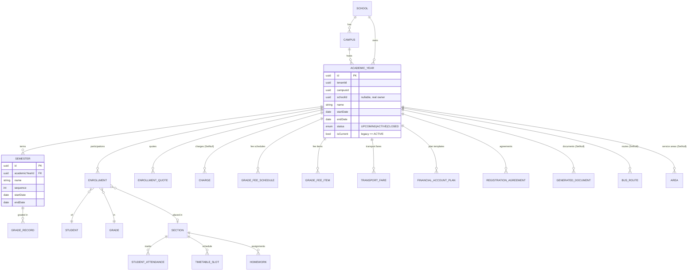

# Academic Year — Data Structure & Relations

Source of truth: `prisma/schema.prisma` (model `AcademicYear`, line ~573). This document
describes the entity, its lifecycle, and every relation as actually defined in the schema.

---

## 1. Overview

An **Academic Year** is a **School-level** entity (Decision 1) representing one operational
cycle of the school (e.g. `2026/2027`). It is the anchor to which almost all year-scoped
academic and financial data attaches — directly (Enrollment, Charge, Semester, …) or
indirectly (Attendance, Timetable, GradeRecord via Enrollment/Section/Semester).

It is **never hard-deleted once used**; it only moves through a lifecycle
`UPCOMING → ACTIVE → CLOSED`.

---

## 2. `AcademicYear` model — fields

| Field       | Type                 | Notes |
|-------------|----------------------|-------|
| `id`        | `String` (uuid, PK)  | Primary key |
| `tenantId`  | `String` (uuid)      | Owning tenant (RLS scope) |
| `campusId`  | `String` (uuid)      | **Transitional shim** — the hosting campus. Being phased out; School is the real owner |
| `schoolId`  | `String?` (uuid)     | Owning School (backfilled from `campus.schoolId`). New code reads/writes this |
| `name`      | `String`             | e.g. `"2026/2027"` |
| `startDate` | `DateTime` (`@db.Date`) | Year start |
| `endDate`   | `DateTime` (`@db.Date`) | Year end |
| `registrationStartDate` | `DateTime?` (`@db.Date`) | Admission/registration window start (optional) |
| `registrationEndDate`   | `DateTime?` (`@db.Date`) | Admission/registration window end (optional) |
| `status`    | `AcademicYearStatus` | Lifecycle; default `UPCOMING`. **Single source of truth** |
| `isCurrent` | `Boolean`            | Legacy flag, kept in sync (`isCurrent == (status === ACTIVE)`) for backward-compatible readers |
| `createdAt` | `DateTime`           | |
| `updatedAt` | `DateTime`           | |

### Constraints & indexes
- `@@unique([tenantId, campusId, name])` — no duplicate year names within a campus
- `@@index([tenantId, campusId])`
- `@@index([tenantId, schoolId])`
- `@@index([tenantId, status])`

---

## 3. Lifecycle status

```prisma
enum AcademicYearStatus {
  UPCOMING   // shown in the UI as "Planned"
  ACTIVE     // the current year — exactly ONE per School
  CLOSED     // read-only / terminal
}
```

**Rules**
- Exactly **one `ACTIVE`** Academic Year per School (activating one supersedes the previous).
- `CLOSED` is **read-only** (terminal).
- `UPCOMING` (Planned) years may be edited.
- **Delete** is allowed **only if the year is completely unused** and not `CLOSED`
  (see §6). Otherwise it can only be `CLOSED`.
- Changing the current year is an **administrative config change** — it never promotes
  students, creates enrollments, modifies grades, generates charges, or copies timetables.
  Promotion is the separate **Year-End** wizard.

---

## 4. Parent relations (Academic Year *belongs to*)

| Relation | Target   | Cardinality | `onDelete` |
|----------|----------|-------------|------------|
| `tenant` | `Tenant` | many-to-one | `Cascade` |
| `campus` | `Campus` | many-to-one | `Cascade` |
| `school` | `School?`| many-to-one (optional, transitional) | `Cascade` |

> Hierarchy: **School → Campus → AcademicYear → Semester**.

---

## 5. Child / dependent relations (things that reference an Academic Year)

These are the models that hold an `academicYearId` FK. `onDelete` is what the **database**
does if the year row were removed; note the application layer forbids deleting a *used* year
long before this matters.

| Model                   | FK optionality | `onDelete` | Meaning |
|-------------------------|----------------|------------|---------|
| `Semester`              | required       | `Cascade`  | Terms of the year (has own `startDate`/`endDate`, `sequence`) |
| `Enrollment`            | required       | `Cascade`  | A student's participation in this year (the core link) |
| `EnrollmentQuote`       | required       | `Cascade`  | Admission fee quote for the year |
| `Charge`                | optional       | `SetNull`  | Financial obligation; keeps the year as a reporting dimension |
| `GradeFeeSchedule`      | required       | `Cascade`  | Per-grade fee schedule for the year |
| `GradeFeeItem`          | required       | `Cascade`  | Per-grade, per-year fee line amount |
| `TransportFare`         | required       | `Cascade`  | Transport pricing for the year |
| `FinancialAccountPlan`  | required       | `Cascade`  | Payment plan template scoped to the year |
| `RegistrationAgreement` | required       | `Cascade`  | Signed registration agreement for the year |
| `GeneratedDocument`     | optional       | `SetNull`  | Rendered documents tagged with the year |
| `BusRoute`              | optional       | `SetNull`  | Fleet routes scoped to the year |
| `Area` (service area)   | optional       | `SetNull`  | Transport service areas scoped to the year |

---

## 6. Indirect relations (why a year is "used")

Several operational tables are **not** FK'd directly to `AcademicYear` — they attach through
`Enrollment`, `Semester`, or `Section`. These matter for **delete eligibility**, **metrics**,
and **readiness**:

| Data          | Reached via                                   | Used for |
|---------------|-----------------------------------------------|----------|
| Attendance (`StudentAttendance`) | `Section` + the year's date window   | Attendance % metric |
| Grades (`GradeRecord`)           | `Semester` (`semesterId`)            | Report-card completion; delete guard |
| Timetable (`TimetableSlot`)      | `Section` (of enrolled students)     | Timetable completion; delete guard |
| Homework                         | `Section`                            | Operational insight |
| Behaviour (`BehaviorLog`)        | `Student` / `Section`                | Operational insight |
| Audit (`AuditLog`)               | `entityType='AcademicYear', entityId`| Delete guard |

**Delete guard** (`GET /academic-years/:id/deletable`) blocks deletion when **any** of:
`enrollments`, `charges`, `semesters`, `reports (grade records)`, `timetable`, or
`auditLogs` exist — surfacing *"This Academic Year contains historical data and cannot be
deleted."*

---

## 7. Entity–relationship diagram



---

## 8. How the structure maps to the workspace

| Workspace surface | Backed by |
|-------------------|-----------|
| Card KPIs (students, enrollments, classes, semesters) | `Enrollment` (by status), distinct `Section`/`Grade`, `Semester` count |
| Outstanding fees / unverified payments | `Charge` (PENDING/PARTIAL), `Payment` (PENDING) |
| Attendance / report-card / timetable % | `StudentAttendance`, `GradeRecord` (via Semester), `TimetableSlot` (via Section) |
| Academic Readiness Score & activation checks | Year dates, registration window, and **`Semester` geometry** (inside-year / no-overlap / full coverage), plus `Grade` & `Section` counts — all real records |
| Delete guard | Existence across `Enrollment`, `Charge`, `Semester`, `GradeRecord`, `TimetableSlot`, `AuditLog` |
| Current-year indicator | `AcademicYear` where `status = ACTIVE` |

### Readiness activation checklist (all derived from real data)

1. Start date set · 2. End date set · 3. Registration window set
4. At least one Semester · 5. Semester dates fall inside the year
6. Semester dates do not overlap · 7. Semesters cover the whole year
8. Grades configured · 9. Sections configured

> There is **no** free-text "academic calendar" field. The instructional calendar is derived
> entirely from **Semester** records (name / sequence / inclusive `startDate` / `endDate`); the
> term count is always `count(Semester)`, never a stored field. Holiday/event scheduling is
> intentionally deferred — a future `AcademicCalendarEvent` module can be added additively
> without touching `AcademicYear` or `Semester`.
