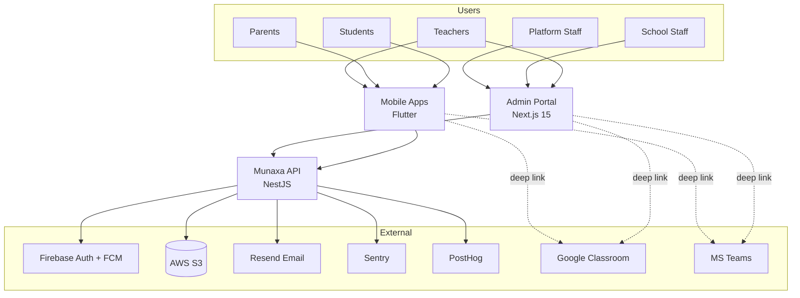
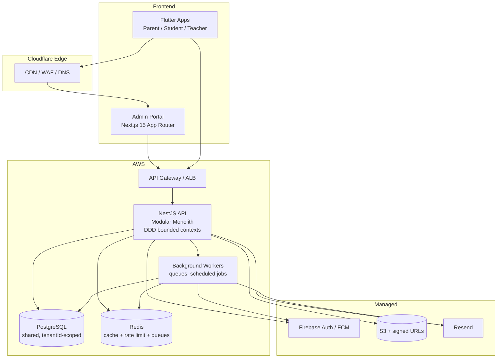

# 00 — System Architecture

## 1. Purpose & scope

Munaxa is a **multi-tenant School Operating System** covering school administration, student
management, parent communication, teacher operations, attendance, scheduling, finance, reporting,
and operations. It explicitly **does not** implement LMS features (assignments grading workflows,
course content delivery) — those are delegated to **Google Classroom** and **Microsoft Teams**
via **deep links**.

## 2. Actors

| Actor | Surface | Notes |
|-------|---------|-------|
| Platform Owner / Admin / Support Agent | Admin Portal | Cross-tenant operations, tenant provisioning, support |
| School Admin / Principal / Vice-Principal / Finance Officer / Secretary | Admin Portal | Single-tenant operations |
| Teacher | Mobile (primary) + Admin Portal | Attendance, homework, behavior, current-class |
| Parent | Mobile | Multi-child view, payments receipts, communication |
| Student | Mobile | Dashboard, homework list, timetable, gamification |
| External LMS (Google Classroom, MS Teams) | Deep link | Outbound only |

## 3. C4 — System Context

## 4. C4 — Container view

## 5. Key architectural decisions (ADR summary)

| ID | Decision | Rationale |
|----|----------|-----------|
| ADR-001 | **Modular monolith** NestJS (not microservices initially) | Faster delivery, simpler ops, strong consistency; DDD module boundaries allow later extraction |
| ADR-002 | **Shared PostgreSQL** with `tenantId` column on every business entity | Cost-efficient multi-tenancy for SMB schools; isolation enforced in Prisma middleware + guards + RLS-style checks |
| ADR-003 | **Firebase Auth** as the identity provider, JWT issued by Munaxa API | Offload credential security, MFA, social/phone where needed; Munaxa controls authorization |
| ADR-004 | **Offline-first mobile** (Flutter) for attendance | Schools have unreliable connectivity; attendance must work offline |
| ADR-005 | **No payment gateway** — receipt-upload + CliQ reference workflow | Market constraint (Jordan); reduces PCI scope to zero |
| ADR-006 | **Deep-link LMS integration only** | Product mandate: not an LMS, no duplication |
| ADR-007 | **Cloudflare edge + AWS origin** | Cloudflare for WAF/CDN/DNS; AWS for compute/data |

## 6. Cross-cutting concerns

- **Localization**: every user-facing string keyed (i18n); `dir` = rtl|ltr resolved per user locale.
- **Observability**: Sentry (errors/traces), PostHog (product analytics), structured JSON logs.
- **Tenancy**: resolved per request → injected into request context → enforced in every repository.
- **Auditing**: all state-changing operations emit `AuditLog` entries (see doc 10).
- **Idempotency**: write endpoints accept `Idempotency-Key` for safe mobile retries.

## 7. Non-functional targets (initial)

| Attribute | Target |
|-----------|--------|
| API p95 latency | < 300 ms (read), < 600 ms (write) |
| Availability | 99.9% monthly |
| RPO | ≤ 15 min |
| RTO | ≤ 2 h |
| Tenant isolation breaches | 0 (hard requirement) |
