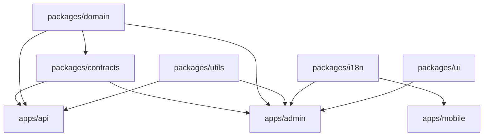

# 01 — Monorepo Architecture (Turborepo)

> Target layout for **Phase 1** scaffolding. No business modules are created in Phase 0.

## 1. Workspace layout

```text
school/
├── apps/
│   ├── api/                 # NestJS backend (modular monolith, DDD)
│   ├── admin/               # Next.js 15 Admin Portal (App Router)
│   └── mobile/              # Flutter workspace (Parent / Student / Teacher flavors)
├── packages/
│   ├── config-eslint/       # Shared ESLint config
│   ├── config-typescript/   # Shared tsconfig bases
│   ├── config-tailwind/     # Shared Tailwind preset + design tokens
│   ├── ui/                  # Shared React UI (shadcn-based) for admin
│   ├── contracts/           # Shared DTOs / API types / zod schemas (TS source of truth)
│   ├── i18n/                # Shared en/ar message catalogs + locale utils
│   ├── domain/              # Shared domain enums, value objects, constants (framework-free)
│   └── utils/               # Pure cross-cutting helpers
├── prisma/                  # Prisma schema, migrations, seed (consumed by apps/api)
├── infra/                   # IaC (Terraform), docker, deployment manifests
├── docs/                    # Architecture & runbooks (this folder lives here)
├── .github/workflows/       # CI/CD pipelines
├── turbo.json               # Turborepo pipeline
├── package.json             # Root workspaces
└── pnpm-workspace.yaml      # pnpm workspaces (package manager: pnpm)
```

> **Note on Flutter**: the Flutter app lives inside the monorepo for source cohesion but is built
> by its own toolchain (`flutter`/`melos`), not by Turborepo's JS pipeline. Turbo tasks shell out
> where needed; CI runs a separate Flutter job.

## 2. Dependency graph



- `packages/contracts` is the **single source of truth** for request/response shapes (zod + TS),
  shared between API and Admin. Mobile (Dart) consumes the OpenAPI spec generated from these.
- `packages/domain` is **framework-free** (no Nest/React imports) so it can be shared everywhere.

## 3. Turborepo pipeline (conceptual)

```jsonc
// turbo.json (Phase 1 will materialize this)
{
  "tasks": {
    "build":    { "dependsOn": ["^build"], "outputs": ["dist/**", ".next/**"] },
    "lint":     { "dependsOn": ["^build"] },
    "typecheck":{ "dependsOn": ["^build"] },
    "test":     { "dependsOn": ["^build"], "outputs": ["coverage/**"] },
    "dev":      { "cache": false, "persistent": true }
  }
}
```

## 4. Conventions

- **Package manager**: pnpm + workspaces (deterministic, fast, content-addressable store).
- **Versioning**: single-version policy (everything moves together; no independent publishing).
- **Path aliases**: `@school/contracts`, `@school/domain`, etc.
- **No app→app imports**: apps only depend on `packages/*`, never on each other.
- **Generated artifacts**: OpenAPI spec emitted by `apps/api` → consumed by Admin & Mobile codegen.
