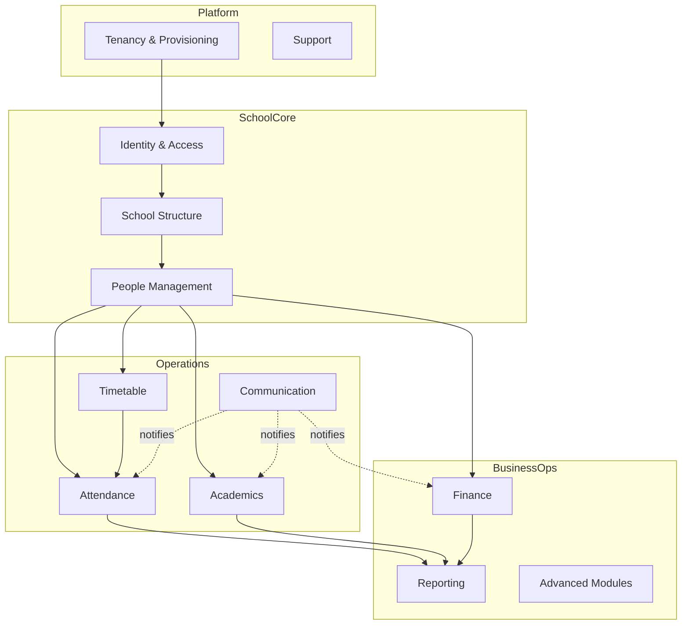
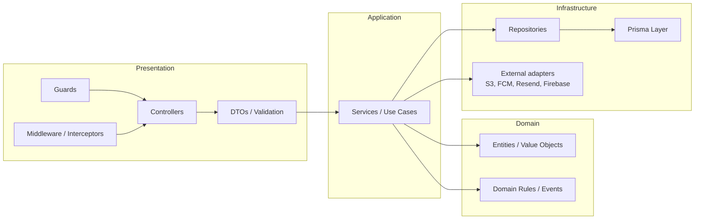

# 02 — Domain Architecture (DDD + Clean Architecture)

## 1. Bounded contexts



| Context | Owns | Phase |
|---------|------|-------|
| Tenancy & Provisioning | Tenant, School lifecycle, feature flags | 2, 14 |
| Identity & Access (IAM) | User, Role, Permission, sessions, RBAC | 3 |
| School Structure | Campus, AcademicYear, Semester, Grade, Section, Classroom | 4 |
| People Management | Student, Parent, Teacher, Employee, links, QR IDs | 5 |
| Timetable | MasterTimetable, ScheduleException, substitutes, Ramadan, current-class | 6 |
| Attendance | Student & teacher attendance, QR, offline queue | 7 |
| Academics | Homework, behavior logs, grade import, reports | 8 |
| Finance | Fee plans, charges, transactions, receipts, balances | 9 |
| Communication | Announcements, notifications, WhatsApp bridge | 10 |
| Parent Portal | Multi-child, leave/absence, PTM, document vault | 11 |
| Student App | Dashboard, resources, gamification | 12 |
| Reporting | Cross-context read models & exports | 13 |
| Advanced Modules | Bus, library, inventory, clinic (flag-gated) | 14 |

## 2. Clean Architecture layers (backend)



**Dependency rule**: dependencies point inward. Domain knows nothing about Nest, Prisma, or HTTP.
Infrastructure implements interfaces (ports) defined by the Application/Domain layers.

### Layer responsibilities (maps to the mandated backend layers)

| Layer | Responsibility | Must NOT |
|-------|----------------|----------|
| Controllers | HTTP routing, map DTO ↔ use case | contain business logic |
| DTOs | Shape + validation (class-validator / zod) | leak Prisma models |
| Guards | AuthN, RBAC, tenant isolation | run business logic |
| Middleware / Interceptors | Tenant resolution, logging, audit, idempotency | make domain decisions |
| Services (use cases) | Orchestrate domain + repos, transactions | know about HTTP |
| Repositories | Persistence interface (port) | expose Prisma types upward |
| Prisma Layer | Concrete data access, tenant scoping | be called directly by controllers |

## 3. Module standard (every NestJS feature module)

```text
modules/<context>/
├── <context>.module.ts
├── controllers/        # HTTP
├── dto/                # request/response DTOs + validation
├── services/           # use cases
├── repositories/       # ports + Prisma implementations
├── domain/             # entities, VOs, domain events
├── guards/             # context-specific guards (rare; most are global)
├── events/             # domain event handlers
└── __tests__/          # unit + integration tests
```

## 4. Domain events & integration

- Contexts communicate via **domain events** (in-process event bus initially; can move to a
  durable queue later). Example: `AttendanceMarkedAbsent` → Communication context sends parent push.
- No context reads another context's tables directly except the **Reporting** read models, which
  are built from published events / scheduled projections.

## 5. LMS integration boundary

LMS is **outside** every context. We store only a `LmsLink` value (provider + URL/identifier) on
relevant entities (e.g., a Section may carry a Google Classroom link). The apps render a deep link.
No grades, rosters, or content are synced.
