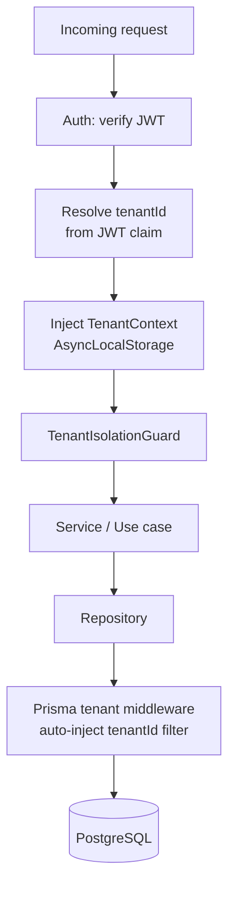
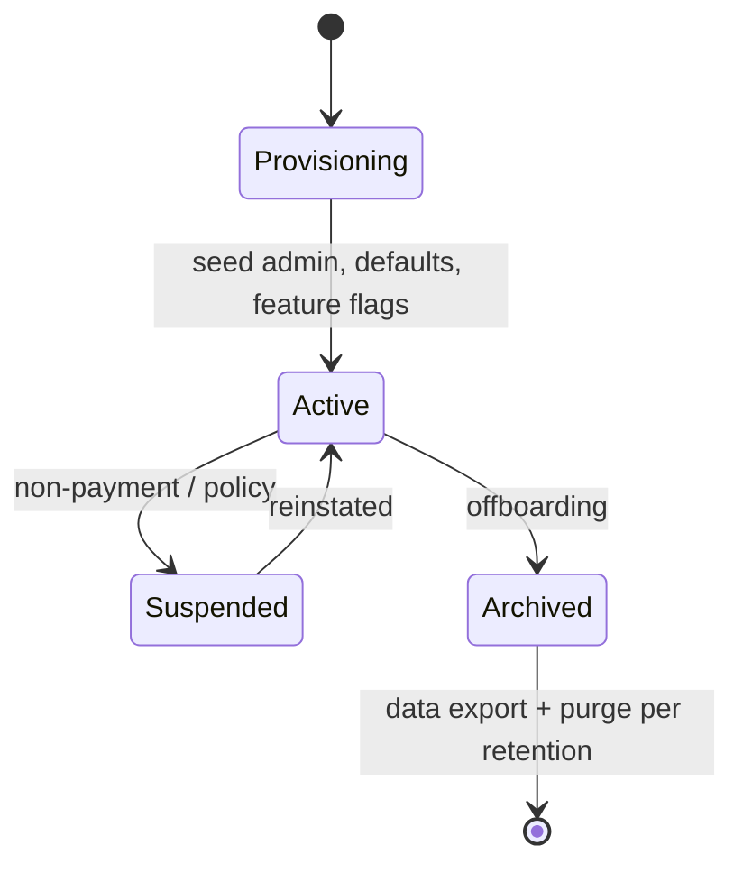

# 03 — Multi-Tenant Architecture

## 1. Model: shared database, shared schema, row-level isolation

- One PostgreSQL database, one schema.
- **Every business entity carries a non-null `tenantId`** (FK → `Tenant`).
- Tenant type = **School** (a `Tenant` maps 1:1 to a school organization; a school may have many
  campuses under one tenant).
- **Hard rule: no school may ever read or write another school's data.**

## 2. Defense-in-depth (four enforcement layers)

| Layer | Mechanism | Guarantee |
|-------|-----------|-----------|
| 1. Token | `tenantId` is a **signed JWT claim**, set at login, never client-supplied | Caller cannot forge tenant |
| 2. Context | `tenantId` stored in request-scoped **AsyncLocalStorage**, not in params | No accidental cross-wiring |
| 3. Guard | `TenantIsolationGuard` rejects any explicit `tenantId` in body/query that ≠ context | Blocks injection attempts |
| 4. Data | **Prisma middleware** auto-adds `where: { tenantId }` to all queries on tenant-scoped models; writes auto-stamp `tenantId` | DB queries physically scoped |

Additionally, **PostgreSQL Row-Level Security (RLS)** policies are applied as a backstop on
tenant-scoped tables using a session GUC (`app.tenant_id`) set per transaction — so even a logic
bug in the app cannot return cross-tenant rows.

## 3. Platform (cross-tenant) access

Platform roles (`PlatformOwner`, `PlatformAdmin`, `SupportAgent`) operate above tenants:

- Their JWT carries a `platform` scope instead of a single `tenantId`.
- Cross-tenant access goes through a **dedicated platform service layer** that:
  - requires elevated permission,
  - **writes an `AuditLog` for every cross-tenant read/write** (impersonation/support access),
  - optionally requires an explicit `X-Acting-Tenant` header to scope a support session to one tenant.
- Platform endpoints are physically separated (e.g., `/platform/*`) and never reachable by school JWTs.

## 4. Tenant lifecycle

- **Provisioning** (Phase 2/14): create Tenant + School, seed default roles/permissions, default
  academic year, feature flags (advanced modules off by default).
- **Suspended**: read-only or login-blocked, data retained.
- **Archived**: data exported, then purged per retention policy and audit-logged.

## 5. Tenant-scoped vs global tables

| Category | Examples | `tenantId`? |
|----------|----------|-------------|
| Business entities | Student, Charge, Attendance, Timetable, Announcement | **Required** |
| Tenant root | Tenant, School | Self (id) |
| Platform/global | Permission catalog, FeatureFlag definitions, system config | No (global, read-only to tenants) |
| Audit | AuditLog | `tenantId` (nullable only for platform-level events) |

## 6. Isolation testing (QA mandate, enforced from Phase 3)

- Automated **cross-tenant access tests**: seed two tenants; assert every endpoint returns 403/404
  (never another tenant's data) when accessed with the wrong tenant's token.
- A CI gate fails the build if any tenant-scoped model lacks the Prisma middleware filter or RLS policy.
