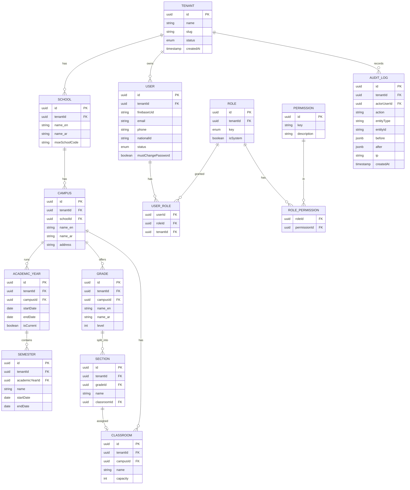
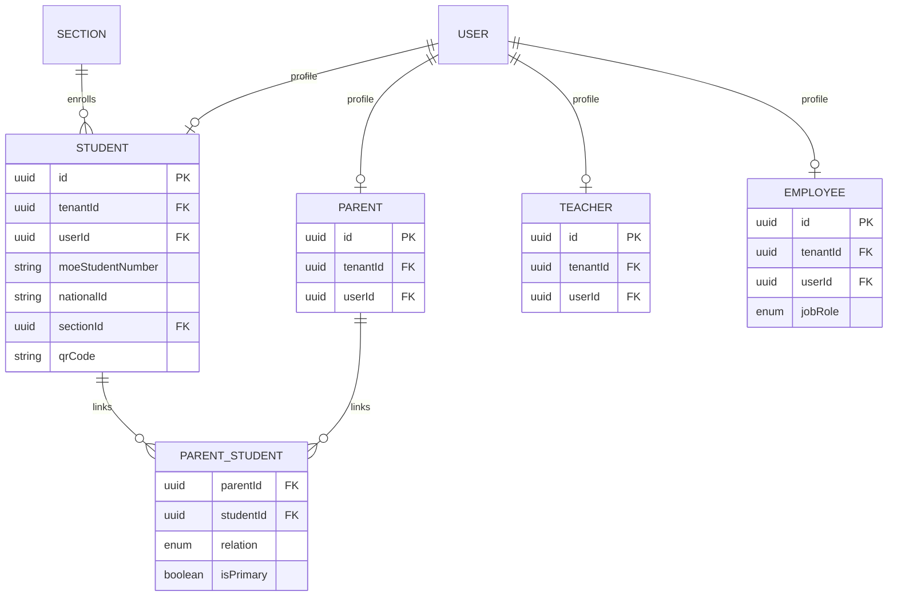

# 04 — Database ERD (Core)

> This is the **conceptual** ERD for the platform. The concrete Prisma schema for the core
> entities is built in **Phase 2**; later phases add their own contexts. Every business entity
> includes `tenantId`, `createdAt`, `updatedAt`, and soft-delete `deletedAt` where applicable.

## 1. Core / foundation ERD (Phase 2 target)

## 2. People & operations (forward-looking, later phases)

> Attendance, Timetable, Academics, Finance, Communication ERDs are defined in their phases and
> appended to this folder as `04a-…`, `04b-…` etc. to keep Phase 2 focused on the core.

## 3. Indexing strategy

- **Composite tenant indexes**: every frequent query gets a leading `tenantId`, e.g.
  `(tenantId, sectionId)`, `(tenantId, status)`, `(tenantId, createdAt)`.
- **Uniqueness scoped to tenant**: e.g. `@@unique([tenantId, moeStudentNumber])`,
  `@@unique([tenantId, email])` — identifiers are unique *within* a tenant, not globally.
- **National ID**: `@@unique([tenantId, nationalId])` where present; validated for Jordanian format.
- **Audit**: index `(tenantId, entityType, entityId)` and `(tenantId, createdAt)` for queries.
- **Hot paths** (attendance by day/section, current charges) get targeted partial/covering indexes.

## 4. Migration strategy

- **Prisma Migrate** as the single migration tool; migrations are committed and reviewed.
- **Expand → migrate → contract** pattern for zero-downtime changes (add nullable → backfill →
  enforce → drop old).
- Migrations run in CI against an ephemeral DB and in a **staging** environment before production.
- **No destructive migration** reaches production without an explicit, reviewed backfill/rollback note.
- RLS policies are managed as versioned SQL migrations alongside Prisma.

## 5. Data types & conventions

- Primary keys: **UUID v4** (avoid sequential ID enumeration leaks).
- Money: `Decimal` (never float) with currency = JOD; amounts stored in minor units where summed.
- Timestamps: `timestamptz`, UTC in DB; localized at presentation.
- Localized text fields: `_en` / `_ar` pairs (or a JSONB `{en, ar}` where many).
- Soft deletes via `deletedAt` for recoverable business records; hard delete only on purge.
