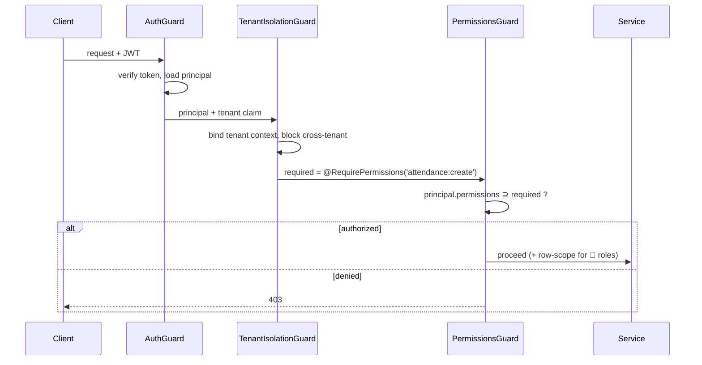

# 05 — RBAC Matrix

Strict role-based access control with **two role planes**: Platform (cross-tenant) and School
(tenant-scoped). Permissions are fine-grained `resource:action` strings; roles are bundles of
permissions. Authorization = AuthN ✓ → tenant context ✓ → permission check ✓.

## 1. Roles

### Platform plane (no single `tenantId`; cross-tenant, heavily audited)
| Role | Purpose |
|------|---------|
| `PlatformOwner` | Full platform control, billing, tenant lifecycle, all permissions |
| `PlatformAdmin` | Operate the platform, provision/suspend tenants, manage staff |
| `SupportAgent` | Time-boxed, audited support access into a tenant (read-mostly) |

### School plane (always tenant-scoped)
| Role | Purpose |
|------|---------|
| `SchoolAdmin` | Full administration within the tenant |
| `Principal` | School-wide oversight, approvals, reports |
| `VicePrincipal` | Delegated principal duties, discipline/behavior |
| `FinanceOfficer` | Fees, charges, transactions, receipts, finance reports |
| `Teacher` | Attendance, homework, behavior, current-class, comms to their classes |
| `Secretary` | Front-office: people records, document handling, basic comms |
| `Parent` | Own children's data, payments receipts, requests, comms |
| `Student` | Own academic data, timetable, homework, gamification |

## 2. Permission catalog (representative — extended per phase)

`resource:action` where action ∈ `create | read | update | delete | export | approve | manage`.

```
tenant:manage           school:manage          campus:manage
academicyear:manage     grade:manage           section:manage        classroom:manage
user:manage             role:manage            student:manage        parent:manage
teacher:manage          employee:manage        timetable:manage      timetable:read
attendance:create       attendance:read        attendance:export
homework:manage         homework:read          behavior:manage       grade:import
grade:read              finance:manage         finance:read          finance:export
transaction:create      receipt:upload         announcement:manage   announcement:read
notification:send       report:read            report:export         leave:request
leave:approve           ptm:book               ptm:manage            document:manage
featureflag:manage      audit:read             platform:tenant:manage support:impersonate
```

## 3. Role × Capability matrix

Legend: ✅ full · 👁 read-only · 🔸 scoped to own/assigned records · — none

### School plane
| Capability | SchoolAdmin | Principal | VicePrincipal | FinanceOfficer | Teacher | Secretary | Parent | Student |
|---|---|---|---|---|---|---|---|---|
| School / Campus config | ✅ | 👁 | 👁 | — | — | — | — | — |
| Academic year / structure | ✅ | 👁 | 👁 | — | — | 👁 | — | — |
| Users & roles | ✅ | 👁 | — | — | — | 🔸 | — | — |
| Students | ✅ | 👁 | 👁 | 👁 | 🔸 | ✅ | 🔸 | 🔸 |
| Parents | ✅ | 👁 | 👁 | 👁 | 🔸 | ✅ | 🔸 | — |
| Teachers / employees | ✅ | 👁 | 👁 | — | — | 🔸 | — | — |
| Timetable | ✅ | 👁 | ✅ | — | 🔸 | 👁 | 🔸 | 🔸 |
| Attendance (mark) | ✅ | 👁 | ✅ | — | 🔸 | 🔸 | — | — |
| Attendance (view) | ✅ | ✅ | ✅ | 👁 | 🔸 | 👁 | 🔸 | 🔸 |
| Homework | ✅ | 👁 | 👁 | — | 🔸 | — | 🔸 | 🔸 |
| Behavior logs | ✅ | ✅ | ✅ | — | 🔸 | 👁 | 🔸 | 🔸 |
| Grades (import/manage) | ✅ | 👁 | 👁 | — | 🔸 | — | — | — |
| Grades (view) | ✅ | ✅ | ✅ | — | 🔸 | 👁 | 🔸 | 🔸 |
| Finance (manage) | ✅ | 👁 | — | ✅ | — | — | — | — |
| Receipt upload | ✅ | — | — | ✅ | — | 🔸 | 🔸 | — |
| Announcements | ✅ | ✅ | ✅ | 🔸 | 🔸 | 🔸 | 👁 | 👁 |
| Notifications (send) | ✅ | ✅ | ✅ | 🔸 | 🔸 | 🔸 | — | — |
| Leave / absence requests | ✅ | approve | approve | — | 👁 | 🔸 | request | — |
| PTM | ✅ | 👁 | ✅ | — | 🔸 | 🔸 | book | — |
| Documents vault | ✅ | 👁 | 👁 | 👁 | 🔸 | ✅ | 🔸 | 🔸 |
| Reports | ✅ | ✅ | ✅ | 🔸(fin) | 🔸 | 👁 | 🔸 | 🔸 |
| Feature flags | ✅ | — | — | — | — | — | — | — |
| Audit log (read) | ✅ | 👁 | — | 🔸(fin) | — | — | — | — |

> 🔸 examples: a Teacher's "Students" = only students in sections they teach; a Parent's
> "Students" = only their linked children; a Student = only self.

### Platform plane
| Capability | PlatformOwner | PlatformAdmin | SupportAgent |
|---|---|---|---|
| Tenant lifecycle (create/suspend/archive) | ✅ | ✅ | — |
| Platform staff & roles | ✅ | 🔸 | — |
| Billing / plans | ✅ | 👁 | — |
| Impersonate / support into tenant | ✅ | ✅ | 👁 (time-boxed, audited) |
| Global config / permission catalog | ✅ | 🔸 | — |
| Platform audit log | ✅ | ✅ | 👁 |

## 4. Enforcement



- Controllers declare needs via `@RequirePermissions(...)` decorators.
- **Scoped (🔸) access** is enforced in the service/repository layer (e.g., filter to assigned
  sections / linked children), not just at the permission gate.
- Roles are **seeded as system roles per tenant** at provisioning (Phase 2/3); custom roles are a
  later enhancement and inherit from the permission catalog.
- Every **deny** and every **privileged action** is audit-logged.
