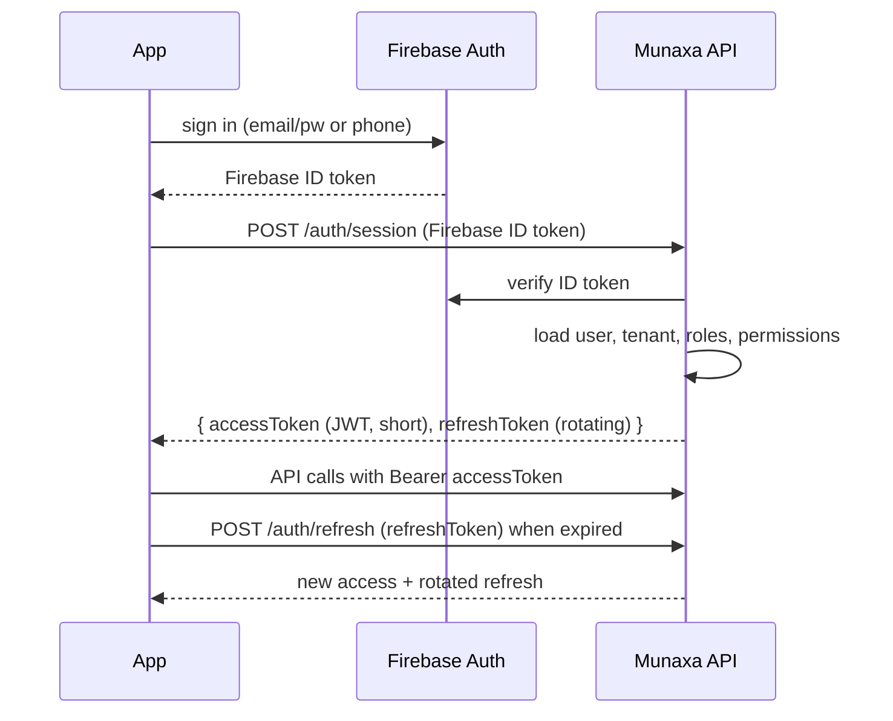

# 06 — API Architecture

## 1. Style & conventions

- **REST/JSON** over HTTPS, NestJS controllers, resource-oriented.
- **Versioned** via URI prefix: `/api/v1/...`. Breaking changes → `/api/v2`.
- **Plural nouns**, nested only one level deep; deeper relations via query filters.
- **Tenant is implicit** (from JWT) — never a path/body parameter for school users.
- Platform endpoints under `/api/v1/platform/...` (separate guards).

```text
GET    /api/v1/students?sectionId=...&page=1&pageSize=25
POST   /api/v1/students
GET    /api/v1/students/{id}
PATCH  /api/v1/students/{id}
DELETE /api/v1/students/{id}            # soft delete
POST   /api/v1/attendance/sessions/{id}/mark
GET    /api/v1/platform/tenants
```

## 2. Request/response standards

- **Validation**: every request body/query uses a DTO with `class-validator` (+ shared zod schemas
  in `packages/contracts`). Unknown fields rejected (`whitelist + forbidNonWhitelisted`).
- **Pagination**: cursor or page/pageSize; responses include `{ data, meta: { page, pageSize, total } }`.
- **Filtering/sorting**: explicit allow-listed fields only (no arbitrary query → SQL).
- **Idempotency**: mutating endpoints accept `Idempotency-Key`; server stores result keyed by
  `(tenantId, key)` to make mobile retries safe.
- **Localization**: `Accept-Language: ar|en` controls localized server messages.

## 3. Error model (RFC 7807-style)

```jsonc
{
  "type": "https://munaxa.app/errors/validation",
  "title": "Validation failed",
  "status": 422,
  "code": "VALIDATION_ERROR",
  "detail": "nationalId is not a valid Jordanian National ID",
  "errors": [{ "field": "nationalId", "message": "..." }],
  "traceId": "..."          // correlates to Sentry
}
```

| Status | Use |
|--------|-----|
| 400 | Malformed request |
| 401 | Missing/invalid token |
| 403 | Authenticated but not permitted (RBAC / tenant) |
| 404 | Not found *or* hidden cross-tenant resource |
| 409 | Conflict (duplicate, version) |
| 422 | Validation error |
| 429 | Rate limited |
| 5xx | Server error (logged to Sentry, generic message to client) |

> **Cross-tenant resources return 404, not 403**, to avoid leaking existence.

## 4. Auth flow (high level — detailed in doc 09 & Phase 3)



- Access token: short-lived JWT (~15 min) with claims `sub, tenantId|platform, roles, perms, ver`.
- Refresh token: long-lived, **rotating**, stored hashed server-side, revocable; reuse detection.
- First-login forces password change (`mustChangePassword`).

## 5. Documentation & contracts

- **Swagger/OpenAPI** auto-generated from controllers + DTO decorators at `/api/docs`.
- OpenAPI JSON is emitted as a build artifact and consumed by:
  - Admin Portal (typed client / react-query hooks),
  - Flutter (Dart client codegen).
- `packages/contracts` is the TS source of truth shared between API and Admin.

## 6. Cross-cutting middleware/interceptor order

```
RequestId → Helmet/Security headers → CORS → RateLimit → BodyParser+Validation
→ Auth → TenantResolution → Permissions → (Controller) → Audit interceptor
→ Response serializer → Error filter → Sentry
```

## 7. Rate limiting & abuse

- Global + per-route limits via Redis token bucket (e.g., auth endpoints stricter).
- Per-tenant and per-IP buckets; `429` with `Retry-After`.
- Sensitive flows (login, password reset, receipt upload) get tighter limits + audit.

## 8. File handling

- Uploads (receipts, documents, homework attachments) use **S3 pre-signed URLs**: client uploads
  directly to S3; API only issues/validates the signed URL and records metadata.
- Content-type and size validated; AV scan hook before marking a file "available" (see doc 09).
