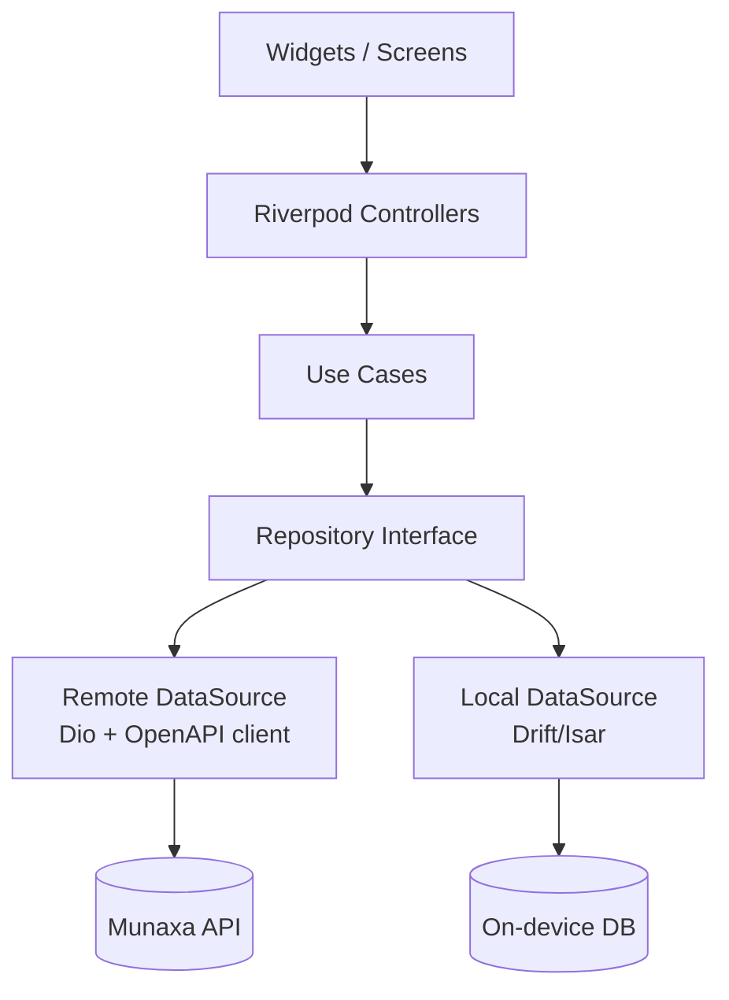
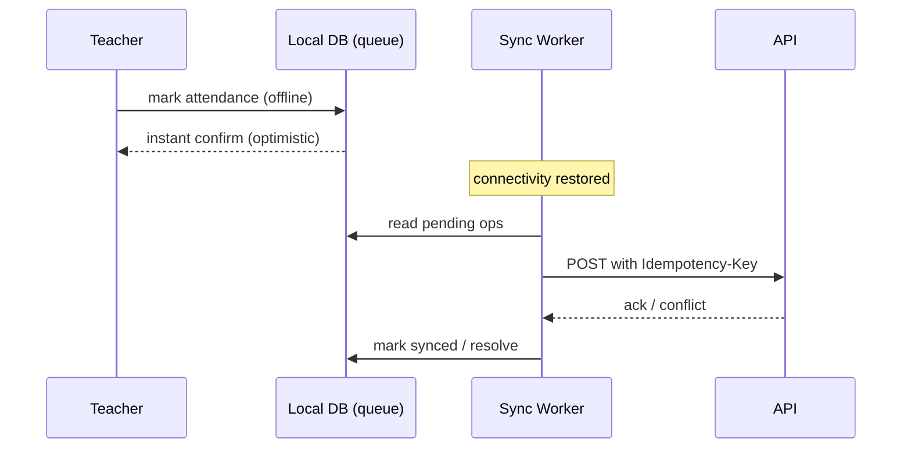

# 07 — Mobile Architecture (Flutter)

## 1. Apps & flavors

Three audiences, one codebase with **build flavors** sharing a common core:

| Flavor | Audience | Highlights |
|--------|----------|-----------|
| `parent` | Parents | Multi-child switcher, attendance/academic view, receipts, requests, comms |
| `student` | Students | Dashboard, homework, timetable, resources, gamification/streaks |
| `teacher` | Teachers | Current-class, attendance (offline), homework, behavior, comms |

Stack: **Flutter** · **Riverpod** (state) · **GoRouter** (navigation) · Dio (HTTP) · Drift/Isar
(local DB) · Firebase Auth + FCM.

## 2. Layered structure (mirrors Clean Architecture)

```text
lib/
├── core/            # config, theme, i18n (ar/en + RTL), error handling, network
├── data/            # DTOs, API clients (codegen from OpenAPI), local DB, repositories impl
├── domain/          # entities, repository interfaces, use cases
├── features/<f>/    # presentation: screens, widgets, Riverpod providers/controllers
└── flavors/         # parent / student / teacher entry points + DI overrides
```



## 3. Offline-first (mandatory for attendance — Phase 7)



- **Write-ahead queue**: actions persisted locally first, then synced.
- **Idempotency keys** per queued op → safe retries, no duplicates.
- **Background sync** via `workmanager`/background fetch on reconnect.
- **Conflict policy**: last-write-wins for simple fields; server authoritative for derived state;
  attendance edits keep an audit trail.
- Read models cached locally with TTL; stale-while-revalidate UX.

## 4. Localization & theming

- Full **AR/EN** with **RTL/LTR** mirroring; locale persisted, follows device by default.
- Design tokens from the Munaxa Design System (violet `#7A3FFF`, coral `#FF8E6E`, aqua `#4DF4E1`,
  dark surfaces) shared via the `packages/i18n` catalogs and a Flutter theme mirror.
- Numerals: Eastern/Western Arabic numerals per locale; Hijri/Gregorian dates where relevant
  (Ramadan mode in Phase 6).

## 5. Auth & security on device

- Firebase Auth for sign-in; Munaxa JWT + refresh stored in **secure storage** (Keychain/Keystore).
- Biometric unlock optional; tokens never in plain prefs.
- Certificate pinning for API; jailbreak/root awareness (warn, not block).
- Push via **FCM**; deep links open relevant screens or external LMS (Classroom/Teams).

## 6. Navigation

- **GoRouter** with declarative, role/flavor-aware routes and guarded redirects (auth, first-login
  password change, child selection for parents).
- Deep-link routes for notifications and LMS hand-off.

## 7. Quality

- Widget + unit tests (Riverpod overrides), golden tests for RTL/LTR, integration tests for the
  offline attendance flow. CI runs `flutter analyze` + tests as a separate pipeline job.

## 8. Implementation status

### Shipped
- **Three flavors** wired via `lib/main_{parent,student,teacher}.dart` → `bootstrap()` →
  `AppConfig` (flavor, app name, `API_URL`).
- **Auth-guarded routing** (`core/router/app_router.dart`, `routerProvider`): a `ChangeNotifier`
  bridges the Riverpod `authControllerProvider` to GoRouter's `refreshListenable`, and `redirect`
  resolves the destination:
  `AuthUnknown → /splash`, `AuthUnauthenticated → /login`,
  `mustChangePassword → /change-password`, `AuthAuthenticated → /` (the flavor home).
- **Session lifecycle**: `MunaxaApp` restores the persisted session after first frame
  (`AuthController.restore()` → `GET /auth/me`); tokens live in `flutter_secure_storage`.
- **Transparent token refresh**: the Dio `QueuedInterceptorsWrapper` attaches the bearer token and,
  on a `401` (non-auth route), refreshes via a bare client, persists the rotated pair, and replays
  the original request once — single-flight via the queued interceptor. Refresh failure clears
  storage and returns the app to `/login`.
- **Login** uses the API's `identifier` field (email **or** username — see ADR 15), with an
  optional school slug; a **first-login password change** screen gates the temporary password.
- **Flavor home dashboards** (read models from the existing `data/*` API clients):
  - Parent — bottom-nav shell (Home · Grades · Requests · Meetings · Documents) with a shared
    app-bar child switcher: per-child dashboard, **grade report** (overall % + per-subject
    averages), submit/cancel **leave & absence** requests, book/cancel **PTM** slots, and a
    **document vault** (open externally + upload from device via `file_picker` → presign → PUT →
    confirm).
  - Student — bottom-nav shell (Home · Timetable · Homework · Resources · Grades): gamification
    (points/level/streak) + attendance dashboard, day-grouped timetable, due-date homework list,
    learning resources that open externally (`url_launcher`), and the student's own **grade report**.
  - Teacher — bottom-nav shell (Class · Notifications · Account). **Class** is the offline-first
    attendance capture: section/date/period pickers, roster with P/L/A/E segments, "mark all
    present", and Save → `AttendanceController.markMany` (write-ahead queue → idempotent
    `/attendance/students/bulk`, auto-synced on reconnect, with a pending-sync banner + manual
    "Sync now"). Section/roster reads use `GET /sections` and `GET /students?sectionId=`, now
    granted to `attendance:create` holders (RequireAnyPermission alongside the manage permissions).
- **Push (FCM)**: `core/push/PushService` initializes Firebase at startup, registers the device
  token with `POST /notifications/devices` once authenticated (and on token refresh), and routes
  notification taps to in-app destinations via the `route` data payload → `GoRouter.go`. No-op safe:
  if Firebase isn't configured for the build, init fails gracefully and push becomes inert so the
  app still runs in dev/CI.
- **Locale (AR/EN + RTL)**: `localeProvider` (persisted) drives `MaterialApp.locale`; a
  `LocaleToggleButton` on the login screen and every shell flips English↔Arabic, switching the whole
  app to RTL. Logical/directional layout (`AlignmentDirectional`, start/end paddings) mirrors
  automatically.
- **Tests**: `test/smoke_test.dart` boots with an empty-token override and asserts the sign-in
  screen; `test/rtl_test.dart` pins the locale to Arabic and asserts the ambient
  `Directionality` is RTL.

### Not yet wired (tracked for later phases)
- Drift-backed read caches / stale-while-revalidate (the attendance & presence queues already exist).
- Firebase Auth sign-in, biometric unlock, certificate pinning; Firebase project config files
  (`google-services.json` / `GoogleService-Info.plist`) must be supplied to activate push.
- **String translations**: a lightweight bilingual catalog (`l10n/strings.dart`, `stringsProvider`
  keyed off `localeProvider`) now covers all user-facing copy across the three flavors — chrome
  (tab titles, nav labels, sign-out, language toggle), auth (login + change-password), dashboard
  metric labels, list empty-states, and the request/meeting/document/attendance forms — plus the
  shared `AsyncSection` (load-error/retry). A move to gen-l10n/ARB can come later; the provider API
  keeps call sites stable. (Server-sourced values — student names, statuses, category codes — are
  passed through as-is.)
- **Locale-aware dates & numerals** (`l10n/formats.dart`, `formatsProvider`): in Arabic, dates use
  Arabic month names + Eastern Arabic-Indic digits and numbers/percentages use locale digits (CLDR
  `ar`), via `intl`'s `DateFormat`/`NumberFormat` (date symbols initialized in `bootstrap`). Applied
  to leave-request dates, homework due dates, the attendance date picker, and grade percentages.
  Display-only — API payloads stay ISO/Western (e.g. leave submission still sends `YYYY-MM-DD`).
- Pixel **golden** baselines (need a machine with the Flutter SDK to capture) — current RTL coverage
  is an assertion test (`test/rtl_test.dart`).
- Cross-tenant **Account/Membership** school switcher (see
  `15-identity-and-cross-tenant-membership.md`) — lands with the parent multi-school experience.
