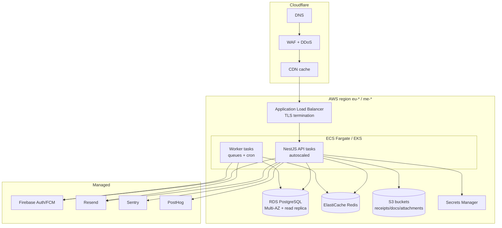
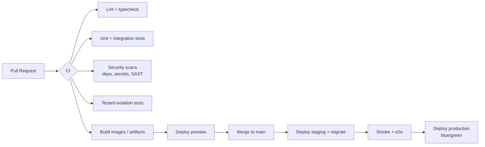

# 08 — Deployment Architecture

## 1. Topology (Cloudflare edge + AWS origin)

- **Admin Portal (Next.js 15)**: deployed to Cloudflare (Pages/Workers) or AWS (Amplify/container)
  — Cloudflare preferred for edge + static; SSR/route handlers proxy to the API.
- **Mobile**: distributed via App Store / Google Play; talks to API through Cloudflare.
- **Region**: chosen for Jordan latency/data-residency (EU or ME region); single primary region
  with cross-region backups (see doc 11/12).

## 2. Environments

| Env | Purpose | Data |
|-----|---------|------|
| `local` | Developer machines | Docker Compose (Postgres, Redis, mailhog, localstack S3) |
| `preview` | Per-PR ephemeral | Seeded throwaway DB |
| `staging` | Pre-prod, mirrors prod | Anonymized/synthetic data |
| `production` | Live | Real data, restricted access |

Config strictly via **environment variables** + **AWS Secrets Manager**; nothing secret in code or
images. `.env.example` files document required vars (Phase 1).

## 3. CI/CD

- **GitHub Actions** pipelines (Phase 1).
- DB migrations run as a **gated step** (staging first, then prod) with backup-before-migrate.
- **Blue/green or rolling** deploy with health-check gating and automatic rollback.
- Flutter has its own jobs (analyze, test, build) and store release lanes (fastlane).

## 4. Containerization

- Multi-stage Dockerfiles (small runtime images, non-root user, read-only FS where possible).
- API and Worker share an image, differ by entrypoint/command.
- Compose for local; ECS/EKS task defs for cloud (Phase 1 scaffolds, Phase 15 hardens).

## 5. Scaling & availability

- API/Worker autoscale on CPU/RPS/queue depth.
- RDS Multi-AZ; read replica for reporting-heavy queries.
- Redis for cache, rate limiting, sessions/idempotency, and the job queue.
- Stateless API tasks → horizontal scale; sticky state only in Postgres/Redis/S3.

## 6. Observability in deployment

- Sentry releases tagged per deploy (source maps uploaded).
- Health endpoints `/health/live`, `/health/ready` (DB, Redis, S3 checks) for LB + orchestration.
- Centralized structured logs; PostHog for product analytics; metrics/alerts (Phase 15).
