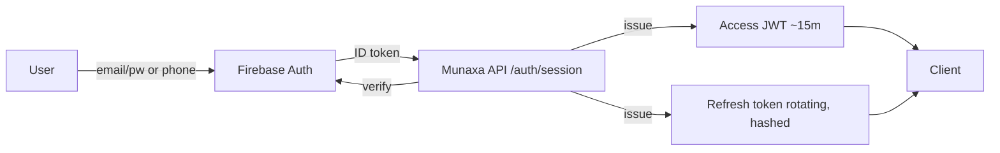
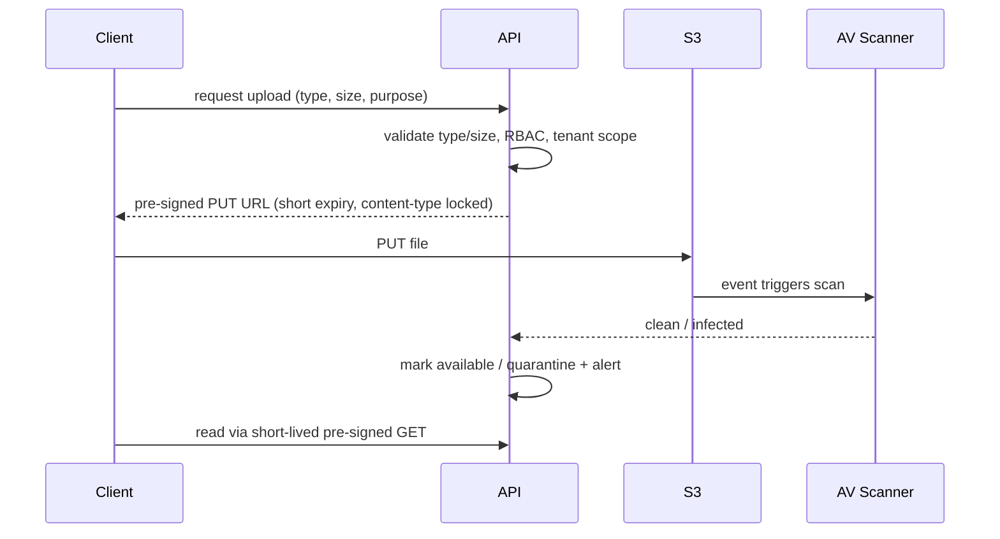

# 09 — Security Architecture

Security is a first-class, cross-cutting concern. This document maps Munaxa's controls to the
**OWASP Top 10** and details authN/Z, secrets, and secure file handling.

## 1. OWASP Top 10 (2021) coverage

| Risk | Controls in Munaxa |
|------|--------------------|
| A01 Broken Access Control | Strict RBAC (doc 05), 4-layer tenant isolation + RLS (doc 03), 404 on cross-tenant, scoped (🔸) row filters, automated isolation tests in CI |
| A02 Cryptographic Failures | TLS everywhere (Cloudflare + ALB), tokens hashed at rest, secrets in Secrets Manager, no sensitive data in logs, S3 SSE encryption, Decimal for money |
| A03 Injection | Prisma parameterized queries (no raw string SQL), DTO + zod validation, allow-listed filters/sorts, output encoding in Admin |
| A04 Insecure Design | DDD + Clean Architecture, threat-modeled flows, idempotency, least-privilege roles, secure defaults (advanced modules off) |
| A05 Security Misconfiguration | Helmet security headers, locked-down CORS, non-root containers, env-only config, hardened CSP for Admin |
| A06 Vulnerable Components | Dependency scanning (Dependabot/`pnpm audit`), pinned versions, SBOM, regular updates |
| A07 Identification & Auth Failures | Firebase Auth, short-lived JWT, rotating refresh tokens + reuse detection, lockout/rate limit on auth, forced first-login password change, optional MFA |
| A08 Software & Data Integrity | Signed/locked dependencies, CI provenance, idempotent migrations, audit log integrity (append-only) |
| A09 Logging & Monitoring Failures | Structured audit logs (doc 10), Sentry, security event alerts, login/permission-deny logging |
| A10 SSRF | No user-controlled outbound URLs to internal services; egress allow-list; S3/Firebase via SDKs; LMS links are client-side deep links only |

## 2. Authentication

- **Access JWT**: short TTL; claims `sub, tenantId|platform, roles, perms, tokenVersion`. Signed
  with rotating keys (kid in header). Stateless verification.
- **Refresh tokens**: long TTL, **rotated on every use**, stored only as a hash; **reuse detection**
  revokes the whole family; revocable on logout/role change (`tokenVersion` bump invalidates access).
- **Password policy**: complexity + breach check; **forced change on first login**; secure reset via
  email (Resend) with single-use, expiring token.
- **MFA**: supported via Firebase for privileged/platform roles (recommended mandatory for Platform).

## 3. Authorization
- Two planes (Platform / School), strict RBAC + scoped row access — see doc 05.
- Tenant isolation — see doc 03. Every privileged/cross-tenant action is audited.

## 4. Secrets management
- **Never hardcoded.** Sourced from env vars (local) and **AWS Secrets Manager** (cloud).
- Rotation policy for DB creds, JWT signing keys, third-party API keys.
- CI uses encrypted secrets; **secret scanning** blocks commits with leaked credentials.
- `.env.example` documents names only — no values.

## 5. Transport & network
- TLS 1.2+ end to end; HSTS; Cloudflare WAF + DDoS protection in front.
- CORS restricted to known Admin/mobile origins; no wildcard with credentials.
- Private subnets for RDS/Redis; API in private compute behind ALB; egress allow-list.

## 6. Input validation & output safety
- DTO validation (class-validator) + shared zod schemas; reject unknown fields.
- Jordan-specific validators: **National ID (Raqam Watani)** checksum, **MoE student number**,
  CliQ reference format, phone formats.
- Admin: React auto-escaping + strict CSP; sanitize any rich text.

## 7. Secure file uploads (receipts, documents, attachments)

- Direct-to-S3 via **pre-signed URLs**; size/content-type enforced; randomized keys scoped by tenant.
- **AV scanning** before a file is marked available; infected → quarantine + audit + notify.
- Downloads via short-lived pre-signed GET; no public buckets; SSE encryption at rest.
- Strip metadata where appropriate; never trust client-provided filenames for storage paths.

## 8. Rate limiting & abuse (also doc 06)
- Redis-backed limits, stricter on auth/reset/upload; per-IP + per-tenant; `429` + `Retry-After`.
- Bot/DDoS handled at Cloudflare edge.

## 9. Privacy & data handling
- Minors' data (students) — data minimization, access strictly scoped, retention + purge policy.
- Audit access to sensitive records; export/delete workflows for offboarding (doc 11/03).
- PII redaction in logs and Sentry (scrubbing).

## 10. Production hardening — implementation status (Phase 15)

### Shipped
- **Password KDF — scrypt** (`auth/services/password.service.ts`): Node's built-in scrypt
  (memory-hard; N=2^15, r=8, p=1; 16-byte salt; timing-safe compare), stored as
  `scrypt:N:r:p:salt:key`. Legacy bcrypt hashes still verify and are **transparently re-hashed on
  the next successful login** (`needsRehash` + in-transaction upgrade in `AuthService.login`).
- **Per-account lockout**: 5 failed logins within 15 minutes (counted from the committed audit
  trail since the last success) → `403` even with the correct password, audited as
  `auth.login.locked`. Complements the per-IP throttle (20/min on `/auth/login`).
- **Env guards**: `JWT_ACCESS_SECRET`/`JWT_REFRESH_SECRET` are **required and must differ** when
  `NODE_ENV=production` (fail-fast at boot, zod `superRefine`).
- **Breach-list check (HIBP k-anonymity)** on password change/reset: only the first 5 SHA-1 chars
  leave the server; fail-open on network errors; enabled with `PASSWORD_BREACH_CHECK=1`
  (recommended in production).
- **API runtime**: helmet, CORS allowlist from `CORS_ORIGINS`, compression, `trust proxy`,
  global validation (`whitelist`+`forbidNonWhitelisted`), shutdown hooks, Swagger disabled in
  production.
- **Admin runtime**: Next.js `output: 'standalone'` (slim, self-contained image); production-only
  **CSP** (blocks external script injection; `connect-src` pinned to the API origin + Sentry) and
  **HSTS**, alongside nosniff/frame-deny/referrer/permissions headers.
- **Containers**: both Dockerfiles are multi-stage, run as **non-root**, and define HEALTHCHECKs;
  the admin image now ships only the standalone server output.
- **Delivery**: `deploy.yml` builds and pushes both images to **GHCR** (sha + latest tags, GHA
  layer cache), then runs `prisma migrate deploy` + re-applies the NOBYPASSRLS app-role grants —
  gated per GitHub environment via the `DIRECT_DATABASE_URL` secret (skips with a warning when
  unset). The final rollout step stays explicitly unbound until the hosting target is chosen.

### Still open (tracked)
- JWT **signing-key rotation** (kid) and `tokenVersion` claim; MFA enforcement for platform roles.
  (Access tokens stay valid ≤15 min after suspension; refresh families are already revoked
  immediately on password change/suspend — accepted trade-off to keep verification stateless.)
- CSP **nonce** plumbing (currently `unsafe-inline` for Next hydration); Redis-backed distributed
  rate limiting; Cloudflare edge rules.
- ClamAV scanning on uploads; mobile cert pinning + biometric unlock.
