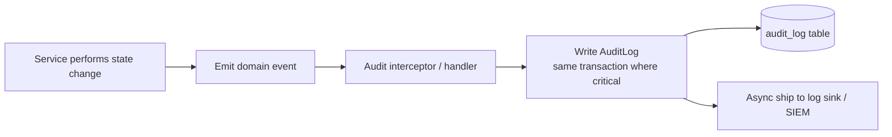

# 10 — Audit Logging Strategy

## 1. Goals
Provide a tamper-evident, queryable record of **who did what, when, to which entity, in which
tenant** — for security forensics, compliance, support, and dispute resolution (especially finance).

## 2. What is audited

| Category | Examples | Required |
|----------|----------|----------|
| AuthN/Z | login success/failure, logout, refresh reuse, password change/reset, permission denies | ✅ |
| Tenant/platform | tenant create/suspend/archive, **support impersonation (start/stop)**, cross-tenant access | ✅ |
| People | create/update/delete of Student/Parent/Teacher/Employee, parent-student linking | ✅ |
| Structure | school/campus/year/grade/section/classroom changes | ✅ |
| **Finance (all)** | fee plan, charge, transaction, **receipt upload/verify/reject**, balance adjustments | ✅ (mandated) |
| Attendance | edits/overrides to attendance records (not every normal mark, but corrections) | ✅ |
| Academics | grade imports, behavior log changes | ✅ |
| Config | role/permission changes, feature flag toggles | ✅ |
| Data access | reads of sensitive records by platform/support | ✅ |

> Phase 9 mandates: **all financial actions must generate audit logs.** Phase 3 onward: all
> auth and privileged actions.

## 3. AuditLog record (shape)

```jsonc
{
  "id": "uuid",
  "tenantId": "uuid|null",        // null only for platform-level events
  "actorUserId": "uuid",
  "actorRole": "FinanceOfficer",
  "onBehalfOf": "uuid|null",      // set for support impersonation
  "action": "transaction.create", // resource.action
  "entityType": "Transaction",
  "entityId": "uuid",
  "before": { },                   // prior state (for updates/deletes)
  "after": { },                    // new state
  "metadata": { "amount": "150.000", "currency": "JOD" },
  "ip": "x.x.x.x",
  "userAgent": "...",
  "traceId": "...",               // correlates to Sentry/request
  "createdAt": "timestamptz"
}
```

- PII in `before/after` is **scrubbed/minimized**; store references, not secrets.
- `tenantId` indexed; `(tenantId, entityType, entityId)` and `(tenantId, createdAt)` indexed.

## 4. How it's captured



- **Interceptor + domain events**: write-path operations emit audit entries automatically.
- **Critical (finance, auth, tenancy)**: audit row written **in the same DB transaction** as the
  change, so the action and its audit succeed or fail together.
- Non-critical reads logged asynchronously.

## 5. Integrity & retention
- **Append-only**: no update/delete on `audit_log` via the app; DB role lacks UPDATE/DELETE on it.
- Optional **hash chaining** (each row stores hash of previous) for tamper evidence.
- Mirrored to an external, immutable sink (e.g., S3 object-lock / SIEM) for defense in depth.
- **Retention**: ≥ 1 year hot in DB, ≥ 7 years cold for financial records (configurable per market
  regulation). Purges themselves are audited.

## 6. Access
- `audit:read` permission; SchoolAdmin sees own tenant's logs; FinanceOfficer sees finance subset;
  Platform sees platform plane. Every audit-log export is itself audited.
