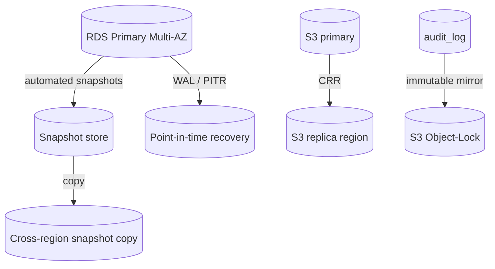

# 11 — Backup Strategy

## 1. Objectives

| Metric | Target |
|--------|--------|
| **RPO** (max data loss) | ≤ 15 minutes |
| **RTO** (max downtime) | ≤ 2 hours |
| Backup retention (DB daily) | 35 days |
| Backup retention (financial/audit) | ≥ 7 years (cold) |
| Restore test cadence | Quarterly (documented) |

## 2. What is backed up

| Asset | Method | Frequency | Retention |
|-------|--------|-----------|-----------|
| PostgreSQL (RDS) | Automated snapshots + **PITR** (WAL) | Continuous WAL, daily snapshot | 35 days PITR; monthly snapshot 12 mo |
| S3 (receipts/docs/attachments) | **Versioning** + cross-region replication | Continuous | Versioned; lifecycle to cold storage |
| Audit logs | In-DB + immutable S3 (object-lock) mirror | Continuous | ≥ 7 years |
| Secrets/config | Secrets Manager (versioned) + IaC in git | On change | Versioned |
| Infra definitions | Terraform in git | On change | Full history |

## 3. Topology

- **Multi-AZ** primary provides HA within region; **cross-region snapshot copies** + **S3 CRR**
  provide geographic durability for DR (doc 12).
- Backups **encrypted at rest** (KMS); access tightly controlled and audited.

## 4. Tenancy considerations
- Shared DB → backups are platform-wide. **Per-tenant logical export** (data subset by `tenantId`)
  is supported for: tenant offboarding, GDPR-style export, and targeted restore-into-staging.
- Tenant offboarding: export tenant data → deliver → purge → audit the purge.

## 5. Procedures (outline; runbooks finalized Phase 15)
- **Automated daily** snapshot + continuous WAL; alert on backup failure.
- **Restore drills** quarterly into an isolated account/region; verify integrity + RTO/RPO actuals.
- **Pre-migration backup**: every production DB migration is preceded by an on-demand snapshot.
- Backup/restore actions are logged and monitored (Sentry/alerts).

## 6. Validation
- Automated checksum/row-count validation post-snapshot where feasible.
- Restore test results recorded; failures are incidents.
