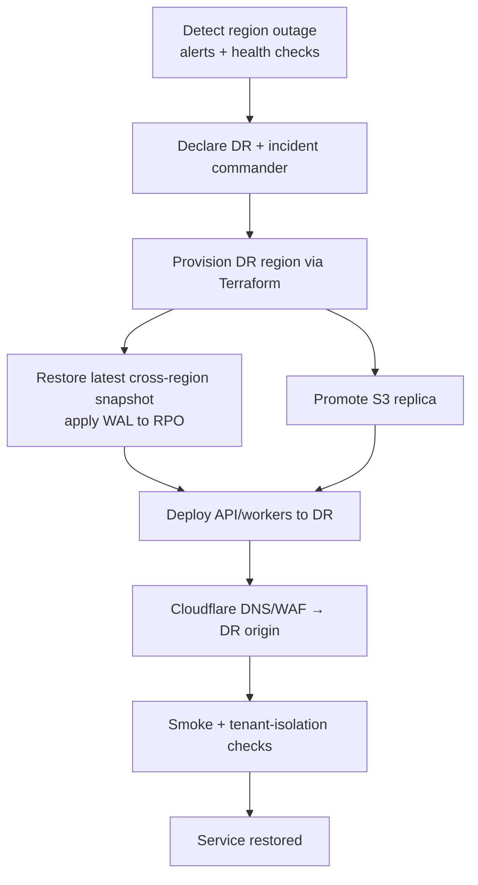

# 12 — Disaster Recovery Strategy

## 1. Scope & objectives
Recover Munaxa after events ranging from a single component failure to a full-region outage, while
preserving **tenant isolation** and meeting **RPO ≤ 15 min / RTO ≤ 2 h**.

## 2. Failure tiers & response

| Tier | Scenario | Mitigation | Recovery |
|------|----------|-----------|----------|
| T1 | Single API/worker task fails | Autoscaling + health checks | Auto-replace, no data loss |
| T2 | AZ failure | RDS Multi-AZ, multi-AZ compute | Automatic failover (minutes) |
| T3 | Data corruption / bad migration | PITR + pre-migration snapshot | Restore to point-in-time |
| T4 | Region outage | Cross-region snapshot copies + S3 CRR + IaC | Rebuild in DR region from backups |
| T5 | Accidental/malicious tenant data loss | Per-tenant logical export + PITR | Targeted tenant restore |
| T6 | Credential/secret compromise | Rotate secrets, revoke tokens (tokenVersion), audit | Containment + forensic review |

## 3. Region failover (T4) — high level

- **Cloudflare** sits in front, so failover is largely a DNS/origin switch once the DR origin is up.
- DR region pre-holds: latest snapshot copies, S3 replica, IaC, and secrets replication.

## 4. RPO/RTO budget

| Step | Target |
|------|--------|
| Detection + declaration | ≤ 15 min |
| Infra provisioning (IaC) | ≤ 45 min |
| DB restore + WAL apply | ≤ 45 min |
| Cutover + verification | ≤ 15 min |
| **Total RTO** | **≤ 2 h** |
| **RPO** | **≤ 15 min** (WAL/CRR) |

## 5. Roles & comms
- **Incident Commander**, **DB/Infra lead**, **Comms lead** named in the runbook.
- Internal comms channel + status page; tenant-facing notice templates (AR/EN).
- Escalation matrix and on-call rotation (finalized Phase 15).

## 6. Tenant-aware recovery
- All restores must preserve `tenantId` integrity and RLS policies; post-restore the CI
  **tenant-isolation test suite** is run before declaring "live".
- Single-tenant recovery (T5) restores into staging, extracts the tenant subset, re-imports —
  never overwriting other tenants.

## 7. Testing & maintenance
- **DR game day** at least annually; **restore drills** quarterly (doc 11).
- Runbooks versioned in `docs/runbooks/` (created in Phase 15) and reviewed after every drill.
- Backups, replication lag, and DR readiness monitored with alerts.
