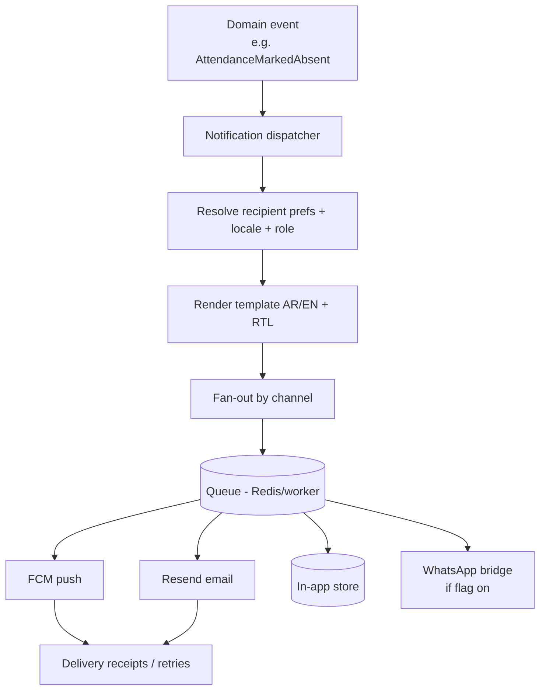

# 13 — Notification Architecture

## 1. Channels

| Channel | Provider | Use |
|---------|----------|-----|
| Push | **Firebase Cloud Messaging (FCM)** | Mobile alerts: attendance, announcements, finance reminders, requests |
| Email | **Resend** | Account/auth, receipts confirmations, digests, password reset |
| In-app | Munaxa (Notification Center) | Persistent feed across Admin + mobile |
| WhatsApp | **Bridge framework (feature-flagged)** | Optional per-tenant; off by default (Phase 10) |

## 2. Pipeline

- **Event-driven**: contexts emit domain events; the Communication context owns delivery.
- **Async via queue + workers** with retry/backoff and dead-letter handling.
- **Idempotent** sends keyed by `(event, recipient, channel)` to prevent duplicates.

## 3. Templating & localization
- Templates are versioned, **bilingual (AR/EN)** with RTL/LTR, parameterized.
- Locale resolved per recipient; numerals/dates localized (Hijri where relevant).
- Channel-appropriate rendering (push: short; email: rich; in-app: structured).

## 4. Preferences & consent
- Per-user, per-category notification preferences (e.g., attendance, finance, announcements).
- Quiet hours and digest options; transactional/critical (security, finance overdue) may override
  marketing-style opt-outs per policy.
- WhatsApp requires explicit tenant enablement (feature flag) + recipient consent.

## 5. Targeting & tenancy
- Audiences resolved within tenant scope and RBAC (e.g., "all parents of Section A", "all
  FinanceOfficers"). Cross-tenant fan-out is impossible by construction.
- Platform-level notices (maintenance) go through the platform plane, audited.

## 6. Device & token management
- FCM device tokens stored per user/device, refreshed on rotation, pruned on invalidation.
- Multi-device supported; logout/role change can revoke push targeting.

## 7. Reliability & observability
- Delivery status tracked (queued/sent/delivered/failed); failures retried then dead-lettered.
- Metrics + Sentry on dispatcher/worker; high-value sends (finance) audited.
- Notification Center provides read/unread state and history as the source of truth in-app.

## 8. Feature flags (Phase 10/14)
- WhatsApp bridge and any new channel are **flag-gated, off by default**, per-tenant toggleable.
