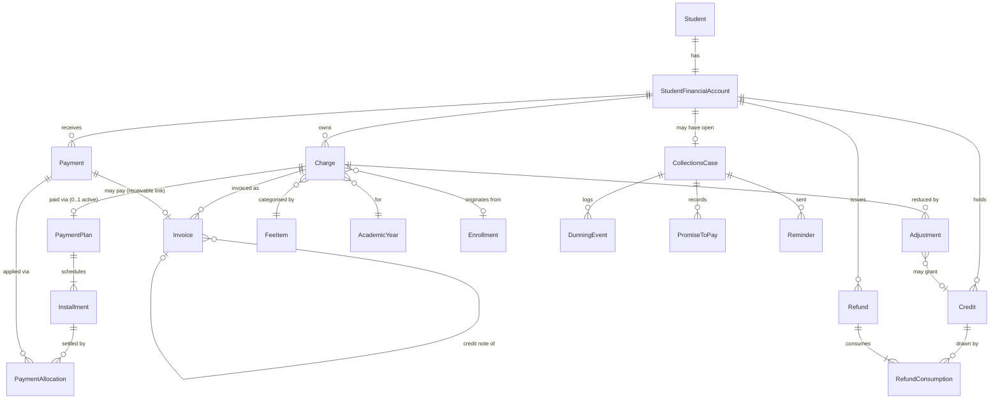

# Munaxa Finance Domain — Enterprise Accounts Receivable Redesign

> **Status:** Architecture proposal (design only — no code changes in this document).
> **Scope:** Redesign the existing Finance domain into a true, DDD-based Accounts
> Receivable (AR) engine for large private schools, while keeping the current system
> operational and preserving all existing data, invoices, collections and reports.
> **Author:** Finance/ERP architecture review.
> **Decimal policy preserved everywhere:** `Decimal(12,3)` (JOD fils precision).

This document is deliberately delivered **before** any implementation, in the exact
order requested:

1. Current Architecture Review
2. Problems Found
3. Enterprise Gap Analysis
4. Proposed Domain Model
5. DDD Bounded Contexts
6. New Entity Relationship Diagram
7. Aggregate Design
8. Database Redesign
9. Ledger Redesign
10. Payment Engine Redesign
11. Installment Engine Redesign
12. Collections Redesign
13. Statement Engine Redesign
14. JoFotara Integration Review
15. Reporting Architecture
16. Admin UI Redesign
17. Parent UI Redesign
18. API Evolution Strategy
19. Data Migration Strategy
20. Backward Compatibility Strategy
21. Risk Analysis
22. Implementation Roadmap

---

## 1. Current Architecture Review

### 1.1 Where the code lives

```
apps/api/src/finance/
  fee-plans/        FeePlan CRUD (legacy generic "amount + recurrence")
  charges/          Charge + installment engine (createInstallments/payInstallment)
  transactions/     Payments (receipt upload → verify/reject, gapless receiptNo)
  ledger/           BillingRepository (derived balances) + LedgerService
                    (adjustments, allocations, refunds)
  statement/        StudentStatement assembly
  collections/      Collections tagging, reminders, aging, transport suspension
  fee-config/       GradeFeeSchedule, TransportFare, DiscountRule, BillingPolicy
  enrollment/       Quote endpoint (thin)
  admissions/       Quote persistence + atomic registration commit
apps/api/src/einvoicing/
  finance-bridge.*  Charge → JoFotara invoice / 381 credit note
  jofotara/         UBL builder + provider
apps/admin/src/app/(app)/finance/*            Admin finance pages
apps/admin/.../students/[studentId]/tabs/finance-tab.tsx   Student finance (820 lines)
apps/mobile/lib/{data,features}/finance/*     Flutter parent statement + pay
prisma/schema.prisma                          All models (single schema, 3290 lines)
```

### 1.2 The current domain model (as built)

The finance schema today is organised around **Charge** as the universal financial
primitive. Every obligation, every installment, and every invoice source is a `Charge`.

| Concern | Model(s) | Notes |
|---|---|---|
| "What the school charges" | `FeePlan` (legacy), `GradeFeeSchedule`, `FeeItem` + `GradeFeeItem`, `TransportFare` | **Three overlapping catalogs** built in different phases. |
| Discount policy | `DiscountRule`, `BillingPolicy` | Rules resolved to `FeeAdjustment` rows on apply. |
| Financial obligation | `Charge` | `amount`, `dueDate`, `status`, optional `feePlanId`, optional `installmentPlanId`. |
| Payment plan | *(none — a nullable `Charge.installmentPlanId` UUID group)* | No table, no FK, no row. |
| Installment | `Charge` (with `installmentPlanId` set) | **Installments are Charges.** |
| Payment | `Transaction` | Receipt upload → `PENDING` → `VERIFIED`/`REJECTED`; gapless `receiptNo`. |
| Allocation | `PaymentAllocation` | Applies a verified `Transaction` to a **Charge** (not an installment). |
| Adjustments | `FeeAdjustment` | Scholarship / discount / sibling / staff / waiver / credit-memo / correction. |
| Credit | `FeeAdjustment` with `chargeId = null` (`CREDIT_MEMO`) | No dedicated credit ledger; credit is a derived aggregate. |
| Refund | `Refund` | Draws against derived `creditBalance`; same verify workflow. |
| Invoice | `EInvoiceDocument` | One per `Charge` (or per `Transaction`); JoFotara UBL. |
| Collections | `StudentBillingProfile`, `PaymentReminder` | Tag NONE/FINANCIAL_ISSUE/LEGAL; reminders; aging computed from charge `dueDate`. |
| Enrollment | `EnrollmentQuote`+`Item`, `Enrollment`, `FeeModification(+Approval)`, `FinancialArrangement`, `RegistrationCommitment` | Commit creates Student+Parent+Enrollment+Charges atomically. |

### 1.3 How balances are computed (a genuine strength)

`BillingRepository` computes **everything from child rows** — there are no stored
balances to drift (`billing.repository.ts`):

- **Per charge:** `gross = charge.amount`, `discount = Σ APPLIED FeeAdjustment`,
  `net = gross − discount`, `allocated = Σ active PaymentAllocation`,
  `balance = net − allocated`.
- **Charge status** is recomputed on every adjustment/allocation
  (`recomputeCharge`): `WAIVED` if net ≤ 0, `PAID` if allocated ≥ net, `PARTIAL`, else `PENDING`.
- **Account summary:** `outstanding = max(netCharged − paid − accountCredits, 0)`,
  `creditBalance = max(paid + accountCredits − netCharged, 0) − refunded`.

This "recompute, never denormalise" discipline is the single best property of the
current system and **must be preserved** in the redesign.

### 1.4 The installment engine (as built)

`ChargeService.createInstallments` splits a total into `N` monthly `Charge` rows sharing
a generated `installmentPlanId`, dividing in **fils** so the parts always sum to the exact
total (last installment absorbs the remainder). `getInstallmentPlan` reads those charges
back as a schedule; `payInstallment` records a payment against one installment-charge and
prepays any surplus onto the **latest** unpaid installments. Only **monthly, equal-split**
is supported (`addMonths`). `admissions.repository.ts` duplicates the same fils-splitting
logic at registration commit.

### 1.5 JoFotara bridge (as built)

`FinanceBridgeService` issues a JoFotara invoice **per Charge**
(`invoiceNumber = FEE-<chargeId>`), and a 381 credit note against the accepted invoice when
a charge is reduced. Auto-issue fires on **every** charge creation when the tenant enables it.

### 1.6 Multi-tenancy, RLS, audit (preserve as-is)

- Every tenant table carries `tenantId`; access goes through `withTenant`/`withPlatform`
  which set `app.tenant_id` / `app.is_platform`.
- RLS is **fail-closed** and `FORCE`d, covering the finance tables (`FeeAdjustment`,
  `PaymentAllocation`, `Refund`, `PaymentReminder`, `StudentBillingProfile`, e-invoicing).
- Every financial state change writes an `AuditLog` **inside the same transaction**
  (`writeAudit`). Receipt numbers and JoFotara ICV are gapless per-tenant counters.

These four properties (tenantId, RLS, in-transaction audit, gapless counters) are
non-negotiable invariants carried forward unchanged.

---

## 2. Problems Found

**P1 — Charge is overloaded (the core defect).** `Charge` simultaneously represents
(a) a financial **obligation** ("Annual Tuition = 3,000 JOD") and (b) a **scheduled
installment** ("Tuition 3/9"). When a plan is created, the single obligation is *destroyed*
and replaced by N installment-charges. There is no longer any row that says "the tuition
obligation is 3,000." This is a one-entity-many-responsibilities violation and the root
cause of most problems below.

**P2 — Payment Plan is not an entity.** It is a bare, nullable `Charge.installmentPlanId`
UUID with **no table, no foreign key, no lifecycle**. "One active plan per student" is
enforced by an application query, not the schema. Plans cannot carry terms (cadence, first
due, balloon, discount, status) because there is nowhere to put them.

**P3 — Installments are Charges → invoicing explodes.** Because each installment is a
`Charge`, and the JoFotara bridge auto-issues per charge, a 9-installment plan produces
**9 tax invoices** instead of **1 invoice for the tuition obligation**. This directly
violates the requirement "Invoices must always originate from Charges; Payment Plans must
never affect invoicing; Installments are payment schedules only."

**P4 — Allocations target Charges, not Installments.** `PaymentAllocation.chargeId` points
at a charge. In the target model, money settles **installments**. Today this only "works"
because installments happen to be charges.

**P5 — No Student Financial Account.** Everything is keyed directly by `studentId`. There
is no account entity to own currency, account status (active/closed/write-off), statement
identity, opening balance, or a household/payer relationship. "Future countries" needs a
currency and locale somewhere; there is nowhere.

**P6 — Two divergent balance truths.** Per-charge balance uses **allocations**
(`net − allocated`); the account summary uses **raw verified payment totals**
(`netCharged − Σpaid`). A verified-but-unallocated payment lowers account `outstanding`
while **no** charge shows progress — the two views can disagree. There is no single ledger
of record reconciling them.

**P7 — Fee catalog is fragmented (3×).** `FeePlan` (legacy generic), `GradeFeeSchedule`
(registration+tuition), and `FeeItem`/`GradeFeeItem` (admissions catalog) all answer "what
does the school charge?" with overlapping, effective-dated, partially-redundant data.

**P8 — No academic-year / period dimension on money.** `Charge` has no `academicYearId`,
`enrollmentId`, `campusId`, `gradeId`, or `feeItemId`. Reporting "by academic year / grade /
campus / category" is **impossible from the ledger** — those dimensions live on `Enrollment`,
which is not linked to the charges it created. This blocks half of the required reports.

**P9 — Credit is not a ledger.** "Credit" is a derived scalar (`creditBalance`) plus
`CREDIT_MEMO` adjustments. Refunds draw against an **aggregate**, not against specific,
traceable credit lots. There is no credit provenance (over-payment vs credit-note vs
scholarship-to-credit), no expiry, no "which credit funded which refund."

**P10 — Installment engine is monolithic and monthly-only.** No weekly/quarterly/custom,
no deferred first payment, holiday skipping, manual reschedule, balloon, or early-payoff.
The fils-splitting logic is **duplicated** in `charges` and `admissions`.

**P11 — Adjustments conflate distinct business events.** `FeeAdjustment` is scholarship,
discount, sibling discount, staff discount, waiver, credit memo, **and** correction — with
one shape. Scholarships (awards), discounts (pricing), waivers (write-offs) and corrections
(error fixes) have different approvals, GL treatment, and reporting.

**P12 — No currency / no i18n money.** Amounts are implicitly JOD; strings say "JOD".
"Support future countries" is unmet at the schema level.

**P13 — No double-entry / GL backbone.** There is no journal, no chart of accounts, no
period, no deferred-revenue recognition for annual tuition. Fine for a receipts tool; a gap
for an "enterprise AR engine for large private schools."

**P14 — Denormalised flag drift.** `StudentBillingProfile.feeModified` duplicates
`Enrollment.feeModified`; both can drift. `transportSuspended` is derived state persisted as
a flag (acceptable as a cache, but must have a single writer).

**P15 — Collections semantics ride on the installment-charge accident.** Aging/overdue is
computed from `Charge.dueDate` (`collections.service.ts`). Correct today only because
installments are charges; in the target model collections must operate on **Installments**.

---

## 3. Enterprise Gap Analysis

Measured against what a large private school's finance office (and its auditor) expects:

| # | Enterprise capability | Today | Target |
|---|---|---|---|
| G1 | First-class **AR account** per student/payer | ✗ | `StudentFinancialAccount` |
| G2 | Obligation vs schedule separation | ✗ (Charge = both) | `Charge` → `PaymentPlan` → `Installment` |
| G3 | Payment **allocation to installments** | ✗ (to charges) | `PaymentAllocation → Installment` |
| G4 | **Credit ledger** with lots & provenance | ✗ (scalar) | `Credit` entity, `Refund` consumes credits |
| G5 | **Period / academic-year** on every money row | ✗ | `academicYearId` (+ dims) on `Charge`/`Installment` |
| G6 | **Multi-currency** & rounding rules | ✗ | `currency` on account/charge; provider FX later |
| G7 | Dunning workflow: **promise-to-pay**, escalation, lawyer | partial (tag + reminders) | `CollectionsCase`, `PromiseToPay`, `DunningEvent` |
| G8 | **Deferred revenue / GL journal** (optional module) | ✗ | `JournalEntry`/`LedgerAccount` (Phase-gated) |
| G9 | **Write-off** as a first-class event | partial (`WAIVER`) | explicit `WriteOff` adjustment subtype + GL |
| G10 | **Invoice-per-obligation** (not per installment) | ✗ | `Invoice` sources from `Charge`, never `Installment` |
| G11 | Provider-agnostic e-invoicing (JoFotara + future) | partial | `EInvoiceProvider` port + adapters (JoFotara today) |
| G12 | Reporting dimensions (year/grade/campus/category/payer) | ✗ | dimensional read models / views |
| G13 | Idempotent, event-emitting domain | partial | domain events + outbox for reporting/invoicing |
| G14 | Reconciliation & statement-of-account correctness tests | ✗ | ledger-reconciliation test suite |

**Preserved strengths (do not regress):** recompute-not-denormalise balances; gapless
receipt/ICV counters; in-transaction audit; fail-closed RLS; `Decimal(12,3)`; the
best-effort JoFotara auto-issue that never blocks a finance action.

---

## 4. Proposed Domain Model

The target follows the requested chain exactly, with a **Financial Account** at the root:

```
StudentFinancialAccount
        │ 1
        │ N
     Charge                 ← the financial OBLIGATION (never split, never destroyed)
        │ 1                    (dimensions: academicYear, grade, campus, category/feeItem)
        │ 0..1
   PaymentPlan               ← HOW a charge may be paid (cadence/terms/status)
        │ 1
        │ N
   Installment               ← WHEN payment is expected (scheduled obligation, NOT a charge)
        ▲
        │ settled by
  PaymentAllocation ─────────┐
        ▲                    │
        │ N                  │
     Payment                 ← actual money RECEIVED (verify workflow, receiptNo)
        │
   ┌────┴─────────────────────────────┐
Adjustments   Credits    Refunds    Invoices
(Discount/    (credit    (consume   (tax docs;
 Scholarship/  lots)      credits)   from Charge only)
 Waiver/
 CreditMemo)
        │
   Audit Trail (every state change, in-transaction)
```

**Invariants of the model**

1. A **Charge** is immutable in amount once invoiced (reductions happen via Adjustment +
   credit note; never edit-in-place).
2. A **Charge** has **0..1 active PaymentPlan**. No plan ⇒ the charge is a single
   implicit "pay-in-full" obligation with one virtual installment (its own balance).
3. A **PaymentPlan** has **1..N Installments** whose amounts **sum to the charge net**
   (enforced in fils; the last installment carries the remainder).
4. **Installments are never Charges** and never produce invoices.
5. **Invoices originate only from Charges.** One tuition obligation ⇒ one invoice, no
   matter how many installments.
6. **Outstanding is always derived**, never stored.
7. **Credits** are their own asset lots; **Refunds** consume specific credit lots (FIFO),
   preserving provenance.

**Separation of concepts (never combined again):**

| Concept | Entity | Answers |
|---|---|---|
| Fee Plan (pricing) | `FeeItem`/`GradeFeeItem` (canonical catalog) | *What* the school charges |
| Payment Plan | `PaymentPlan` | *How* the school allows payment |
| Installment | `Installment` | *When* payment is expected |
| Payment | `Payment` | Money *received* |
| Allocation | `PaymentAllocation` | *Application* of money to an installment |
| Invoice | `Invoice` (`EInvoiceDocument`) | The *tax document* |

---

## 5. DDD Bounded Contexts

Seven contexts, each with its own ubiquitous language, aggregates and anti-corruption
boundary. They map cleanly onto the existing NestJS module structure so we **refactor in
place** rather than rebuild.

```
┌──────────────────────────────────────────────────────────────────────────┐
│ Pricing & Catalog                (upstream, config)                        │
│   FeeItem, GradeFeeItem, GradeFeeSchedule*, TransportFare, DiscountRule,    │
│   BillingPolicy                                                            │
│   → publishes: PriceResolved (a priced fee line for a grade/year)          │
└───────────────┬────────────────────────────────────────────────────────────┘
                │ quote uses prices
┌───────────────▼────────────────────────────────────────────────────────────┐
│ Admissions & Enrollment           (initiates receivables)                  │
│   EnrollmentQuote(+Item), Enrollment, FeeModification(+Approval),          │
│   FinancialArrangement, RegistrationCommitment                            │
│   → command: OpenChargesForEnrollment → AR context                          │
└───────────────┬────────────────────────────────────────────────────────────┘
                │ creates account + charges
┌───────────────▼──────────────── CORE ──────────────────────────────────────┐
│ Accounts Receivable (the ledger of record)                                 │
│   StudentFinancialAccount, Charge, PaymentPlan, Installment, Payment,      │
│   PaymentAllocation, Adjustment, Credit, Refund                            │
│   → publishes: ChargeOpened, PaymentVerified, InstallmentSettled,          │
│                CreditGranted, RefundIssued                                  │
└──────┬───────────────────────┬───────────────────────┬─────────────────────┘
       │ overdue installments  │ charge issued/reduced │ money events
┌──────▼─────────┐   ┌─────────▼──────────┐   ┌────────▼───────────────────────┐
│ Collections &  │   │ Invoicing /        │   │ Reporting & Analytics          │
│ Dunning        │   │ e-Invoicing        │   │ (read models / dimensional     │
│  CollectionsCase│  │  Invoice, CreditNote│  │  views; consumes domain events)│
│  PromiseToPay   │  │  EInvoiceProvider   │  │                                │
│  DunningEvent   │  │  port (JoFotara +   │  │                                │
│  Reminder       │  │  future adapters)   │  │                                │
└─────────────────┘  └─────────────────────┘  └────────────────────────────────┘
                Documents (statements, receipts, agreements) — existing engine
```

\* `GradeFeeSchedule` and legacy `FeePlan` are **subsumed** by `FeeItem`/`GradeFeeItem`
over time (see §8.6) — Pricing exposes one catalog to the rest of the system.

**Context relationships (Context Map):**

- Pricing → Admissions: **Customer/Supplier** (Admissions consumes prices via a
  `PriceListService` ACL; never reads catalog tables directly at commit time — it snapshots).
- Admissions → AR: **Conformist via a published command** (`OpenChargesForEnrollment`); AR
  owns the ledger and will not accept edits to money after the fact except through its own
  operations (adjustment/credit/void).
- AR → Collections / Invoicing / Reporting: **Publisher/Subscriber** via domain events
  (in-process event bus now; outbox table for reliability — see §9/§15).
- AR ↔ Invoicing: **Anti-corruption layer** = today's `FinanceBridgeService`, kept and
  hardened so AR never depends on JoFotara specifics.

---

## 6. New Entity Relationship Diagram



**Key edges that are new or changed vs today:**

- `Student 1—1 StudentFinancialAccount` (new root).
- `Charge 1—0..1 PaymentPlan` and `PaymentPlan 1—N Installment` (plans/installments become
  rows, replacing `Charge.installmentPlanId`).
- `PaymentAllocation → Installment` (was `→ Charge`).
- `Credit` + `RefundConsumption` (new credit ledger; refunds consume lots).
- `Charge → AcademicYear / FeeItem / Enrollment` dimensions (new; enables reporting).
- `CollectionsCase` replaces the flat `StudentBillingProfile` tag as the dunning aggregate
  root (profile flags remain as a projection/cache).

---

## 7. Aggregate Design

Aggregates are kept **small** so transactions stay short and RLS-friendly. Cross-aggregate
links are **by id**, consistency across aggregates is **eventual** (via domain events),
consistency **within** an aggregate is transactional and invariant-checked.

### A1 — `StudentFinancialAccount` (root)
- **Owns:** account identity, `currency`, `status` (ACTIVE/CLOSED/WRITTEN_OFF), payer/household
  link, opening balance date.
- **Invariant:** exactly one account per (tenant, student). Derived figures
  (outstanding/credit) are **computed**, not stored on the root.
- **Why a root:** gives currency/locale a home (G6), a closable lifecycle, and a stable
  anchor for statements and reporting.

### A2 — `Charge` (root)
- **Owns:** `PaymentPlan` (0..1) and its `Installment` children.
- **Invariants:**
  - `Σ Installment.amount == charge.net` (in fils; last installment carries remainder).
  - At most one **active** `PaymentPlan`; superseding a plan voids the previous plan's
    *unsettled* installments (settled ones are retained for history).
  - `net = amount − Σ active Adjustment(charge)`; `amount` immutable once an accepted
    invoice exists (reduce via Adjustment + credit note).
- **Rationale:** the plan and its schedule are meaningless without the charge and must
  change together — so they live in one aggregate.

### A3 — `Payment` (root)
- **Owns:** its `PaymentAllocation` lines.
- **Invariants:** `Σ active allocations ≤ amount`; only a `VERIFIED` payment may allocate;
  `receiptNo` assigned exactly once, gaplessly, at verify.
- Allocation references an `Installment` **by id** (cross-aggregate).

### A4 — `Adjustment` (root)
- Subtypes: `DISCOUNT`, `SCHOLARSHIP`, `SIBLING_DISCOUNT`, `STAFF_DISCOUNT`, `WAIVER`,
  `WRITE_OFF`, `CREDIT_MEMO`, `CORRECTION`.
- **Invariant:** a charge-scoped adjustment cannot exceed the charge's remaining net.
  A `CREDIT_MEMO`/over-application may **grant a Credit** (emits `CreditGranted`).

### A5 — `Credit` (root) + `RefundConsumption`
- A credit **lot**: `source` (OVERPAYMENT/CREDIT_MEMO/SCHOLARSHIP/RETURN), `amount`,
  `remaining`, optional `expiresAt`.
- **Invariant:** `remaining = amount − Σ RefundConsumption − Σ credit applications`;
  never negative.

### A6 — `Refund` (root)
- Consumes one or more `Credit` lots (FIFO) via `RefundConsumption`.
- **Invariant:** `Σ consumptions == refund.amount ≤ Σ available credit`. Same
  PENDING→VERIFIED/REJECTED workflow as today.

### A7 — `Invoice` (`EInvoiceDocument`, root) — Invoicing context
- **Invariant:** sourced from a **Charge** (or a receipt/`Payment`), **never** an
  installment; deterministic idempotent number per charge; ICV gapless.

### A8 — `CollectionsCase` (root) — Collections context
- **Owns:** `DunningEvent`, `PromiseToPay`, `Reminder` history.
- Operates over **overdue Installments** (queried by id from AR read model).
- `StudentBillingProfile` becomes a **cached projection** of the case's headline status.

---

## 8. Database Redesign

Principles: **normalize**, keep `Decimal(12,3)`, keep `tenantId` + RLS on every table,
keep append-only audit, and keep the recompute-not-store discipline for money. New tables
are **additive**; existing tables are extended with nullable/new columns and backfilled.

> The Prisma below is a **target sketch** for review, not an applied migration. Migration
> mechanics are in §19.

### 8.1 New: Student Financial Account

```prisma
enum AccountStatus { ACTIVE CLOSED WRITTEN_OFF }

model StudentFinancialAccount {
  id            String        @id @default(uuid()) @db.Uuid
  tenantId      String        @db.Uuid
  studentId     String        @unique @db.Uuid
  currency      String        @default("JOD")            // G6: future countries
  status        AccountStatus @default(ACTIVE)
  openedAt      DateTime      @default(now()) @db.Timestamptz(6)
  closedAt      DateTime?     @db.Timestamptz(6)
  createdAt     DateTime      @default(now()) @db.Timestamptz(6)
  updatedAt     DateTime      @updatedAt @db.Timestamptz(6)

  tenant   Tenant  @relation(fields: [tenantId], references: [id], onDelete: Cascade)
  student  Student @relation(fields: [studentId], references: [id], onDelete: Cascade)
  charges  Charge[]
  payments Payment[]
  credits  Credit[]
  refunds  Refund[]

  @@index([tenantId])
}
```

### 8.2 Charge — add dimensions + account link (keep the table)

```prisma
model Charge {
  id             String       @id @default(uuid()) @db.Uuid
  tenantId       String       @db.Uuid
  accountId      String?      @db.Uuid   // NEW (backfilled per student), later required
  studentId      String       @db.Uuid   // retained for back-compat + RLS-friendly filters
  // Reporting dimensions (G5/G8/G12) — all nullable, backfilled where derivable:
  academicYearId String?      @db.Uuid
  gradeId        String?      @db.Uuid
  campusId       String?      @db.Uuid
  feeItemId      String?      @db.Uuid   // category (TUITION/REGISTRATION/TRANSPORT/…)
  enrollmentId   String?      @db.Uuid
  description    String
  amount         Decimal      @db.Decimal(12, 3)
  currency       String       @default("JOD")
  dueDate        DateTime?    @db.Date    // pay-in-full due when there is no plan
  status         ChargeStatus @default(PENDING)
  // installmentPlanId REMOVED from the model as the grouping mechanism.
  // (Kept as a deprecated shadow column during migration only — see §19/§20.)
  createdById    String?      @db.Uuid
  createdAt      DateTime     @default(now()) @db.Timestamptz(6)
  updatedAt      DateTime     @updatedAt @db.Timestamptz(6)

  tenant       Tenant       @relation(fields: [tenantId], references: [id], onDelete: Cascade)
  account      StudentFinancialAccount? @relation(fields: [accountId], references: [id])
  student      Student      @relation(fields: [studentId], references: [id], onDelete: Cascade)
  plan         PaymentPlan?              // 0..1 active
  adjustments  FeeAdjustment[]
  invoices     EInvoiceDocument[]
  // NOTE: PaymentAllocation moves OFF Charge onto Installment (see 8.4).

  @@index([tenantId, accountId])
  @@index([tenantId, studentId])
  @@index([tenantId, status])
  @@index([tenantId, academicYearId])
  @@index([tenantId, feeItemId])
}
```

### 8.3 New: PaymentPlan + Installment (first-class)

```prisma
enum PaymentPlanCadence { MONTHLY WEEKLY QUARTERLY CUSTOM }
enum PaymentPlanStatus  { ACTIVE COMPLETED SUPERSEDED CANCELLED }
enum InstallmentStatus  { SCHEDULED PARTIAL PAID WAIVED CANCELLED } // OVERDUE is DERIVED

model PaymentPlan {
  id            String             @id @default(uuid()) @db.Uuid
  tenantId      String             @db.Uuid
  chargeId      String             @unique @db.Uuid   // 1—0..1 with Charge (active plan)
  cadence       PaymentPlanCadence @default(MONTHLY)
  installments  Int
  firstDueDate  DateTime           @db.Date
  balloonFinal  Boolean            @default(false)    // last installment larger (§11)
  status        PaymentPlanStatus  @default(ACTIVE)
  createdById   String?            @db.Uuid
  createdAt     DateTime           @default(now()) @db.Timestamptz(6)
  updatedAt     DateTime           @updatedAt @db.Timestamptz(6)

  tenant        Tenant       @relation(fields: [tenantId], references: [id], onDelete: Cascade)
  charge        Charge       @relation(fields: [chargeId], references: [id], onDelete: Cascade)
  installmentRows Installment[]

  @@index([tenantId, status])
}

model Installment {
  id          String            @id @default(uuid()) @db.Uuid
  tenantId    String            @db.Uuid
  planId      String            @db.Uuid
  seq         Int                                    // 1..N
  dueDate     DateTime          @db.Date
  amount      Decimal           @db.Decimal(12, 3)   // scheduled (Σ == charge.net)
  status      InstallmentStatus @default(SCHEDULED)
  createdAt   DateTime          @default(now()) @db.Timestamptz(6)
  updatedAt   DateTime          @updatedAt @db.Timestamptz(6)

  tenant      Tenant             @relation(fields: [tenantId], references: [id], onDelete: Cascade)
  plan        PaymentPlan        @relation(fields: [planId], references: [id], onDelete: Cascade)
  allocations PaymentAllocation[]

  @@unique([planId, seq])
  @@index([tenantId, dueDate])         // aging / collections scans
  @@index([tenantId, status])
}
```

### 8.4 Payment + Allocation → Installment

`Transaction` is **renamed conceptually to `Payment`** (keep the physical table
`Transaction` initially to avoid a big-bang rename — see §20). Allocation moves onto
Installment:

```prisma
model PaymentAllocation {
  id            String    @id @default(uuid()) @db.Uuid
  tenantId      String    @db.Uuid
  transactionId String    @db.Uuid            // the Payment
  installmentId String    @db.Uuid            // CHANGED from chargeId → installmentId
  amount        Decimal   @db.Decimal(12, 3)
  createdById   String?   @db.Uuid
  reversedAt    DateTime? @db.Timestamptz(6)
  createdAt     DateTime  @default(now()) @db.Timestamptz(6)

  tenant      Tenant      @relation(fields: [tenantId], references: [id], onDelete: Cascade)
  transaction Transaction @relation(fields: [transactionId], references: [id], onDelete: Cascade)
  installment Installment @relation(fields: [installmentId], references: [id], onDelete: Cascade)

  @@index([tenantId, transactionId])
  @@index([tenantId, installmentId])
}
```

For a **charge without a plan**, we materialise exactly **one implicit installment**
(`seq=1`, `amount = charge.net`, `dueDate = charge.dueDate`) so that *all* money always
allocates to an installment — one uniform code path.

### 8.5 Credit ledger (new) + Refund consumption

```prisma
enum CreditSource { OVERPAYMENT CREDIT_MEMO SCHOLARSHIP RETURN }

model Credit {
  id           String       @id @default(uuid()) @db.Uuid
  tenantId     String       @db.Uuid
  accountId    String       @db.Uuid
  source       CreditSource
  amount       Decimal      @db.Decimal(12, 3)
  adjustmentId String?      @db.Uuid          // provenance if from a CREDIT_MEMO
  paymentId    String?      @db.Uuid          // provenance if from over-payment
  expiresAt    DateTime?    @db.Date
  createdAt    DateTime     @default(now()) @db.Timestamptz(6)

  tenant       Tenant  @relation(fields: [tenantId], references: [id], onDelete: Cascade)
  account      StudentFinancialAccount @relation(fields: [accountId], references: [id], onDelete: Cascade)
  consumptions RefundConsumption[]

  @@index([tenantId, accountId])
}

model RefundConsumption {
  id        String  @id @default(uuid()) @db.Uuid
  tenantId  String  @db.Uuid
  refundId  String  @db.Uuid
  creditId  String  @db.Uuid
  amount    Decimal @db.Decimal(12, 3)

  tenant Tenant @relation(fields: [tenantId], references: [id], onDelete: Cascade)
  refund Refund @relation(fields: [refundId], references: [id], onDelete: Cascade)
  credit Credit @relation(fields: [creditId], references: [id], onDelete: Cascade)

  @@index([tenantId, refundId])
  @@index([tenantId, creditId])
}
```

`FeeAdjustment` gains `WRITE_OFF` in `AdjustmentType` and (optionally) a nullable
`creditId` when it grants credit; otherwise it is unchanged.

### 8.6 Fee catalog consolidation (converge to one)

- **Canonical:** `FeeItem` + `GradeFeeItem` (already the richest, bilingual, effective-dated).
- `GradeFeeSchedule` → represented as two seeded `FeeItem`s (`REGISTRATION`, `TUITION`) with
  `GradeFeeItem` amounts; a **compatibility view** keeps its read API alive during transition.
- Legacy `FeePlan` → deprecated; retained read-only until no `Charge.feePlanId` references
  remain, then dropped.

### 8.7 Collections aggregate (new) + profile as projection

```prisma
enum CollectionsCaseStatus { OPEN PROMISE_TO_PAY LEGAL RESOLVED }

model CollectionsCase {
  id           String                @id @default(uuid()) @db.Uuid
  tenantId     String                @db.Uuid
  accountId    String                @db.Uuid
  status       CollectionsCaseStatus @default(OPEN)
  openedAt     DateTime              @default(now()) @db.Timestamptz(6)
  resolvedAt   DateTime?             @db.Timestamptz(6)
  lawyerRef    String?
  notes        String?

  tenant       Tenant  @relation(fields: [tenantId], references: [id], onDelete: Cascade)
  account      StudentFinancialAccount @relation(fields: [accountId], references: [id], onDelete: Cascade)
  promises     PromiseToPay[]
  events       DunningEvent[]

  @@index([tenantId, status])
}

model PromiseToPay {
  id        String   @id @default(uuid()) @db.Uuid
  tenantId  String   @db.Uuid
  caseId    String   @db.Uuid
  amount    Decimal  @db.Decimal(12, 3)
  promiseBy DateTime @db.Date
  kept      Boolean?                     // null=open, true=kept, false=broken
  createdAt DateTime @default(now()) @db.Timestamptz(6)
  tenant Tenant @relation(fields: [tenantId], references: [id], onDelete: Cascade)
  case   CollectionsCase @relation(fields: [caseId], references: [id], onDelete: Cascade)
  @@index([tenantId, caseId])
}
```

`StudentBillingProfile` is retained as a **read cache** (single writer = Collections
context) for the badges the UI already renders; `PaymentReminder` becomes a `DunningEvent`
subtype or is kept and linked to the case.

### 8.8 Optional GL module (Phase-gated, §22)

`LedgerAccount` (chart of accounts), `JournalEntry` + `JournalLine` (double-entry),
`AccountingPeriod`. Off by default; when enabled, AR domain events post journals
(receivable, cash, deferred revenue, discount, write-off). Not required for parity.

---

## 9. Ledger Redesign

**Ledger of record = the child rows** (Charge, Adjustment, Installment, Payment,
Allocation, Credit, Refund). Every figure is **derived**, exactly as today, but now with a
**single** definition that per-charge and per-account views share (fixes P6):

Definitions (all in fils, presented `toFixed(3)`):

- `charge.net        = charge.amount − Σ active Adjustment(charge)`
- `installment.paid  = Σ active PaymentAllocation(installment)`
- `installment.balance = installment.amount − installment.paid`  (floored at 0 via waivers)
- `charge.paid       = Σ installment.paid`   (⇐ **one** truth: account rolls up from installments)
- `charge.balance    = charge.net − charge.paid`
- `account.outstanding = Σ charge.balance (status ≠ CANCELLED)`
- `account.creditBalance = Σ Credit.remaining`
- `account.paid      = Σ installment.paid`   (equals Σ verified-payment allocations)

This removes the "two divergent truths" (P6): the account outstanding is now the **sum of
installment balances**, and an unallocated payment does **not** silently reduce outstanding
— it becomes an explicit **Credit** (over-payment) or stays unapplied, visibly.

**Accounting principles honored**

- **Charges produce receivables**; **payments reduce receivables** (via installment
  allocation); **adjustments modify receivables**; **credits are independent assets**;
  **refunds consume credits**; **installments are schedules** (never receivables of their
  own — the receivable is the charge).
- **No duplicated balances, no denormalized totals** — same discipline, one formula set.
- **Status recompute** now runs at two levels: `Installment.status` from its allocations,
  and `Charge.status` rolled up from its installments (WAIVED if net≤0; PAID if every
  installment PAID/WAIVED; PARTIAL if any paid; else PENDING).

**Reconciliation guarantees (tested — §22):** for every account and at all times
`Σ payments.verified == Σ allocations + Σ credit(from overpayment)` and
`Σ charge.net == Σ installment.amount` per charge.

---

## 10. Payment Engine Redesign

Flow (verify → allocate → installments; §Payment aggregate):

1. **Record** a `Payment` (receipt upload / reference) → `PENDING` (unchanged UX; keep
   `receiptKey`, `reference`, `method`).
2. **Verify** → assign gapless `receiptNo` (unchanged counter). On verify:
   - If the payment targets a **charge/plan**, **auto-allocate FIFO across that charge's
     installments** (earliest `dueDate` first), capped per installment balance.
   - If it targets nothing specific, allocate FIFO across the **account's** open
     installments (earliest due first) — the existing `allocateFifo` behavior, retargeted
     from charges to installments.
   - Any residue after all installments are settled ⇒ create an **over-payment `Credit`**
     (explicit, provenance-tracked) instead of silently lowering outstanding.
3. **Manual allocation** endpoint retained, but lines now target **installmentId**
   (back-compat shim accepts `chargeId` and expands to that charge's installments FIFO —
   §20).
4. **Reversal**: allocations are soft-reversed (`reversedAt`), recomputing installment and
   charge status — unchanged mechanism.

Rules enforced (as today, retargeted): only `VERIFIED` payments allocate;
`Σ allocations ≤ payment.amount`; allocation ≤ installment balance. **Payment schedules
never create Charges** (P1/P3 fixed): paying an installment records a `Payment` +
`PaymentAllocation` only.

The fragile `payInstallment` "prepay latest installment" fils-juggling is **replaced** by
plain FIFO-forward allocation over installments (surplus flows to the next-due installment,
then to account credit) — simpler and provably conserves the plan total.

---

## 11. Installment Engine Redesign

A dedicated **`InstallmentScheduleService`** (one home; removes the duplication between
`charges` and `admissions`, P10). Input: charge net, cadence, count, first due, options.
Output: `Installment[]` whose amounts sum exactly to the net (fils split; remainder policy
configurable — last installment or balloon).

Supported schedules:

| Feature | Mechanism |
|---|---|
| **Monthly / Weekly / Quarterly** | `cadence` + step function (`addMonths`/`addWeeks`/`addQuarters`). |
| **Custom** | caller supplies explicit `{dueDate, amount}[]`; validated to sum to net. |
| **Deferred first payment** | `firstDueDate` offset from charge date (no charge is created early). |
| **Holiday skipping** | schedule generator consults an academic-calendar/holiday list; shifts due dates forward. |
| **Manual rescheduling** | move a single `Installment.dueDate`/`amount`; invariant re-checked (Σ==net); audited. |
| **Partial settlement** | native — allocations accrue against an installment; `PARTIAL` until balance 0. |
| **Early payoff** | allocate remaining across all open installments FIFO; plan → `COMPLETED`. |
| **Balloon payment** | `balloonFinal=true` ⇒ smaller equal installments, remainder concentrated in the last. |
| **Future extensibility** | strategy interface `ScheduleStrategy.generate(net, opts)`; new cadences are new strategies. |

Re-plan (supersede) semantics: creating a new plan on a charge sets the old plan
`SUPERSEDED`, cancels its **unsettled** installments, and generates a fresh schedule for the
**remaining** balance — settled installments and their allocations are preserved (history
intact). This replaces today's "delete plan, cancel/detach charges" flow.

---

## 12. Collections Redesign

Collections operate on **overdue Installments**, not charges (P15):

- **Overdue** = `Installment.status ∈ {SCHEDULED, PARTIAL}` AND `dueDate < today` AND
  `balance > 0`. `OVERDUE` is a **derived** state, never stored (so it can never drift).
- **Aging buckets** (current / 1–30 / 31–60 / 61–90 / 90+) computed from installment
  `dueDate` (the existing `collections.service` logic is retargeted from charge to
  installment — same math, correct source).
- **`CollectionsCase`** aggregate replaces the flat tag as the workflow root, adding:
  - **Collections status** (`OPEN / PROMISE_TO_PAY / LEGAL / RESOLVED`) — supersedes the
    `NONE/FINANCIAL_ISSUE/LEGAL` enum, mapped forward.
  - **Reminder history** (existing `PaymentReminder` → `DunningEvent`).
  - **Promise to pay** (`PromiseToPay`: amount + date + kept/broken).
  - **Lawyer status** (`lawyerRef`, `LEGAL` status excludes automated reminders — existing
    rule preserved).
  - **Collection notes** (`notes`).
- **Transport suspension** stays policy-driven (`BillingPolicy.suspendTransportAfterOverdue`)
  but now counts **overdue installments** directly; `StudentBillingProfile.transportSuspended`
  remains the cached flag with Collections as the single writer (fixes P14 drift).

All existing endpoints (reminders, aging, push-outstanding, transport evaluate) keep their
shapes; internals point at installments.

---

## 13. Statement Engine Redesign

The statement becomes a **hierarchical account view** (matches the required UI, §16/§17):

```
StudentFinancialAccount (currency, status)
  Totals: charged · discounts · net · paid · outstanding · credits · refunds
  ├─ Charge "Annual Tuition"         gross / discount / net / paid / balance / invoice#
  │    └─ PaymentPlan (MONTHLY ×9, first due …)
  │         ├─ Installment 1  due / amount / paid / balance / status
  │         ├─ Installment 2  …
  │         └─ …
  ├─ Charge "Registration"           (no plan ⇒ single implicit installment)
  ├─ Charge "Transportation"         …
  Payments (receiptNo, method, verifiedBy, linked invoice)
  Adjustments (type, reason, status)
  Credits (source, remaining, expiry)
  Refunds (status, consumed credits)
  Collections (case status, aging, promises)
```

`StatementService.forStudent` returns this tree (charges each embedding their plan +
installments + per-installment balances), plus flat payment/adjustment/credit/refund lists
and the account summary. It must **expose everything required**: Charges, Payment Plans,
Installments, Payments, Credits, Refunds, Adjustments, Invoices, Collections, Outstanding,
Aging. Back-compat scalar totals (`charged/paid/outstanding`) are retained on the response.

---

## 14. JoFotara Integration Review

**Current behavior is subtly wrong for the target model** and is corrected as follows:

- **Invoices originate from Charges only.** Today auto-issue fires on *every* charge — and
  because installments are charges, a plan yields N invoices (P3). After the redesign,
  installments are **not** charges, so **one obligation ⇒ one invoice** naturally. The
  auto-issue hook stays on `Charge` creation (the obligation), never on `Installment`.
- **Payment Plans never affect invoicing.** No plan/installment field is passed to the
  bridge or UBL builder. Changing a plan (reschedule/supersede) does **not** re-invoice.
- **Installments are schedules only** — never referenced by the invoicing context.
- **Reductions** (adjustment/waiver/write-off on an invoiced charge) continue to emit a
  **381 credit note** against the accepted invoice (existing `issueCreditForCharge`),
  now also for the new `WRITE_OFF` subtype.
- **Provider abstraction (G11):** extract an `EInvoiceProvider` port (submit/credit/status)
  with **JoFotara** as the first adapter; `FinanceBridgeService` remains the AR↔Invoicing
  ACL. `EInvoiceDocument.currency`/buyer snapshot already exist and are reused. This is the
  seam for "future e-invoicing providers."
- **Preserved:** deterministic idempotent `invoiceNumber` per charge, gapless ICV, UBL
  builder, ISTD retention artefacts (`submittedXml`/`signedInvoice`), best-effort
  never-blocks semantics.

---

## 15. Reporting Architecture

Reporting is a **read-side** context fed by (a) the new **dimensions** on `Charge`/
`Installment` and (b) **domain events** landing in an outbox → projections. No report reads
write-model internals directly.

Required reports and their source dimension:

| Report | Grain / dimension |
|---|---|
| By **Charge** | Charge rows (net/paid/balance/status). |
| By **Category** | `Charge.feeItemId` → `FeeItem.kind`. |
| By **Payment Plan** | `PaymentPlan.cadence/status`; installments due vs paid. |
| By **Installment** | `Installment.dueDate/status` (schedule adherence). |
| By **Academic Year** | `Charge.academicYearId`. |
| By **Grade / Campus** | `Charge.gradeId` / `Charge.campusId`. |
| By **Student / Parent** | account → student → guardian links. |
| **Collections** | `CollectionsCase` + overdue installments. |
| **Cash Flow** | `Payment.verifiedAt` (money in) vs `Installment.dueDate` (expected). |
| **Revenue** | recognised via GL module (deferred-revenue release) or charge-net proxy. |
| **Outstanding Aging** | installment buckets (§12) rolled to grade/campus/year. |

Delivery: SQL **views/materialized views** per report for parity now; the event outbox
enables a future warehouse without touching the write model. All reports are tenant-scoped
(RLS) and honor `Decimal(12,3)`.

---

## 16. Admin UI Redesign

**Design-system constraint:** use **only** the existing Munaxa Design System components
(`@/components/ui`: `Card`, `Table`, `Badge`, `Button`, `Field`, `Select`, `EmptyState`,
etc.) and existing domain badges (`charge-status-badge`, `TransactionStatusBadge`,
`fee-modified-badge`). **No new visual patterns.**

**Student Finance tab (`finance-tab.tsx`) → hierarchical account view:**

```
┌ Student Financial Account ─────────────────────────────────────────┐
│  Outstanding  |  Paid  |  Credits  |  Refunds  |  Collections badge  │  ← Card + stat row
├─────────────────────────────────────────────────────────────────────┤
│ ▼ Annual Tuition           Gross 3,000 · Disc 150 · Net 2,850 · Out 1,900 │  ← expandable Card
│      Payment Plan · MONTHLY × 9 · first due 2026-09-01              │
│      ┌ Installment 1  01 Sep  316.667  paid 316.667  ✓ PAID        │  ← Table (existing)
│      ├ Installment 2  01 Oct  316.667  paid 0        ● OVERDUE     │
│      └ …                                                           │
│ ▶ Registration            Net 200 · Out 0  ✓                      │  ← collapsed rows
│ ▶ Transportation          Net 600 · Out 600                       │
│ ▶ Books                   Net 120 · Out 120                       │
├─────────────────────────────────────────────────────────────────────┤
│ Payments · Adjustments · Credits · Refunds · Documents (tabs/sections)│
└─────────────────────────────────────────────────────────────────────┘
```

Rules: **no duplicated charges**; **installments appear only inside their Payment Plan**;
each charge shows gross/discount/net/outstanding + its invoice link; existing actions
(record payment, verify, apply adjustment, refund, reminders, JoFotara issue) are preserved,
relocated under the relevant charge/account node. Collections, fee-config, fee-catalog,
admissions pages keep their routes; only the student finance tree changes shape.

---

## 17. Parent UI Redesign

Flutter parent app (`apps/mobile/.../finance`) mirrors the same hierarchy, read-mostly:

- **Account header:** outstanding, next-due amount + date, credit balance.
- **Expandable charge cards:** Annual Tuition → plan → installments (due/paid/status),
  then Registration/Transport/Books collapsed.
- **Pay flow unchanged:** presign receipt → upload → record payment against the **next-due
  installment** (the API resolves the target); parent never sees "charges vs installments"
  confusion.
- Statement totals endpoint stays; the response gains the charge→plan→installment tree
  (additive fields), so existing screens keep working while the new tree renders when
  present. Bilingual (EN/AR, RTL) using existing components — no new patterns.

---

## 18. API Evolution Strategy

**Guiding rule:** existing endpoints keep working; new structure is additive; breaking
changes are avoided or versioned.

| Endpoint | Evolution |
|---|---|
| `POST /finance/charges` | unchanged (creates the obligation). Optionally accepts dimensions. |
| `POST /finance/charges/installments` | **kept**; now creates `PaymentPlan`+`Installment` under a charge instead of N charges. Response shape preserved (planId + rows). |
| `GET /finance/charges/installments` | unchanged shape; served from the new plan/installments. |
| `POST /finance/charges/installments/pay` | unchanged shape; internally records Payment + allocates to installment. |
| `POST /finance/ledger/allocate` | accepts `installmentId` (new) **and** `chargeId` (shim → expand to charge's installments FIFO). |
| `POST /finance/ledger/allocate/fifo` | retargeted to installments (same behavior). |
| `GET /finance/students/:id/statement` | **additive** fields (charge→plan→installment tree, credits); scalar totals retained. |
| `POST /finance/ledger/refunds*` | unchanged; internally consumes credit lots. |
| Collections endpoints | unchanged shapes; internals use installments + `CollectionsCase`. |
| e-invoicing `from-charge/:chargeId` | unchanged. |

New endpoints (additive): `GET /finance/students/:id/account`, `POST /finance/charges/:id/plan`
(create/replace plan), `PATCH /finance/installments/:id` (reschedule), `GET /finance/credits`.
Versioning stays on the existing `version: '1'` controllers; anything genuinely breaking
ships under `version: '2'` while `v1` adapters remain.

---

## 19. Data Migration Strategy

**Zero data loss. All migrations forward-only, reversible where feasible, run inside
transactions, RLS-safe.** Steps:

1. **Create new tables** (`StudentFinancialAccount`, `PaymentPlan`, `Installment`, `Credit`,
   `RefundConsumption`, `CollectionsCase`, `PromiseToPay`, `DunningEvent`) with RLS enabled +
   `FORCE`d, mirroring the existing RLS migration pattern. Add new **nullable** columns to
   `Charge` (`accountId`, dimensions) and `PaymentAllocation` (`installmentId`).

2. **Backfill accounts:** one `StudentFinancialAccount` per student with any financial
   history; set `Charge.accountId`.

3. **Reconstruct plans/installments from legacy charges:**
   - Group charges by `installmentPlanId` (non-null). For each group, create a **parent
     `Charge`** representing the obligation (amount = Σ group net; description from the shared
     stem, e.g. "Tuition & fees"), a `PaymentPlan` (cadence inferred MONTHLY, count = group
     size, firstDueDate = earliest due), and one `Installment` per legacy charge (seq by due
     date, amount = legacy charge net, dueDate = legacy dueDate).
   - **Repoint allocations:** every `PaymentAllocation.chargeId` → the matching
     `Installment.id` (1:1, since each legacy installment-charge maps to one installment).
   - Legacy stand-alone charges (no `installmentPlanId`) get **one implicit installment**
     (seq 1, amount = net, dueDate = charge.dueDate); their allocations repoint to it.

4. **Backfill dimensions:** derive `academicYearId`/`gradeId`/`campusId`/`enrollmentId`/
   `feeItemId` from the linked `Enrollment` (via `installmentPlanId` ↔ `Enrollment.installmentPlanId`)
   and from description/label heuristics where enrollment is absent; leave null when unknown
   (reports treat null as "unclassified").

5. **Rebuild credit ledger:** for each account with a positive legacy `creditBalance`, create
   a `Credit` lot (`source=OVERPAYMENT` for payment surplus, `CREDIT_MEMO` for account-level
   adjustments) so the sum of `Credit.remaining` equals the previously-derived credit balance.
   Repoint existing `Refund`s to consume those lots (FIFO) via `RefundConsumption`.

6. **Collections:** create a `CollectionsCase` per `StudentBillingProfile` with a non-`NONE`
   status; map `FINANCIAL_ISSUE→OPEN`, `LEGAL→LEGAL`; attach existing `PaymentReminder`s as
   `DunningEvent`s. Keep the profile as the cache.

7. **Verify parity (blocking gate):** a reconciliation script asserts, per account, that
   **pre-migration** `outstanding/paid/creditBalance/aging` equal **post-migration** values,
   and that every invoice/receipt/audit row is intact. Migration is not promoted unless
   parity is exact (fils-level).

8. **Deprecate, don't drop:** keep `Charge.installmentPlanId` (shadow) and `FeePlan` read-only
   until all consumers are cut over (§20), then drop in a later migration.

Everything is **idempotent** and chunked per tenant to respect RLS and keep transactions
short.

---

## 20. Backward Compatibility Strategy

- **Dual-write / dual-read window:** during rollout, `installments` endpoints write the new
  plan/installment rows **and** (optionally, behind a flag) keep the shadow
  `installmentPlanId` populated so any un-migrated reader still works.
- **Adapters at the seams:**
  - `allocate` accepts legacy `chargeId` lines and expands them to installment FIFO.
  - `getInstallmentPlan` returns the same `{planId, charges:[…]}` shape, sourced from the new
    installments (field names preserved for the admin/mobile clients).
  - Statement keeps scalar `charged/paid/outstanding` and adds the tree.
- **Physical table renames deferred:** `Transaction` stays the table name (Payment is the
  ubiquitous term); a Prisma `@@map`/alias introduces `Payment` semantics without a risky
  rename. `PaymentAllocation` gains `installmentId` alongside `chargeId` (nullable) until the
  backfill completes, then `chargeId` is dropped.
- **Feature-flag the UI** (`FeatureFlag`) so the hierarchical finance tab can be enabled per
  tenant and rolled back instantly to the current flat view.
- **No endpoint removed** without a `v2` replacement shipping first and a deprecation window.

---

## 21. Risk Analysis

| Risk | Likelihood | Impact | Mitigation |
|---|---|---|---|
| Migration mis-maps allocations → wrong balances | Med | High | 1:1 legacy-charge→installment mapping; blocking fils-level parity gate (§19.7); per-tenant dry-run. |
| Invoice count changes surprise finance staff | Med | Med | Redesign *reduces* invoices to 1/obligation; migrate historical invoices as-is (no re-issue); document the change. |
| Divergent-truth fix changes an account's outstanding | Low | High | Parity gate must show identical outstanding; investigate any delta before promote (delta = latent bug surfaced). |
| Big-bang refactor destabilises a working system | Med | High | Strangler pattern: additive tables, dual-write, feature flags, context-by-context rollout (§22). |
| RLS gap on new tables | Low | High | Reuse the proven `FORCE`d fail-closed policy migration; test with no-context = no-rows. |
| Fee-catalog consolidation breaks fee-config UI | Med | Med | Keep `GradeFeeSchedule` compat view; converge behind it; UI unchanged until cutover. |
| Duplicated installment logic re-diverges | Med | Med | Single `InstallmentScheduleService`; delete the admissions copy; unit-tested. |
| Performance of per-row recompute at scale | Low | Med | Indexes on `Installment(dueDate,status)`; materialized views for reports; recompute stays O(children). |
| Multi-currency half-done | Med | Med | Ship `currency` columns now (default JOD), defer FX until a real second-country tenant. |
| Scope creep into GL/double-entry | Med | Med | GL is explicitly Phase-gated/optional (§8.8/§22); parity does not depend on it. |

---

## 22. Implementation Roadmap

Delivered as a **strangler-fig** sequence — each phase is shippable, reversible, and never
regresses the live system. No implementation begins until this architecture is approved.

**Phase 0 — Foundations (no behavior change)**
- Add new tables + nullable columns + RLS; introduce domain-event bus + outbox.
- Introduce `StudentFinancialAccount` and backfill; wire it read-only into statements.
- Deliverables: migrations, RLS tests, backfill script + parity report.

**Phase 1 — Plans & Installments become first-class**
- `PaymentPlan`/`Installment` tables; `InstallmentScheduleService` (monthly parity first).
- Dual-write from `createInstallments`/admissions commit; migrate legacy groups; repoint
  allocations to installments.
- Deliverables: migration, reconciliation tests, unchanged API shapes.

**Phase 2 — Payment engine on installments**
- Retarget allocation/FIFO/auto-allocate to installments; over-payment → `Credit`.
- Adapter for legacy `chargeId` allocation.
- Deliverables: unit + integration + ledger-reconciliation tests.

**Phase 3 — Credit ledger & refunds**
- `Credit`/`RefundConsumption`; refunds consume lots FIFO; backfill credit lots.
- Deliverables: accounting-correctness tests (credit provenance, refund ≤ available).

**Phase 4 — Collections aggregate**
- `CollectionsCase`/`PromiseToPay`/`DunningEvent`; retarget aging/overdue to installments;
  profile becomes cache. Endpoints unchanged.

**Phase 5 — Invoicing correctness + provider port**
- Confirm one-invoice-per-charge; extract `EInvoiceProvider` port (JoFotara adapter).

**Phase 6 — Statement + dimensions + reporting**
- Hierarchical statement tree; backfill dimensions; report views (year/grade/campus/
  category/collections/cash-flow/aging).

**Phase 7 — UI cutover (flagged)**
- Admin hierarchical finance tab + parent app tree, Munaxa Design System only; per-tenant
  feature flag; rollback path.

**Phase 8 — Catalog consolidation & cleanup**
- Converge `FeePlan`/`GradeFeeSchedule` into `FeeItem`/`GradeFeeItem` behind compat views;
  drop shadow `installmentPlanId` and `PaymentAllocation.chargeId` once no readers remain.

**Phase 9 (optional) — GL / deferred revenue module**
- Chart of accounts, journal entries, period close, revenue recognition — event-driven,
  off by default.

**Test strategy across all phases:** unit (schedule math, allocation, credit),
integration (commit→charge→plan→installment→payment→invoice), **migration tests**
(legacy→new mapping), **regression** (existing endpoint shapes), **ledger reconciliation**
(Σ installments == charge net; Σ allocations+credits == verified payments), and
**accounting correctness** (outstanding/aging/credit/refund invariants) — with the
per-tenant **parity gate** as the promotion criterion.

---

### Appendix — Concept ↔ Table quick map (target)

| Concept | Table (target) | From (today) |
|---|---|---|
| Financial Account | `StudentFinancialAccount` *(new)* | implicit `studentId` |
| Charge (obligation) | `Charge` (+dimensions) | `Charge` (overloaded) |
| Payment Plan | `PaymentPlan` *(new)* | `Charge.installmentPlanId` |
| Installment | `Installment` *(new)* | installment-`Charge` |
| Payment | `Transaction` (→ Payment) | `Transaction` |
| Allocation | `PaymentAllocation` (→ installment) | `PaymentAllocation` (→ charge) |
| Adjustment | `FeeAdjustment` (+`WRITE_OFF`) | `FeeAdjustment` |
| Credit | `Credit` *(new)* | derived `creditBalance` |
| Refund | `Refund` + `RefundConsumption` | `Refund` |
| Invoice | `EInvoiceDocument` (charge-sourced) | `EInvoiceDocument` (per charge/installment) |
| Collections | `CollectionsCase` (+`PromiseToPay`,`DunningEvent`) | `StudentBillingProfile` tag |
| Fee catalog | `FeeItem`/`GradeFeeItem` | `FeePlan`+`GradeFeeSchedule`+`FeeItem` |
| Audit | `AuditLog` (unchanged) | `AuditLog` |
