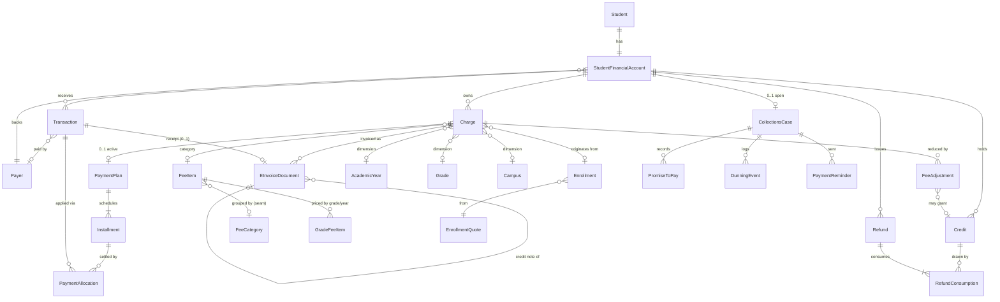
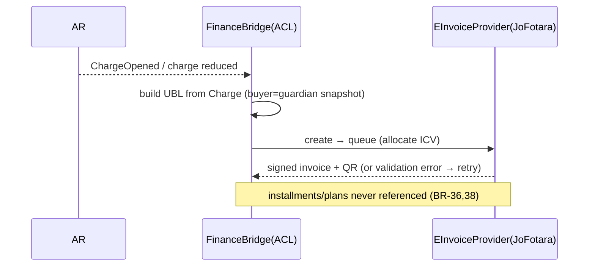
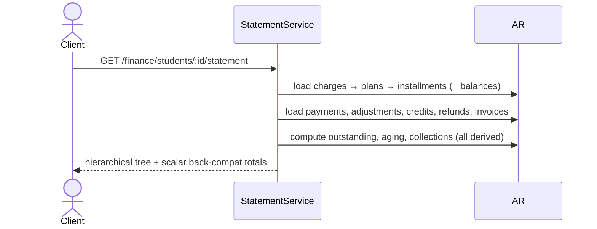

# Munaxa Finance Domain Specification — v1.0

> **Status:** APPROVED / FROZEN — single source of truth for the Munaxa Finance domain.
> Implementation is in progress and proceeds strictly according to this document.
> **Supersedes:** nothing (first spec). **Companion:** `finance-domain-redesign.md`
> (rationale/roadmap). Where the two differ, **this document wins**.
> **Scope:** Accounts Receivable (AR) for multi-tenant School OS.
> **Money precision (global invariant):** `Decimal(12,3)` — JOD fils. All internal
> arithmetic in integer **fils**; presentation `toFixed(3)`.
>
> **Implementation strategy amendment (approved):** Munaxa has **no production database,
> no production customers, and no integrations requiring backward compatibility**. The
> Migration Rules (§19, MG-*) — which assumed a live DB preserved via a parity gate — are
> therefore **superseded by ADR-013 (greenfield replacement)**. The old Charge-centric
> finance schema is **replaced outright**; obsolete tables/columns/code/UI are deleted, no
> compatibility layers are retained, and the API adopts one ubiquitous language
> (`Payment` replaces `Transaction`, etc.). Backward-compat items in §18/§20 do **not**
> apply. See ADR-013.

---

## 0. Final Architecture Review & Freeze Decisions

A final critical pass evaluated six candidate additions. Only changes that *materially*
improve the 10–15-year foundation **and** are cheaper to add now than to retrofit were
accepted. The rest are deferred behind explicit seams so they never require a domain
redesign.

### 0.1 Accepted into v1.0

**D-1 · Payer / Household party — ADOPT (lightweight).**
Families with multiple students are the norm; one guardian pays for several children and
expects one relationship. Retrofitting a payer *above* per-student accounts later would
require moving payments and credits — expensive and risky. Therefore v1.0 introduces a
**`Payer`** party and a nullable **`StudentFinancialAccount.payerId`**. **Receivables
(charges/installments) remain owned by the student account** (unchanged billing/invoicing
identity). **Payments and Credits may optionally attach at payer level.** Cross-student
auto-allocation is **not** built now (it is an allocation-policy extension, D-2); a payer's
credit funding a sibling is a manual, audited transfer in v1.0. This buys the hard-to-add
relationship cheaply without changing the receivable model.

**D-2 · Allocation Policy port — ADOPT (interface now, FIFO-only implementation).**
The allocation engine is being built regardless; exposing it behind an `AllocationPolicy`
strategy is a few lines now and avoids re-cutting the core later. v1.0 ships exactly one
policy — **`FIFO_BY_DUE_DATE`** — as the default and only implementation. `PROPORTIONAL`,
`SPECIFIC_INSTALLMENT`, and `CROSS_STUDENT` are named, documented, unimplemented.

**D-3 · Charge lifecycle enrichment — ADOPT (modest).**
Add **`WRITTEN_OFF`** (bad-debt, distinct from `WAIVED` = discounted-to-zero and
`CANCELLED` = voided/never-owed). Keep `PENDING / PARTIAL / PAID / WAIVED / CANCELLED`.
**`OVERDUE` is derived, never stored.** Rejected: `DRAFT` (quotes already stage pre-commit)
and `DISPUTED` (a collections-case attribute, not a charge state).

**D-4 · Provider ports — ADOPT (declare all, wire the real ones).**
Declare four ports (§18): `EInvoiceProvider`, `NotificationProvider`, `PaymentProvider`,
`AccountingProvider`. Wire only those with a real adapter today — **`EInvoiceProvider`
(JoFotara)** and **`NotificationProvider`** (existing `NotificationEventBus`). `PaymentProvider`
(online gateway) and `AccountingProvider` (GL export) are unimplemented seams. Declaring
ports is cheap; letting the domain call concretes is the expensive mistake.

### 0.2 Deferred (with a seam so no redesign is ever needed)

**D-5 · Hierarchical Fee Categories — DEFER.**
Flat `FeeItem.kind` covers current reporting. Seam: nullable **`FeeItem.categoryId`** →
optional flat **`FeeCategory`** table addable later; a full tree is overengineering for
school fee structures (1–2 grouping levels at most).

**D-6 · Financial Period / close — DEFER to the GL phase.**
Period-locking before a general ledger exists over-constrains AR (it would block legitimate
back-dated corrections). Every money row already carries an authoritative date
(`Charge.createdAt`, `Payment.verifiedAt`, `Installment.dueDate`), so an `AccountingPeriod`
can be layered in the optional GL module (§18, Roadmap Phase 9) with zero AR rework.

### 0.3 Net effect on the frozen model

Two structural additions (`Payer` party + nullable link; `AllocationPolicy` port), one enum
value (`WRITTEN_OFF`), four declared ports. No other change from `finance-domain-redesign.md`.
Complexity added is proportional and each item removes a future migration.

---

## 1. Domain Glossary

Terms are **mutually exclusive**; each answers exactly one question. "Never means" clauses
exist to prevent the historical conflation (Charge = obligation *and* installment).

| Term | Precise meaning | Never means |
|---|---|---|
| **Student Financial Account** (`StudentFinancialAccount`) | The AR ledger owner for one student: currency, status, opening date. All of a student's charges/payments/credits/refunds hang off it. | A person; a login; a bank account. |
| **Payer** | A billing party (guardian/company) that may be responsible for one or more student accounts; can hold payments/credits. | The receivable owner (that is the student account). |
| **Fee Item** (`FeeItem` / `GradeFeeItem`) | Catalog definition of *what* a school charges (Tuition, Registration, Transport, …) and its per-grade/year price. | An amount owed by a specific student. |
| **Charge** | A single **financial obligation** owed by one account (e.g. "Annual Tuition 2026/27 = 3,000"). The receivable. Immutable in amount once invoiced. | A schedule; an installment; a payment; an invoice. **Never split into sub-charges.** |
| **Payment Plan** (`PaymentPlan`) | *How* a single charge may be paid over time: cadence, count, terms, status. 0..1 active per charge. | A charge; money; a catalog price. |
| **Installment** | *When* a scheduled portion of a charge's net is expected: sequence, due date, scheduled amount. A schedule line. | A charge; a receivable of its own; an invoice source. |
| **Payment** (physical table `Transaction`) | Actual **money received** (or its verified record): method, reference, receipt, verify workflow, gapless `receiptNo`. | An obligation; a schedule; an allocation. |
| **Payment Allocation** (`PaymentAllocation`) | The **application** of (part of) a verified payment to a specific **installment**. | Money itself; a charge link. |
| **Adjustment** (`FeeAdjustment`) | A deduction/correction against a charge's net or the account: Discount, Scholarship, Sibling/Staff discount, Waiver, Write-off, Credit-memo, Correction. | A payment; a refund; a schedule change. |
| **Credit** | An independent **asset lot** the account holds (over-payment, credit-memo, scholarship-to-credit, return), with provenance and remaining balance. | Negative outstanding; an adjustment; cash. |
| **Refund** | Money returned to a payer, **consuming** specific credit lots (FIFO). Same verify workflow as a payment. | A reversal of a charge; a discount. |
| **Invoice** (`EInvoiceDocument`) | The **tax document** for a charge (or a receipt for a payment), issued to a provider (JoFotara). One obligation ⇒ one invoice. | A charge; an installment; a demand for a scheduled amount. |
| **Credit Note** | A 381 tax document reversing part/all of an accepted invoice (from a reduction/write-off). | A `Credit` lot (that is an AR asset, not a tax doc). |
| **Statement** | A **read-only** hierarchical view of an account: charges → plans → installments, payments, credits, refunds, adjustments, invoices, collections, outstanding, aging. | A ledger of record; an obligation. |
| **Collections Case** (`CollectionsCase`) | The dunning **workflow** over an account's **overdue installments**: status, promises, dunning events, lawyer ref. | A tag on a student; a charge. |
| **Promise to Pay** | A recorded commitment (amount + date) within a collections case. | A payment; a plan. |
| **Outstanding** | Derived: Σ open charge balances = Σ open installment balances. | A stored column. |
| **Aging** | Derived bucketing (current/1-30/31-60/61-90/90+) of installment balances by due date. | A stored column. |
| **Fee Modification** | A recorded, audited deviation from the standard fee plan at enrollment. | A discount (that reduces net via Adjustment). |
| **Enrollment Quote** | A persisted, student-less-until-commit price + plan proposal. | A charge; an enrollment. |

---

## 2. Business Rules

Rules are normative. **MUST** = invariant enforced in code + (where possible) DB constraint.
Rule IDs (`BR-n`) are referenced by tests and ADRs.

### 2.1 Account & Payer
- **BR-1** Exactly one `StudentFinancialAccount` per (tenant, student). MUST (unique).
- **BR-2** An account has a `currency` (default `JOD`); all its charges/installments/payments
  share that currency. Cross-currency within an account is forbidden in v1.0. MUST.
- **BR-3** An account may reference 0..1 `Payer`. A `Payer` may back N accounts. Deleting a
  payer detaches (never cascades receivables).
- **BR-4** A `CLOSED`/`WRITTEN_OFF` account MUST reject new charges and new plans; it MAY
  still accept credit-note issuance and audit reads.

### 2.2 Charge (obligation)
- **BR-5** A charge belongs to exactly one account and has `amount > 0` at creation. MUST.
- **BR-6** `net = amount − Σ APPLIED charge-scoped Adjustments`. `net ≥ 0` MUST.
- **BR-7** A charge's `amount` is **immutable once an accepted invoice exists**; reductions
  are via Adjustment (+ automatic credit note). MUST.
- **BR-8** A charge has **0..1 active PaymentPlan**. With no plan, the charge has exactly one
  **implicit installment** (seq 1, amount = net, due = `Charge.dueDate`). MUST.
- **BR-9** `Σ Installment.amount (active plan) == charge.net`, in fils, always. MUST.
- **BR-10** Charge status is **rolled up** from its installments (§3.1); it is never set
  directly except `CANCELLED`/`WRITTEN_OFF` by explicit action.

### 2.3 Payment Plan & Installments
- **BR-11** A plan targets exactly one charge; creating a new plan on a charge that already
  has an active plan **supersedes** the old one (§3.4). MUST.
- **BR-12** `1 ≤ installments ≤ BillingPolicy.maxInstallments` and `≥ minInstallments`. MUST.
- **BR-13** Installment amounts are split in fils; remainder goes to the **last** installment
  (or is concentrated there when `balloonFinal`). `Σ == net`. MUST (BR-9).
- **BR-14** Installments are **never** invoiced and **never** create charges. MUST.
- **BR-15** Rescheduling one installment's date/amount re-checks BR-9 and is audited.
- **BR-16** `OVERDUE` is derived: installment with `balance > 0` and `dueDate < today`.
  Never stored.

### 2.4 Payment, Verification & Allocation
- **BR-17** A payment is recorded `PENDING`; only a `FinanceOfficer` (RBAC) may `VERIFY`/`REJECT`.
- **BR-18** A **gapless** `receiptNo` is assigned **exactly once**, at verify, from the
  per-tenant `FinanceReceiptCounter`. Rejected/pending payments never burn a number. MUST.
- **BR-19** CliQ/e-wallet payments MUST carry a `receiptKey` or `reference`.
- **BR-20** Only a `VERIFIED` payment may be allocated. MUST.
- **BR-21** `Σ active allocations(payment) ≤ payment.amount`. MUST.
- **BR-22** `allocation.amount ≤ installment.balance` at allocation time. MUST.
- **BR-23** On verify, the default `AllocationPolicy` (`FIFO_BY_DUE_DATE`) auto-allocates:
  to the target charge's installments if the payment names a charge, else across the
  account's open installments, earliest due first, capped per installment.
- **BR-24** Any verified amount that cannot be allocated (all installments settled) becomes
  an **over-payment `Credit`** lot (source `OVERPAYMENT`). It MUST NOT silently reduce
  outstanding. MUST. *(Fixes the historical "two truths" bug.)*
- **BR-25** Allocations are reversed by soft-reversal (`reversedAt`), which recomputes the
  installment and charge status. Reversal is audited.

### 2.5 Adjustments
- **BR-26** A charge-scoped adjustment's `amount ≤ charge remaining net`. MUST.
- **BR-27** `SCHOLARSHIP/DISCOUNT/SIBLING/STAFF/WAIVER/WRITE_OFF/CORRECTION` reduce charge net;
  `CREDIT_MEMO` grants an account/payer `Credit` (chargeId null). MUST.
- **BR-28** `WRITE_OFF` transitions the charge toward `WRITTEN_OFF` when it zeroes net via
  bad-debt (distinct from `WAIVER`, which is a granted discount). Both are audited with reason.
- **BR-29** Reducing an **invoiced** charge best-effort issues a 381 **credit note** (never
  blocks the finance action).
- **BR-30** Adjustments are reversible (`REVERSED`), which recomputes affected charge status.

### 2.6 Credits & Refunds
- **BR-31** A `Credit` lot has `remaining = amount − Σ RefundConsumption − Σ credit applications`,
  `remaining ≥ 0`. MUST.
- **BR-32** Available credit for an account/payer = `Σ Credit.remaining`.
- **BR-33** A refund's `amount ≤ available credit` at **both** request and verify time. MUST.
- **BR-34** A verified refund consumes credit lots **FIFO** via `RefundConsumption`;
  `Σ consumptions == refund.amount`. MUST.
- **BR-35** Refunds follow the payment verify workflow (`PENDING→VERIFIED/REJECTED`).

### 2.7 Invoicing (JoFotara)
- **BR-36** Invoices originate **only** from a **Charge** (receivable) or a **Payment**
  (receipt). **Never** from an installment or a plan. MUST.
- **BR-37** One charge ⇒ at most one active invoice; `invoiceNumber` is a **deterministic,
  idempotent** function of `chargeId`. ICV is gapless per tenant. MUST.
- **BR-38** Plan creation/rescheduling/supersession MUST NOT trigger (re-)invoicing. MUST.
- **BR-39** e-invoicing failures never block the finance action (`try*` hooks warn, don't throw).

### 2.8 Collections
- **BR-40** Collections operate on **overdue installments** (BR-16), never on charges.
- **BR-41** `LEGAL` accounts are excluded from automated reminders. MUST.
- **BR-42** Transport suspension is driven by `BillingPolicy.suspendTransportAfterOverdue`
  counted over **overdue installments**; auto-restored when the count falls back. Collections
  is the **single writer** of `StudentBillingProfile.transportSuspended`. MUST.

### 2.9 Calculation rules (single definitions — §10)
- **BR-43** `installment.balance = amount − Σ active allocations` (floored at 0 only by waiver).
- **BR-44** `charge.paid = Σ installment.paid`; `charge.balance = net − charge.paid`.
- **BR-45** `account.outstanding = Σ charge.balance (status ∉ {CANCELLED, WRITTEN_OFF})`.
- **BR-46** `account.creditBalance = Σ Credit.remaining` (already net of refunds).
- **BR-47** No figure in §2.9 is ever stored; all are recomputed from child rows. MUST.

---

## 3. State Machines

`OVERDUE` never appears as a stored state anywhere; it is a derived view over `SCHEDULED`/
`PARTIAL` installments.

### 3.1 Charge lifecycle
```
                    ┌─────────── adjust/allocate rollup ───────────┐
                    ▼                                              │
[create] ──▶ PENDING ──▶ PARTIAL ──▶ PAID                         │
               │  │          │                                    │
               │  │          └──▶ (reversal) ──▶ PARTIAL/PENDING ─┘
               │  └──▶ WAIVED        (net → 0 via WAIVER/discounts)
               ├──▶ WRITTEN_OFF      (bad debt via WRITE_OFF)
               └──▶ CANCELLED        (voided; never owed)
```
- **PENDING**: net > 0, nothing allocated. **PARTIAL**: 0 < paid < net. **PAID**: every
  installment PAID/WAIVED. **WAIVED**: net ≤ 0 by discount/waiver. **WRITTEN_OFF**: bad debt.
  **CANCELLED**: voided. `PAID/WAIVED/CANCELLED/WRITTEN_OFF` are terminal (reversal of the
  triggering event can reopen). Transitions are **computed** (except CANCELLED/WRITTEN_OFF,
  which are explicit, RBAC-gated actions).

### 3.2 Payment lifecycle
```
[record] ──▶ PENDING ──▶ VERIFIED ──▶ (allocated / over-payment→Credit)
                 │
                 └──▶ REJECTED (terminal)
```
- `receiptNo` assigned on `PENDING→VERIFIED` only. `VERIFIED` is terminal for status;
  allocations may still be added/reversed against it.

### 3.3 Installment lifecycle
```
[generate] ──▶ SCHEDULED ──▶ PARTIAL ──▶ PAID
                   │             │
                   │             └──▶ (reversal) ──▶ PARTIAL/SCHEDULED
                   ├──▶ WAIVED     (covered by a charge-level waiver)
                   └──▶ CANCELLED  (plan superseded/cancelled; unsettled only)
```
- Derived view **OVERDUE** = `SCHEDULED|PARTIAL` ∧ `balance>0` ∧ `dueDate<today`.

### 3.4 Payment Plan lifecycle
```
[create] ──▶ ACTIVE ──┬──▶ COMPLETED    (all installments PAID/WAIVED)
                      ├──▶ SUPERSEDED   (replaced by a new plan; unsettled installments CANCELLED)
                      └──▶ CANCELLED    (plan removed; charge reverts to implicit single installment)
```
- Superseding regenerates a schedule for the **remaining** balance; settled installments and
  their allocations are retained (history intact).

### 3.5 Invoice lifecycle (`EInvoiceDocument`)
```
[from charge] ──▶ DRAFT ──▶ QUEUED ──▶ SUBMITTED ──▶ ACCEPTED
                    │                       │
                    └──────────────▶ CANCELLED / REJECTED ◀── (validation error → retry)
Credit note: ACCEPTED(invoice) ──▶ [381 draft] ──▶ QUEUED ──▶ … ──▶ ACCEPTED
```
- ICV allocated at `QUEUED`. Retry with backoff on `REJECTED`. Terminal: `ACCEPTED`,
  `CANCELLED`.

### 3.6 Refund lifecycle
```
[request] ──▶ PENDING ──▶ VERIFIED (consumes credit lots FIFO)
                 │
                 └──▶ REJECTED (terminal)
```

### 3.7 Collections lifecycle
```
[open on overdue] ──▶ OPEN ──┬──▶ PROMISE_TO_PAY ──▶ OPEN (broken) / RESOLVED (kept+cleared)
                             ├──▶ LEGAL (excluded from auto-reminders) ──▶ RESOLVED
                             └──▶ RESOLVED (no overdue balance remains)
```
- A case auto-opens when an account first has overdue installments and auto-`RESOLVED` when
  overdue clears (auditable), unless manually held (`LEGAL`).

---

## 4. Entity Definitions

For each: **responsibility · owner (aggregate) · key relationships · invariants.**

- **StudentFinancialAccount** — *Owns a student's AR.* Root of its own aggregate. → Student
  (1:1), Payer (N:1 optional), Charges/Payments/Credits/Refunds (1:N). Inv: BR-1,2,4.
- **Payer** — *Billing party.* Own aggregate (party). → accounts (1:N), payments/credits
  (optional). Inv: detach-not-cascade (BR-3).
- **Charge** — *One obligation.* Root of the Charge aggregate. → Account (N:1),
  PaymentPlan (1:0..1), Adjustments (1:N), Invoices (1:N), dims (year/grade/campus/feeItem/
  enrollment, optional). Inv: BR-5..10.
- **PaymentPlan** — *How a charge is paid.* Inside Charge aggregate. → Charge (1:1),
  Installments (1:N). Inv: BR-11,12,13.
- **Installment** — *When a portion is due.* Inside Charge aggregate. → Plan (N:1),
  Allocations (1:N). Inv: BR-9,13,16.
- **Payment** (`Transaction`) — *Money received.* Root of Payment aggregate. → Account (N:1),
  Payer (optional), Allocations (1:N), Invoice (0..1 receipt). Inv: BR-17..21,25.
- **PaymentAllocation** — *Application of money to an installment.* Inside Payment aggregate.
  → Payment (N:1), Installment (N:1 by id). Inv: BR-22.
- **FeeAdjustment** — *Deduction/correction.* Own aggregate. → Charge (optional), Account.
  → may grant Credit. Inv: BR-26..30.
- **Credit** — *Asset lot.* Root of Credit aggregate. → Account/Payer, provenance
  (adjustment/payment). → RefundConsumptions. Inv: BR-31,32.
- **Refund** — *Money returned.* Root. → Account/Payer, RefundConsumptions (1:N). Inv: BR-33,34,35.
- **RefundConsumption** — *Credit drawn by a refund.* Inside Refund aggregate. → Refund, Credit.
- **EInvoiceDocument** (Invoice/Credit-note) — *Tax document.* Root (Invoicing ctx). →
  Charge or Payment (source), original doc (credit notes). Inv: BR-36,37,38.
- **CollectionsCase** — *Dunning workflow.* Root (Collections ctx). → Account, PromiseToPay,
  DunningEvent, Reminder. Inv: BR-40,41,42.
- **PromiseToPay / DunningEvent / Reminder** — inside CollectionsCase aggregate.
- **StudentBillingProfile** — *Projection/cache* of collections headline + permanent flags
  (`feeModified`, `customArrangement`, `transportSuspended`). Single writer = Collections/
  Admissions. Not a source of truth for money.
- **FeeItem / GradeFeeItem** — *Catalog.* Pricing context. → optional FeeCategory (seam, D-5).
- **EnrollmentQuote(+Item) / Enrollment / FeeModification(+Approval) / FinancialArrangement /
  RegistrationCommitment** — Admissions context (unchanged responsibilities).
- **BillingPolicy / DiscountRule / TransportFare / GradeFeeSchedule(compat)** — Pricing config.
- **AuditLog** — append-only record of every state change (cross-cutting).

---

## 5. Aggregate Definitions

Small aggregates; cross-aggregate references **by id**; intra-aggregate consistency is
transactional, inter-aggregate is eventual (domain events).

| Aggregate | Root | Contains | Transactional invariants |
|---|---|---|---|
| **Account** | `StudentFinancialAccount` | — (money children are their own roots for scale) | one per student; currency fixed; status gating (BR-1,2,4) |
| **Payer** | `Payer` | — | party identity |
| **Charge** | `Charge` | `PaymentPlan`, `Installment[]`, plan supersession | Σ installments == net; ≤1 active plan; net ≥ 0 (BR-6,8,9,11) |
| **Payment** | `Transaction` | `PaymentAllocation[]` | Σ alloc ≤ amount; alloc ≤ installment balance; verified-only (BR-20,21,22) |
| **Adjustment** | `FeeAdjustment` | — | ≤ remaining net; type rules (BR-26,27) |
| **Credit** | `Credit` | `RefundConsumption[]` (shared with Refund) | remaining ≥ 0 (BR-31) |
| **Refund** | `Refund` | `RefundConsumption[]` | Σ consumptions == amount ≤ available (BR-33,34) |
| **Invoice** | `EInvoiceDocument` | lines (JSON), credit-note link | source is charge/payment; idempotent number; gapless ICV (BR-36,37) |
| **CollectionsCase** | `CollectionsCase` | `PromiseToPay[]`, `DunningEvent[]`, `Reminder[]` | operates on overdue installments; LEGAL exclusion (BR-40,41) |

**Cross-aggregate consistency** is carried by domain events on an **outbox** (§15/§16):
`ChargeOpened`, `PlanCreated`, `PaymentVerified`, `AllocationApplied`, `InstallmentSettled`,
`CreditGranted`, `RefundIssued`, `InvoiceAccepted`, `CollectionsOpened/Resolved`.

---

## 6. Complete ERD



---

## 7. Sequence Diagrams — Major Workflows

### 7.1 Admissions → registration commit
```mermaid
sequenceDiagram
  actor Registrar
  participant Adm as Admissions
  participant Price as Pricing(ACL)
  participant AR as AR Context
  participant Inv as Invoicing
  Registrar->>Adm: create Quote (grade, year, transport, mode, installments)
  Adm->>Price: resolve prices (snapshot fee items)
  Price-->>Adm: priced lines
  Registrar->>Adm: commit(quoteId, idempotencyKey)
  Adm->>Adm: ensure Student+Parent+Enrollment (atomic, idempotent)
  Adm->>AR: OpenChargesForEnrollment(account, lines, plan?)
  AR->>AR: ensure Account; create Charge per fee line (net of discount)
  alt INSTALLMENTS
    AR->>AR: create PaymentPlan + Installments (Σ==net)
  else FULL
    AR->>AR: implicit single installment per charge
  end
  AR-->>Inv: ChargeOpened (event)
  Inv-->>Inv: best-effort issue invoice per charge (if enabled)
```

### 7.2 Charge creation (standalone)
```mermaid
sequenceDiagram
  actor Officer
  participant AR
  participant Inv as Invoicing
  Officer->>AR: POST /finance/charges {account, amount, dueDate, dims}
  AR->>AR: validate (BR-5); create Charge; implicit installment
  AR-->>Inv: ChargeOpened
  Inv-->>Inv: tryIssueForCharge (never blocks)
```

### 7.3 Payment plan creation / supersession
```mermaid
sequenceDiagram
  actor Officer
  participant AR
  Officer->>AR: POST /finance/charges/:id/plan {cadence, count, firstDue, balloon?}
  AR->>AR: validate BR-11,12; if active plan → mark SUPERSEDED, cancel unsettled installments
  AR->>AR: InstallmentScheduleService.generate(remainingNet, opts)
  AR->>AR: persist PaymentPlan + Installments (assert Σ==net)
  AR-->>AR: PlanCreated (event)  // no invoicing (BR-38)
```

### 7.4 Payment verification
```mermaid
sequenceDiagram
  actor Parent
  actor Officer
  participant Pay as Payment
  participant AR
  Parent->>Pay: presign receipt → upload → POST /finance/transactions (PENDING)
  Officer->>Pay: POST /transactions/:id/verify
  Pay->>Pay: assign gapless receiptNo (BR-18); status VERIFIED
  Pay->>AR: PaymentVerified(chargeId?)
  AR->>AR: AllocationPolicy.allocate (FIFO by due date)
  AR->>AR: residue → Credit(OVERPAYMENT) (BR-24)
  AR-->>AR: InstallmentSettled / CreditGranted events
```

### 7.5 Payment allocation (manual)
```mermaid
sequenceDiagram
  actor Officer
  participant AR
  Officer->>AR: POST /finance/ledger/allocate {transactionId, lines[installmentId|chargeId, amount]}
  AR->>AR: expand chargeId→installments FIFO (compat shim)
  AR->>AR: assert Σ ≤ unallocated (BR-21) & ≤ installment.balance (BR-22)
  AR->>AR: create allocations; recompute installment+charge status
```

### 7.6 Refund
```mermaid
sequenceDiagram
  actor Officer
  participant AR
  Officer->>AR: POST /finance/ledger/refunds {account/payer, amount, method, reason}
  AR->>AR: assert amount ≤ available credit (BR-33)
  AR->>AR: create Refund PENDING
  Officer->>AR: POST /refunds/:id/verify
  AR->>AR: re-check available; consume Credit lots FIFO → RefundConsumption (BR-34)
```

### 7.7 Credit memo
```mermaid
sequenceDiagram
  actor Officer
  participant AR
  participant Inv
  Officer->>AR: POST /finance/ledger/adjustments {type: CREDIT_MEMO, account, amount, reason}
  AR->>AR: create FeeAdjustment(chargeId=null); Credit(source=CREDIT_MEMO, provenance)
  Note over AR: account-level; no charge net change
  Officer->>AR: (if against invoiced charge) type: WAIVER/WRITE_OFF/DISCOUNT
  AR->>AR: reduce charge net (BR-26); recompute status
  AR-->>Inv: best-effort 381 credit note (BR-29,39)
```

### 7.8 Collections
```mermaid
sequenceDiagram
  participant Sched as Nightly/Trigger
  participant Col as Collections
  participant AR
  participant Notif as NotificationProvider
  Sched->>Col: evaluate accounts with overdue installments
  Col->>AR: query overdue installments (derived)
  Col->>Col: open/refresh CollectionsCase; compute aging
  alt not LEGAL
    Col->>Notif: reminder (in-app/SMS/email/push)
    Col->>Col: log DunningEvent
  else LEGAL
    Col->>Col: skip auto-reminder (BR-41)
  end
  Col->>Col: evaluate transport suspension (BR-42)
```

### 7.9 JoFotara


### 7.10 Statement generation


---

## 8. API Contracts

REST, tenant-scoped (JWT → tenant context), NestJS `version:'1'`; breaking changes ship as
`v2` with `v1` adapters. Money as strings `"1234.567"`. All responses omit other tenants
(RLS). Representative contracts (⊕ = additive/new, ✎ = evolved, = unchanged):

**Charges**
- `POST /finance/charges` — `{studentId|accountId, description, amount, dueDate?, feeItemId?, academicYearId?, gradeId?, campusId?, enrollmentId?}` → `Charge`.
- ⊕ `POST /finance/charges/:id/plan` — `{cadence, installments, firstDueDate, balloonFinal?}` → `{planId, installments:[{seq,dueDate,amount,status}]}`.
- ✎ `POST /finance/charges/installments` — legacy shape kept; now creates Charge+Plan+Installments (returns `{planId, charges:[…]}` for back-compat).
- ✎ `GET /finance/charges/installments?studentId` — `{planId, charges:[{id,description,dueDate,amount,paid,balance,status}]}` (served from installments).
- ✎ `POST /finance/charges/installments/pay` — `{studentId, chargeId|installmentId, amount, method, reference?}` → plan view.

**Payments**
- `POST /finance/transactions/receipt/presign` · `POST /finance/transactions` ·
  `POST /finance/transactions/:id/verify` · `.../reject` · `.../notify-parent` · `GET /finance/transactions?studentId`.

**Ledger**
- ✎ `POST /finance/ledger/allocate` — `{transactionId, allocations:[{installmentId | chargeId, amount}]}` (chargeId shim → FIFO over that charge's installments).
- ✎ `POST /finance/ledger/allocate/fifo` — `{transactionId}` (account-wide FIFO over installments).
- `POST /finance/ledger/adjustments` — `{studentId|accountId, chargeId?, type, amount?|percent?, reason}` → `FeeAdjustment` (+Credit if CREDIT_MEMO).
- `POST /finance/ledger/adjustments/:id/reverse`.
- `POST /finance/ledger/refunds` — `{studentId|accountId|payerId, amount, method, reference?, reason}` → `Refund`; `.../verify`, `.../reject`.
- ⊕ `GET /finance/accounts/:studentId` — account header (currency, status, outstanding, creditBalance, payer).
- ⊕ `GET /finance/credits?accountId` — credit lots with remaining/provenance.
- ⊕ `PATCH /finance/installments/:id` — `{dueDate?, amount?}` reschedule (asserts BR-9).

**Statement / Collections / Admissions / e-Invoicing** — existing routes retained; statement
response gains the charge→plan→installment tree + credits (additive).

**Errors:** `400` validation (BR violations), `409` conflict (state-machine), `403` RBAC,
`404` tenant-scoped not-found. Every mutating endpoint is idempotent where it has an external
effect (commit uses idempotency key; verify is a no-op if already verified).

---

## 9. Database Rules

- **DB-1** Every tenant table has `tenantId @db.Uuid`; RLS `ENABLE`+`FORCE` with fail-closed
  `tenant_isolation` policy (`tenantId = app_current_tenant() OR app_is_platform()`), matching
  the existing pattern. New tables (`StudentFinancialAccount`, `Payer`, `PaymentPlan`,
  `Installment`, `Credit`, `RefundConsumption`, `CollectionsCase`, `PromiseToPay`,
  `DunningEvent`) MUST be added under this policy in the same migration that creates them.
- **DB-2** All money columns `Decimal(12,3)`. No float. No stored balances/totals for derived
  figures (§10). Counters (`receiptNo`, ICV) are the only monotonic stored numerics.
- **DB-3** Referential integrity: `Installment.planId`→`PaymentPlan` (cascade),
  `PaymentPlan.chargeId`→`Charge` (unique, cascade), `PaymentAllocation.installmentId`→
  `Installment`, `RefundConsumption`→`Refund`/`Credit`. `onDelete` mirrors current cascade
  choices; SetNull only for optional dims.
- **DB-4** Uniqueness: `(tenantId, receiptNo)`, `(planId, seq)`, one active plan per charge
  (`PaymentPlan.chargeId @unique`), one account per student (`@unique studentId`).
- **DB-5** Indexes for scan paths: `Installment(tenantId,dueDate)`, `Installment(tenantId,status)`,
  `Charge(tenantId,accountId|status|academicYearId|feeItemId)`, `PaymentAllocation(tenantId,installmentId)`.
- **DB-6** All financial mutations run inside a single DB transaction that also writes the
  `AuditLog` row (§16). No partial commits.
- **DB-7** Migrations are forward-only, additive-first, chunked per tenant; destructive drops
  only after cutover (§19).

---

## 10. Ledger Rules

The **ledger of record is the child rows**; every figure is derived with **one** definition
shared by per-charge and per-account views (removes the historical divergence).

- **LR-1** `charge.net = amount − Σ APPLIED charge Adjustments`.
- **LR-2** `installment.paid = Σ active allocations(installment)`;
  `installment.balance = amount − paid`.
- **LR-3** `charge.paid = Σ installment.paid`; `charge.balance = net − charge.paid`.
- **LR-4** `account.outstanding = Σ charge.balance (status ∉ {CANCELLED, WRITTEN_OFF})`.
- **LR-5** `account.paid = Σ installment.paid` (≡ Σ verified-payment allocations).
- **LR-6** `account.creditBalance = Σ Credit.remaining`.
- **LR-7** Charges produce receivables; payments (via allocation) reduce them; adjustments
  modify them; credits are independent assets; refunds consume credits; installments are
  schedules (never receivables of their own).
- **LR-8** Reconciliation invariants (asserted by tests, §"Testing"): per charge
  `Σ installment.amount == net`; per account `Σ verified payments == Σ allocations +
  Σ overpayment-credits`; `outstanding ≥ 0`; `creditBalance ≥ 0`.
- **LR-9** Status is recomputed at two levels on every allocation/adjustment/reversal:
  `Installment.status` then rolled-up `Charge.status`.

---

## 11. Allocation Rules

- **AR-1** Allocation targets **installments** only.
- **AR-2** Default policy `FIFO_BY_DUE_DATE`: earliest `dueDate` first; ties broken by
  `Installment.seq` then `createdAt`. Undated (implicit) installments sort last.
- **AR-3** Cap each allocation at `installment.balance`; move to the next installment when full.
- **AR-4** Payment-scoped cap: `Σ allocations(payment) ≤ payment.amount` (BR-21).
- **AR-5** Residual after all installments settled ⇒ `Credit(OVERPAYMENT)` (BR-24). Never
  reduce outstanding without an allocation.
- **AR-6** Manual allocation may name specific installments; a legacy `chargeId` line expands
  to that charge's installments under AR-2.
- **AR-7** Reversal (`reversedAt`) frees the installment balance and recomputes status.
- **AR-8** `AllocationPolicy` is a strategy port (D-2). v1.0 registers only `FIFO_BY_DUE_DATE`.
  Extension policies (`PROPORTIONAL`, `SPECIFIC_INSTALLMENT`, `CROSS_STUDENT`) MUST NOT be
  assumed by callers; the port returns a list of `{installmentId, amount}` the engine applies.

---

## 12. Installment Rules

- **IR-1** One `InstallmentScheduleService` is the sole generator (no duplication across
  charges/admissions).
- **IR-2** Amounts split in **fils**; `Σ == charge.net`; remainder to the last installment,
  or concentrated there when `balloonFinal`.
- **IR-3** Cadences: `MONTHLY` (v1 default), `WEEKLY`, `QUARTERLY`, `CUSTOM` (caller supplies
  `{dueDate,amount}[]`, validated to sum to net). Strategy interface `ScheduleStrategy`.
- **IR-4** Options: deferred first payment (`firstDueDate` offset), holiday skipping (shift due
  dates off a tenant holiday calendar), manual reschedule (`PATCH`, re-assert IR-2), early
  payoff (allocate across all open installments; plan → COMPLETED), balloon (IR-2), partial
  settlement (native via allocations).
- **IR-5** Rescheduling/superseding never creates charges and never invoices (BR-14,38).
- **IR-6** Superseding a plan cancels only **unsettled** installments; settled ones + their
  allocations persist. New schedule covers the remaining balance.

---

## 13. Credit Rules

- **CR-1** A `Credit` is a lot with `source ∈ {OVERPAYMENT, CREDIT_MEMO, SCHOLARSHIP, RETURN}`,
  `amount`, derived `remaining`, provenance (`adjustmentId|paymentId`), optional `expiresAt`.
- **CR-2** `remaining = amount − Σ RefundConsumption − Σ credit applications`; never negative.
- **CR-3** Credit belongs to an account; may be attached to a `Payer` (D-1) for family-level
  visibility. Applying a payer credit to a sibling's charge in v1.0 is a **manual, audited**
  action (no automatic cross-student allocation).
- **CR-4** Over-payment (AR-5) and account-level `CREDIT_MEMO` (BR-27) are the two creation
  paths in v1.0.
- **CR-5** Credit is **not** negative outstanding and is **not** a tax document; it is an AR
  asset. Refunds and future credit-application draw it down FIFO (oldest lot first; expiring
  lots prioritized).

---

## 14. Reporting Rules

- **RR-1** Reporting is **read-side only**; it never reads write-model internals directly —
  it uses dimensional views/materialized views fed by dims (§8 columns) and the event outbox.
- **RR-2** Dimensions available on every money row: academic year, grade, campus, fee
  category, student, payer, enrollment.
- **RR-3** Required reports: by Charge, Category, Payment Plan, Installment, Academic Year,
  Grade, Campus, Student, Parent/Payer, Collections, Cash Flow, Revenue, Outstanding Aging.
- **RR-4** Cash flow uses `Payment.verifiedAt` (money in) vs `Installment.dueDate` (expected).
  Aging uses installment balances by due date (§12). Revenue recognition is a GL-phase concern
  (proxy = charge net until GL exists).
- **RR-5** All reports are tenant-scoped (RLS) and render `Decimal(12,3)`.

---

## 15. Multi-tenant Rules

- **MT-1** `tenantId` on every finance row; all access via `withTenant`/`withPlatform` context.
- **MT-2** RLS is fail-closed and `FORCE`d on all finance tables incl. every new table (DB-1).
  No tenant/platform context ⇒ no rows visible or writable.
- **MT-3** Counters (`FinanceReceiptCounter`, `EInvoiceCounter`) are per-tenant and row-locked;
  gapless within a tenant.
- **MT-4** Cross-tenant references are impossible by construction (all FKs are within-tenant;
  RLS blocks cross-tenant reads even on mis-set queries).
- **MT-5** Migrations and batch jobs iterate **per tenant** to respect RLS and keep
  transactions short.
- **MT-6** S3/object keys (receipts, signed invoices) are tenant-prefixed and validated
  (`assertKeyInTenant`).

---

## 16. Audit Rules

- **AU-1** Every financial state change writes an `AuditLog` row **in the same transaction**
  as the change (no out-of-band audit).
- **AU-2** Audited events (min): charge open/cancel/write-off, plan create/supersede/cancel,
  installment reschedule, payment verify/reject, allocation create/reverse, adjustment
  apply/reverse, credit grant, refund create/verify/reject, invoice issue/credit-note,
  collections status change, promise-to-pay, transport suspend/restore, fee modification/approval.
- **AU-3** Audit records actor (`actorUserId`), action, entityType/id, and a metadata snapshot
  (amounts as strings). Append-only; never updated/deleted.
- **AU-4** Immutable financial artefacts are retained: signed UBL XML + QR (ISTD 4-year),
  generated PDFs (statements/receipts/agreements), receipt numbers.
- **AU-5** Amount-bearing snapshots (invoice buyer, quote lines, fee modifications) are frozen
  at the point of the event and never back-edited.

---

## 17. Security Rules

- **SE-1** RBAC gates (existing roles): `FinanceOfficer` verifies/rejects payments & refunds,
  approves fee modifications, issues credit notes; `Registrar` creates quotes/enrollments and
  applies fee overrides (`FEE_OVERRIDE`); `Admin` configures policy/catalog. Parents are
  read-only on their children's statements + submit receipts.
- **SE-2** Separation of duties: `BillingPolicy.allowSelfFeeApproval=false` ⇒ the applier of a
  fee modification cannot approve it. Refund verify SHOULD differ from refund request where
  team size allows (configurable, mirrors fee approval).
- **SE-3** All mutating endpoints require tenant context + role check; no ambient authority.
- **SE-4** Money never trusts client-computed derived values; the server recomputes net/
  balance/outstanding/credit on every operation (LR-*).
- **SE-5** Receipt/object access is tenant-scoped and signed-URL time-boxed; keys validated
  against the caller's tenant.
- **SE-6** PII in buyer snapshots (guardian name/phone/national id) is minimized to what
  JoFotara requires and stored only on the invoice snapshot.
- **SE-7** e-invoicing credentials are per-tenant, encrypted at rest, never returned by APIs.

---

## 18. Extension Points

Declared seams so future needs never force a domain redesign:

- **EP-1 · Provider ports (D-4).**
  - `EInvoiceProvider` — `submit/credit/status`; **JoFotara adapter shipped**. Add future
    e-invoicing providers/countries by new adapters; AR depends only on the port via the
    `FinanceBridge` ACL.
  - `NotificationProvider` — **existing `NotificationEventBus` shipped** (in-app/SMS/email/push).
  - `PaymentProvider` — online gateway (CliQ API/Stripe/…); **declared, unimplemented** (v1.0
    is receipt-based). When added, it produces `Payment` rows via the same verify path.
  - `AccountingProvider` — GL export/posting; **declared, unimplemented** (GL phase).
- **EP-2 · AllocationPolicy port (D-2).** Register additional strategies without touching the
  engine. FIFO shipped.
- **EP-3 · ScheduleStrategy port.** New installment cadences as new strategies (IR-3).
- **EP-4 · FeeCategory seam (D-5).** Nullable `FeeItem.categoryId` → optional `FeeCategory`
  grouping; hierarchy addable if ever justified.
- **EP-5 · AccountingPeriod seam (D-6).** Every money row carries an authoritative date; a
  period/close module layers on in the GL phase without AR rework.
- **EP-6 · Currency/FX seam.** `currency` on account/charge/credit; multi-currency FX handled
  at the provider boundary when a real second-country tenant exists.
- **EP-7 · Domain-event outbox.** All cross-context integration (invoicing, collections,
  reporting, future GL) subscribes to events; new subscribers need no write-model changes.
- **EP-8 · Payer party (D-1).** Family-level billing/statements and cross-student credit are
  additive on the existing `Payer` link.

---

## 19. Migration Rules

- **MG-1** Zero data loss. Forward-only, additive-first; destructive drops only post-cutover.
- **MG-2** Order: create new tables+RLS+nullable columns → backfill accounts → reconstruct
  plans/installments from legacy `installmentPlanId` groups → repoint allocations
  (charge→installment, 1:1) → backfill dimensions from `Enrollment` → rebuild credit lots from
  derived `creditBalance` → open collections cases from profiles → **parity gate** → deprecate
  shadow columns.
- **MG-3** Legacy mapping: each group of installment-charges → one obligation `Charge` +
  `PaymentPlan` + one `Installment` per legacy charge (amount/dueDate preserved); each
  standalone charge → one implicit installment. Every `PaymentAllocation.chargeId` repoints to
  the corresponding `Installment.id`.
- **MG-4** **Parity gate (blocking):** per account, pre- vs post-migration `outstanding`,
  `paid`, `creditBalance`, and aging buckets MUST match to the **fils**; every invoice, receipt
  number, and audit row MUST be intact. No promotion on any delta (a delta is a latent bug to
  investigate, not to accept).
- **MG-5** Idempotent, chunked per tenant; each step re-runnable.
- **MG-6** Historical invoices are migrated **as-is** — never re-issued. The invoice-count
  reduction applies to *new* obligations only.
- **MG-7** Keep `Charge.installmentPlanId` (shadow) and `PaymentAllocation.chargeId` until all
  readers are cut over (§20), then drop in a later migration.

---

## 20. Architecture Decision Records (ADRs)

Concise, numbered, referenced by rule IDs. Format: Context · Decision · Consequences.

**ADR-001 — Charge is the obligation; installments are schedule rows.**
*Context:* installments were Charges grouped by `installmentPlanId` (P1–P4). *Decision:*
`Charge` (0..1) `PaymentPlan` (1..N) `Installment`; installments never invoice, never split
the charge. *Consequences:* one invoice per obligation (BR-36); allocation targets
installments (AR-1); migration reconstructs plans (MG-3). Enforces BR-8,9,14.

**ADR-002 — Recompute, never denormalize.**
*Context:* the current strength — no stored balances. *Decision:* keep it; unify per-charge &
per-account definitions (LR-*). *Consequences:* removes the two-truths bug (BR-24); slightly
more compute, mitigated by indexes and report views.

**ADR-003 — Introduce Student Financial Account + Payer now.**
*Context:* per-student `studentId` keys everywhere; families need a payer. *Decision:* add
`StudentFinancialAccount` (receivable owner) + nullable `Payer` link now (D-1). *Consequences:*
currency/status home; cheap now, expensive later; cross-student credit is manual in v1.0.

**ADR-004 — Credit is a lot ledger; refunds consume lots FIFO.**
*Context:* credit was a derived scalar (P9). *Decision:* `Credit` + `RefundConsumption`
(CR-*, BR-31..34). *Consequences:* provenance, expiry, auditable refunds; over-payments become
explicit credits (AR-5).

**ADR-005 — Allocation behind a policy port, FIFO-only in v1.0.**
*Context:* avoid re-cutting the engine later (D-2). *Decision:* `AllocationPolicy` strategy;
ship `FIFO_BY_DUE_DATE` only (AR-8). *Consequences:* future policies are additive; callers
must not assume ordering.

**ADR-006 — Provider ports declared; wire only real adapters.**
*Context:* JoFotara-coupling risk; future providers (D-4). *Decision:* four ports (EP-1); wire
e-invoicing + notification. *Consequences:* AR depends on ports, not concretes; payment gateway
& GL are drop-in later.

**ADR-007 — Modest charge lifecycle (`WRITTEN_OFF` added; `OVERDUE` derived).**
*Context:* bad-debt ≠ waiver; overdue must not drift (D-3). *Decision:* add `WRITTEN_OFF`; keep
others; `OVERDUE` derived (BR-16, §3.1). *Consequences:* clean bad-debt reporting; no stored
overdue to reconcile.

**ADR-008 — Defer hierarchical categories & financial periods (seams kept).**
*Context:* avoid overengineering (D-5,6). *Decision:* flat `FeeItem.kind` + nullable
`categoryId`; period-close in the GL phase (EP-4,5). *Consequences:* no premature complexity;
both are additive when justified.

**ADR-009 — Invoicing sources from charges/payments only; plans never invoice.**
*Context:* installment-as-charge exploded invoices (P3). *Decision:* BR-36,37,38; provider port
via `FinanceBridge` ACL. *Consequences:* one invoice per obligation; plan changes don't
re-invoice.

**ADR-010 — Collections operate on overdue installments via `CollectionsCase`.**
*Context:* aging rode on the installment-charge accident (P15); flat tag lacked workflow.
*Decision:* `CollectionsCase` + `PromiseToPay` + `DunningEvent`; profile becomes a cache
(single writer). *Consequences:* real dunning workflow; correct source of overdue (BR-40..42).

**ADR-011 — Strangler-fig migration with a fils-level parity gate.**
*Context:* a live production system must not regress. *Decision:* additive tables, dual-write,
feature flags, per-context rollout; blocking parity gate (MG-4). *Consequences:* reversible,
low-risk cutover; promotion only on exact parity.

**ADR-012 — Keep `Decimal(12,3)` + integer-fils arithmetic; per-tenant gapless counters.**
*Context:* rounding drift and receipt/ICV gaplessness are legal/audit requirements. *Decision:*
unchanged. *Consequences:* splits always reconcile (IR-2); receipts/ICV auditable (MT-3, BR-18).

**ADR-013 — Greenfield replacement of the finance schema (supersedes MG-*).**
*Context:* Munaxa is pre-production — no production database, customers, or integrations to
preserve. The MG rules (§19) and the backward-compatibility strategy (§20) optimised for a live
system that does not exist. *Decision:* **replace** the old Charge-centric finance schema outright
in a single migration: drop the obsolete tables (`FeePlan`, `Transaction`, `FinanceReceiptCounter`,
`PaymentReminder`) and legacy columns/relationships; create the AR model (`StudentFinancialAccount`,
`Payer`, `PaymentPlan`, `Installment`, `Payment`, `Credit`, `RefundConsumption`, `CollectionsCase`,
`PromiseToPay`, `DunningEvent`) with RLS+FORCE; adopt one ubiquitous language across schema, code,
APIs and UI (`Transaction`→`Payment`, allocation targets `installmentId`, etc.). No parity gate, no
dual-write, no compatibility adapters, no shadow columns are retained. *Consequences:* the codebase
holds exactly one finance architecture (no old/new mixing); §19 (MG-*) and §20 no longer apply and
are retained only as historical rationale; the DB migration is destructive-by-design and safe
precisely because there is no data to preserve. All other rules (BR/LR/AR/IR/CR/DB/MT/AU/SE) and
ADR-001..012 remain in force unchanged.

---

## Appendix A — Enumerations (frozen)

```
AccountStatus        : ACTIVE | CLOSED | WRITTEN_OFF
ChargeStatus         : PENDING | PARTIAL | PAID | WAIVED | CANCELLED | WRITTEN_OFF   (+derived OVERDUE)
PaymentPlanCadence   : MONTHLY | WEEKLY | QUARTERLY | CUSTOM
PaymentPlanStatus    : ACTIVE | COMPLETED | SUPERSEDED | CANCELLED
InstallmentStatus    : SCHEDULED | PARTIAL | PAID | WAIVED | CANCELLED               (+derived OVERDUE)
TransactionStatus    : PENDING | VERIFIED | REJECTED           (Payment)
AdjustmentType       : DISCOUNT | SCHOLARSHIP | SIBLING_DISCOUNT | STAFF_DISCOUNT | WAIVER | WRITE_OFF | CREDIT_MEMO | CORRECTION
AdjustmentStatus     : APPLIED | REVERSED
CreditSource         : OVERPAYMENT | CREDIT_MEMO | SCHOLARSHIP | RETURN
RefundStatus         : PENDING | VERIFIED | REJECTED
EInvoiceDocStatus    : DRAFT | QUEUED | SUBMITTED | ACCEPTED | REJECTED | CANCELLED
CollectionsCaseStatus: OPEN | PROMISE_TO_PAY | LEGAL | RESOLVED
AllocationPolicy     : FIFO_BY_DUE_DATE            (v1.0)  | PROPORTIONAL | SPECIFIC_INSTALLMENT | CROSS_STUDENT (declared)
PaymentMethod        : CLIQ | EWALLET | CASH | BANK_TRANSFER
```

## Appendix B — Concept ↔ Table (frozen target)

| Concept | Table | Status |
|---|---|---|
| Financial Account | `StudentFinancialAccount` | new |
| Payer | `Payer` | new (lightweight) |
| Charge (obligation) | `Charge` (+dims, +`accountId`) | evolved |
| Payment Plan | `PaymentPlan` | new |
| Installment | `Installment` | new |
| Payment | `Transaction` (Payment semantics) | evolved |
| Allocation | `PaymentAllocation` (→ installment) | evolved |
| Adjustment | `FeeAdjustment` (+`WRITE_OFF`) | evolved |
| Credit | `Credit` | new |
| Refund | `Refund` + `RefundConsumption` | evolved |
| Invoice / Credit note | `EInvoiceDocument` | unchanged (charge-sourced) |
| Collections | `CollectionsCase` (+`PromiseToPay`,`DunningEvent`) | new |
| Collections cache | `StudentBillingProfile` | retained (projection) |
| Fee catalog | `FeeItem`/`GradeFeeItem` (+`categoryId` seam) | evolved |
| Audit | `AuditLog` | unchanged |

---

**End of Finance Domain Specification v1.0 — awaiting approval to freeze.**
Upon approval, implementation follows the roadmap in `finance-domain-redesign.md` §22,
strictly conformant to the rules (`BR/LR/AR/IR/CR/DB/MT/AU/SE/MG`) and ADRs above.
