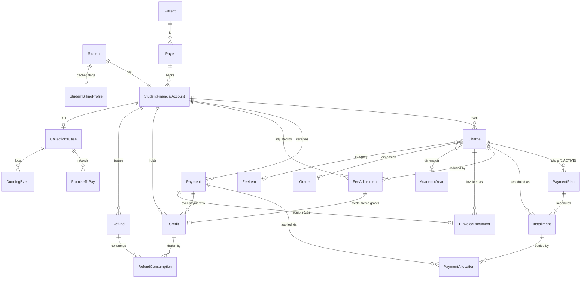

# Munaxa Finance — Implemented ERD (AR domain)

Entity–relationship diagram of the **implemented** Accounts Receivable schema
(`prisma/schema.prisma`, migration `20260703120000_finance_ar_domain`). Every table is
`tenantId`-scoped with RLS `ENABLE`d + `FORCE`d.

## Cardinalities & invariants (as built)

- `Student 1—1 StudentFinancialAccount` (`@unique studentId`).
- `Charge 1—0..1 active PaymentPlan` — partial unique index `PaymentPlan_active_per_charge`
  (`WHERE status='ACTIVE'`); superseded plans retained as history.
- `PaymentPlan 1—N Installment`; a plan-less charge has exactly **one implicit installment**.
  Invariant: `Σ Installment.amount == Charge.net` (fils).
- `PaymentAllocation` references an **Installment** (never a Charge). `Σ active allocations ≤
  Payment.amount`; `allocation ≤ installment.balance`.
- `Credit` = asset lot; `remaining = amount − Σ RefundConsumption`. `Refund` consumes lots FIFO.
- `EInvoiceDocument` sources from a **Charge** (invoice) or a **Payment** (receipt) — never an
  installment/plan.
- `CollectionsCase` (1 per account) owns `PromiseToPay` + `DunningEvent`; `StudentBillingProfile`
  is a cached projection.
- Derived, never stored: `net`, `paid`, `balance`, `outstanding`, `creditBalance`, and installment
  `OVERDUE`.

## Enums (implemented)

`AccountStatus`, `ChargeStatus` (+`WRITTEN_OFF`), `PaymentPlanCadence`, `PaymentPlanStatus`,
`InstallmentStatus`, `PaymentStatus`, `AdjustmentType` (+`WRITE_OFF`), `CreditSource`,
`RefundStatus`, `CollectionsCaseStatus`, `DunningEventType`, `ReminderChannel`, `PaymentMethod`.

See `finance-domain-specification-v1.md` for the full rule set and `FINANCE_COMPLETION_REPORT.md`
for the conformance review.
