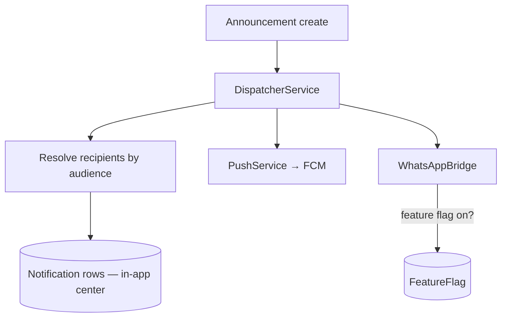

# Phase 10 — Communication System

Announcements with audience fan-out, the in-app notification center, push notifications (FCM),
device registration, per-tenant feature flags, and the **feature-flagged WhatsApp bridge framework**.

## 1. Deliverables

| Area | Where |
|------|-------|
| DB models + RLS | `prisma/migrations/20260603190000_communication/` (Announcement, Notification, DeviceToken, FeatureFlag) |
| Backend | `apps/api/src/communication/{announcements,notifications,devices,feature-flags,dispatch}` |
| Admin Portal | `apps/admin/src/app/communication`, `src/lib/communication.ts` |
| Flutter | `apps/mobile/lib/data/communication`, `lib/features/communication` |
| e2e | `apps/api/test/communication.e2e-spec.ts` (5 cases) |

## 2. Architecture

- **Announcements** target an audience (`ALL / PARENTS / TEACHERS / STUDENTS / SECTION`). On publish,
  the **DispatcherService** resolves recipient `userId`s and writes a **Notification** per recipient
  (the source of truth for the in-app center), then fires best-effort **push (FCM)** and the
  **WhatsApp bridge**.
- **Recipient resolution**: role-based for PARENTS/TEACHERS/STUDENTS (via UserRole), all active users
  for ALL, and for SECTION the section's students (with accounts) + their linked parents.
- **Notification center** endpoints are always scoped to the **current user**
  (`/notifications/me`, unread-count, mark-read, read-all).
- **Push**: `PushService` lazily loads `firebase-admin` and only sends when configured; otherwise it
  no-ops (logs), so the flow works without credentials. Device tokens are registered per user.
- **WhatsApp bridge framework**: `WhatsAppBridge.notify` only dispatches when the per-tenant
  **`whatsapp_bridge`** feature flag is enabled (**off by default**); a concrete provider plugs in
  later. External channels are **best-effort** — they never block the in-app notification.

## 3. API & permissions (`/api/v1`)

| Method | Path | Permission |
|--------|------|------------|
| POST/GET | `/announcements` | `announcement:manage` / `announcement:read` |
| GET | `/notifications/me` · `/me/unread-count` | authenticated (own) |
| POST | `/notifications/:id/read` · `/read-all` | authenticated (own) |
| POST/DELETE | `/notifications/devices` | authenticated (own) |
| GET/PUT | `/feature-flags` · `/feature-flags/:key` | `featureflag:manage` |

## 4. Verified behavior (e2e, real DB)
- ✅ Publishing to **PARENTS** fans out a notification to the parent only (teacher inbox empty);
  response reports the recipient count.
- ✅ Unread count tracking + mark-read.
- ✅ Device token registration.
- ✅ **WhatsApp bridge is gated**: `notify()` returns `false` when the flag is off, `true` after
  enabling `whatsapp_bridge`.
- ✅ RBAC: a Parent cannot publish announcements or manage feature flags (403).

## 5. Admin & Mobile
- **Admin** `/communication`: publish an announcement (audience selector), toggle the WhatsApp
  bridge flag, list recent announcements.
- **Mobile**: `myNotificationsProvider` + `unreadCountProvider` (Riverpod) drive the notification
  center and badge; `registerDevice` wires FCM.

## 6. Notes
- Notification preferences/quiet-hours and digest batching are planned enhancements (architecture
  doc 13). The in-app center is the authoritative record; push/WhatsApp are delivery channels.

## Next: Phase 11 — Parent Portal
Multi-child switcher, leave/absence requests, PTM booking, document vault, and the parent dashboard
(with row-scoping to the parent's own children).
