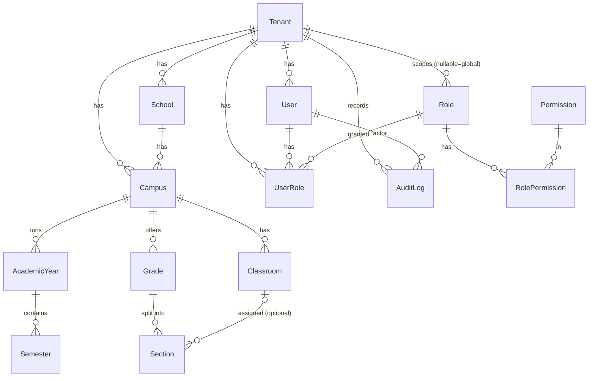

# Phase 2 — Core Database Design

Database-only phase (no APIs). Implements the core Prisma data model, migrations, indexing,
and the tenant-isolation strategy. Verified against a real PostgreSQL 16.

## 1. Deliverables

| Deliverable | Where |
|-------------|-------|
| Prisma schema (12 core models + enums) | `prisma/schema.prisma` |
| Initial migration | `prisma/migrations/20260603120000_init/` |
| RLS / tenant-isolation migration | `prisma/migrations/20260603120100_tenant_rls/` |
| Permission catalog seed | `prisma/seed.ts` |
| Restricted DB app role | `infra/postgres/app-role.sql` |
| Tenant context + helpers (data layer) | `apps/api/src/prisma/tenant-context.ts`, `tenant.helpers.ts` |
| Isolation integration test | `apps/api/test/tenant-isolation.e2e-spec.ts` |

Models: `Tenant, School, Campus, AcademicYear, Semester, Grade, Section, Classroom, User, Role,
Permission, RolePermission, UserRole, AuditLog`.

## 2. ERD (as implemented)



Every business entity carries a non-null `tenantId` (FK → `Tenant`). `Role.tenantId` and
`AuditLog.tenantId` are nullable to represent platform/global rows. `Permission` is a **global**
catalog (no `tenantId`).

## 3. Conventions

- **UUID** primary keys (`@db.Uuid`), application-generated.
- **`timestamptz`** for `createdAt`/`updatedAt`; **soft delete** via `deletedAt` on
  `School`, `Campus`, `User` (recoverable records). `AuditLog` is append-only (no `updatedAt`).
- **Money** is not in the core (Finance is Phase 9); JOD `Decimal` will be used there.
- Bilingual fields are `*_En` / `*_Ar` pairs.

## 4. Indexing strategy

- **Tenant-leading composites** on hot paths: `(tenantId)`, `(tenantId, status)`,
  `(tenantId, schoolId)`, `(tenantId, campusId)`, `(tenantId, gradeId)`, `(tenantId, createdAt)`.
- **Tenant-scoped uniqueness**: `@@unique([tenantId, email])`, `@@unique([tenantId, nationalId])`,
  `@@unique([tenantId, moeSchoolCode])`, `@@unique([tenantId, campusId, level])`,
  `@@unique([tenantId, gradeId, name])`, etc. — identifiers are unique **within** a tenant.
  (PostgreSQL treats NULLs as distinct, so optional unique columns allow multiple NULLs.)
- **Audit** lookups: `(tenantId, createdAt)`, `(tenantId, entityType, entityId)`, `(actorUserId)`.
- `firebaseUid` is globally unique (nullable until linked).

## 5. Migration strategy

- **Prisma Migrate**; migrations are committed and reviewed.
- **Role split**: migrations run as the privileged schema owner (`DIRECT_DATABASE_URL`); the
  application runs as a restricted role (`DATABASE_URL`). This is required for RLS (below).
- **Expand → migrate → contract** for zero-downtime changes (add nullable → backfill → enforce →
  drop). No destructive change reaches production without a reviewed backfill/rollback note and a
  pre-migration snapshot.
- CI applies migrations to an ephemeral Postgres and runs the isolation integration tests.

## 6. Tenant-isolation strategy (defense in depth)

| Layer | Mechanism | Status (Phase 2) |
|-------|-----------|------------------|
| 1. Token | `tenantId` JWT claim | Phase 3 |
| 2. Context | `TenantContextStore` (AsyncLocalStorage) | ✅ implemented (data layer) |
| 3. Transaction scoping | `withTenant` / `withPlatform` set `app.tenant_id` / `app.is_platform` per transaction | ✅ implemented |
| 4. Database RLS | `ENABLE` + `FORCE ROW LEVEL SECURITY` + policies on every tenant table | ✅ implemented & tested |

**RLS** policies use `current_setting('app.tenant_id', true)` and **fail closed** — with no tenant
context set, **zero** tenant-scoped rows are visible or writable. `FORCE ROW LEVEL SECURITY` means
even the table owner is subject to policies; the app therefore connects as a **non-superuser,
NOBYPASSRLS** role (`munaxa_app`). `AuditLog` has only SELECT/INSERT policies → it is **append-only**
(UPDATE/DELETE affect 0 rows).

### Verified behavior (integration test + manual SQL)
- A tenant session sees only its own rows. ✅
- A tenant cannot INSERT a row for another tenant (RLS check violation). ✅
- No tenant context → 0 rows (fail closed). ✅
- `AuditLog` rows cannot be updated or deleted. ✅
- Platform context (`app.is_platform = 'on'`) sees across tenants (for audited platform ops). ✅

## 7. How to run locally

```bash
# Start Postgres (creates the restricted munaxa_app role via infra/postgres/app-role.sql)
pnpm docker:up

# Apply migrations (as the privileged owner) and seed the permission catalog
pnpm --filter @school/api prisma:deploy
pnpm --filter @school/api db:seed

# Run the tenant-isolation integration tests (as the restricted role)
pnpm --filter @school/api test:e2e
```

## 8. Seed contents
- **Global permission catalog** (42 permissions) from `@school/domain`.
- Per-tenant **system roles** and role→permission mappings are seeded during **tenant
  provisioning** (Phase 4), not here.

## Next: Phase 3 — Authentication & RBAC
Firebase Auth + JWT/refresh tokens, password reset, first-login change; RBAC permission guards and
the tenant-isolation guard that binds `TenantContextStore` from the verified principal and wraps
requests with `withTenant` / `withPlatform`.
