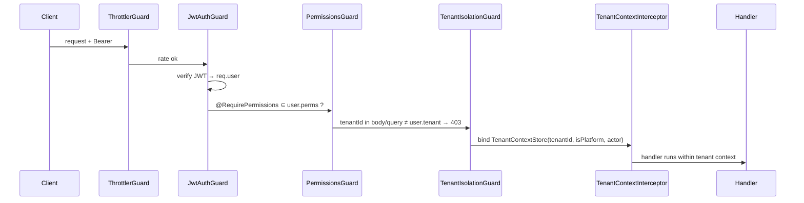

# Phase 3 — Authentication & RBAC

Implements authentication (local + Firebase), JWT access tokens with rotating refresh tokens,
password reset, first-login password change, and authorization (RBAC permission guards + tenant
isolation guard). Backend is fully integration-tested against a real PostgreSQL.

## 1. Deliverables

| Area | Where |
|------|-------|
| DB (auth) | `User.passwordHash`, `RefreshToken`, `PasswordResetToken` + RLS (`prisma/migrations/20260603130000_auth/`) |
| RBAC baseline | `packages/domain/src/role-permissions.ts` (`DEFAULT_ROLE_PERMISSIONS`) |
| Backend module | `apps/api/src/auth/**` (services, guards, decorators, controller) |
| Admin Portal | `apps/admin/src/app/login`, `.../change-password`, `src/lib/auth.ts`, authed home |
| Flutter | `apps/mobile/lib/data/auth`, `lib/features/auth/**` (storage, API, controller, login screen) |
| Swagger | Auto-generated; auth endpoints tagged, bearer scheme registered |
| Tests | 23 unit + 6 auth e2e (+ 3 isolation) against real Postgres |

## 2. Endpoints (all under `/api/v1`)

| Method | Path | Auth | Purpose |
|--------|------|------|---------|
| POST | `/auth/login` | public | Local email+password → token pair |
| POST | `/auth/session` | public | Exchange a Firebase ID token → token pair |
| POST | `/auth/refresh` | public | Rotate refresh token (reuse detection) |
| POST | `/auth/logout` | public | Revoke a refresh-token family |
| POST | `/auth/password/reset/request` | public | Request reset (always 202) |
| POST | `/auth/password/reset/confirm` | public | Confirm reset with token |
| POST | `/auth/password/change` | bearer | Change password / clear first-login flag |
| GET | `/auth/me` | bearer | Current principal (roles + permissions) |

## 3. Token design

- **Access token**: short-lived JWT (HS256, default 15 min) carrying `sub, tid, plat, roles, perms`
  — stateless authorization. Secret from `JWT_ACCESS_SECRET` (required in production).
- **Refresh token**: opaque 384-bit random string; only its **SHA-256 hash** is stored. Rotating —
  every refresh issues a new token and revokes the old one (within a `familyId`).
- **Reuse detection**: presenting an already-rotated/revoked refresh token revokes the **entire
  family** (all sessions descended from that login) and rejects the request. The family-revocation
  is **committed before** the request is rejected (the transaction returns an outcome, then the
  HTTP error is thrown outside it — otherwise the rollback would undo the revocation).
- Password change / reset **revokes all of the user's refresh tokens**.

## 4. Authorization



- **RBAC**: `@RequirePermissions('resource:action', …)` + `PermissionsGuard`. The role→permission
  baseline lives in `@school/domain` and is materialized per tenant by `RbacService`
  (`provisionTenantRoles`) during provisioning (Phase 4) / in tests.
- **Tenant isolation** (defense in depth): JWT `tid` claim → `TenantIsolationGuard` (blocks
  cross-tenant ids in the request) → `TenantContextStore` (bound by the interceptor) → the data
  layer's `withTenant`/`withPlatform` + **PostgreSQL RLS** (Phase 2).
- `@Public()` exempts unauthenticated routes (login, refresh, reset, health).

## 5. Security properties (verified by tests)
- Bad credentials → 401; failed-login attempts are **audit-logged** (and the audit survives because
  it is committed even though the request is rejected).
- `/auth/me` without a token → 401; with a token → roles + permissions.
- Refresh rotation works; **reuse is detected** and revokes the family.
- Password change revokes existing sessions.
- Disabled/suspended accounts are blocked (403).

## 6. Firebase
`FirebaseService` verifies ID tokens via lazily-imported `firebase-admin`; when Firebase is not
configured it cleanly rejects, and **local login remains the alternative path**. Accounts are linked
by `firebaseUid` (or matched by email on first exchange).

## 7. Notes / follow-ups
- Admin tokens are in `localStorage` for now; **httpOnly-cookie sessions + silent refresh** are
  scheduled for Phase 15 hardening.
- Flutter login + secure-token storage + auth controller are in place; the splash→login→home
  **redirect** is wired with the per-flavor app shells (Phases 11/12).
- Password hashing uses bcrypt (work factor 12); **Argon2** is the Phase 15 upgrade.

## How to run the auth e2e locally
```bash
pnpm docker:up
pnpm --filter @school/api prisma:deploy
pnpm --filter @school/api db:seed
pnpm --filter @school/api test:e2e
```

## Next: Phase 4 — School Structure Management
CRUD for School, Campus, AcademicYear, Semester, Grade, Section, Classroom — using the
`@RequirePermissions` guards and `withTenant` scoping established here, plus tenant provisioning
(seeding system roles via `RbacService`).
