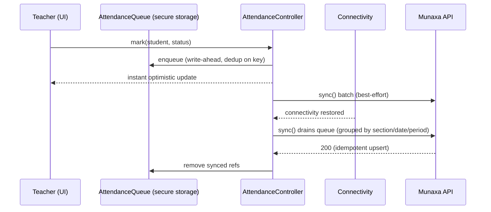

# Phase 7 — Attendance System

Student & teacher attendance, QR attendance, an **offline-first** capture queue with background
synchronization, the attendance dashboard, and the parent/student attendance view.

## 1. Deliverables

| Area | Where |
|------|-------|
| DB models + RLS | `prisma/migrations/20260603160000_attendance/` (StudentAttendance, TeacherAttendance) |
| Backend | `apps/api/src/attendance/{students,teachers}` |
| Admin Portal | `apps/admin/src/app/attendance`, `src/lib/attendance.ts` |
| Flutter (offline-first) | `apps/mobile/lib/data/attendance`, `lib/features/attendance` |
| e2e | `apps/api/test/attendance.e2e-spec.ts` (7 cases) |

## 2. Data model & idempotency

- **StudentAttendance** — unique on **`(tenantId, studentId, date, periodIndex)`**
  (`periodIndex` 0 = daily/homeroom, >0 = per period). Carries `status`, `method` (MANUAL/QR),
  `markedById`, and `clientRef` (the device's offline-queue id, for audit).
- **TeacherAttendance** — unique on `(tenantId, teacherId, date)`.

The unique keys make every write an **upsert**, so re-sending the same marks (offline replay) is
**idempotent** — it updates the existing row instead of duplicating. This is the backbone of the
offline-first guarantee and is verified by the e2e tests.

## 3. API (`/api/v1`)

| Method | Path | Permission | Purpose |
|--------|------|------------|---------|
| POST | `/attendance/students/bulk` | `attendance:create` | Idempotent bulk marking (**offline-sync target**) |
| POST | `/attendance/students/qr` | `attendance:create` | Mark by scanning a student QR code |
| GET | `/attendance/students` (`?sectionId&date&periodIndex`) | `attendance:read` | Section register |
| GET | `/attendance/students/summary` | `attendance:read` | Dashboard counts (present/absent/late/excused) |
| GET | `/attendance/students/:id/history` (`?from&to`) | `attendance:read` | Parent/student attendance view |
| POST | `/attendance/teachers` | `attendance:create` | Mark teacher attendance (idempotent per day) |
| GET | `/attendance/teachers` (`?date`) | `attendance:read` | Teacher register for a date |

## 4. Offline-first architecture (Flutter — mandatory)

- **Write-ahead queue** (`AttendanceQueue`) persists marks in secure storage as JSON, surviving app
  restarts, deduping locally on the idempotency key. Works fully offline.
- **`AttendanceController`** (Riverpod `Notifier`) writes locally first (optimistic), then syncs;
  a **`connectivity_plus`** listener drains the queue automatically when the network returns. It
  exposes the pending-unsynced count for UI badges.
- Sync groups pending marks by `(section, date, period)` and POSTs each batch to the idempotent bulk
  endpoint; failed batches stay queued for the next attempt. **Server idempotency guarantees no
  duplicates on replay.**

## 5. Verified behavior (e2e, real DB)
- ✅ Bulk mark two students.
- ✅ **Idempotent re-sync**: replaying the same batch keeps **2 rows, not 4**, and applies status
  updates (ABSENT → LATE).
- ✅ QR scan marks PRESENT with `method: QR`.
- ✅ Dashboard summary counts are correct.
- ✅ Student history returns the student's records (parent/student view).
- ✅ Teacher attendance is idempotent per day (PRESENT → LATE updates the same row).
- ✅ RBAC: a Student-role user cannot mark attendance (403).

## 6. Admin Portal
`/attendance`: load a section/date summary (present/absent/late/excused counts) and mark a student
PRESENT/ABSENT/LATE/EXCUSED, refreshing the summary.

## 7. Notes
- Parent/student history is gated by `attendance:read`; **row-scoping to a parent's own children**
  is enforced in the Parent Portal (Phase 11).
- Background sync uses connectivity-triggered draining; OS-level periodic background tasks
  (`workmanager`/BGTaskScheduler) are a Phase 15 hardening add-on.
- `clientRef` is stored for audit/debugging; correctness relies on the DB unique key, not the ref.

## Next: Phase 8 — Academics
Homework (+ attachments), behavior logs, grade import (CSV), grade reports, and the parent/student
academic views.
