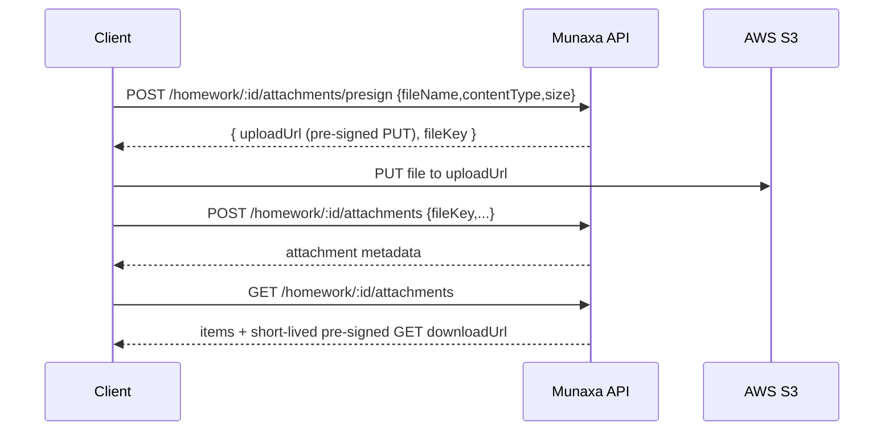

# Phase 8 — Academics

Homework (+ S3 attachments), behavior logs, the grade import engine (+ CSV), grade reports, and the
parent/student academic views.

## 1. Deliverables

| Area | Where |
|------|-------|
| DB models + RLS | `prisma/migrations/20260603170000_academics/` (Homework, HomeworkAttachment, BehaviorLog, GradeRecord) |
| S3 storage | `apps/api/src/common/storage.service.ts` (pre-signed URLs, lazy AWS SDK) |
| Backend | `apps/api/src/academics/{homework,behavior,grades}` |
| New permission | `@school/domain`: `behavior:read` (granted to Parent/Student/Teacher/Principal/VP) |
| Admin Portal | `apps/admin/src/app/academics`, `src/lib/academics.ts` |
| Flutter | `apps/mobile/lib/data/academics`, `lib/features/academics` |
| e2e | `apps/api/test/academics.e2e-spec.ts` (4 cases) |

## 2. API (`/api/v1`)

| Method | Path | Permission | Notes |
|--------|------|------------|-------|
| CRUD | `/homework` (`?sectionId`) | `homework:manage` / `homework:read` | |
| POST | `/homework/:id/attachments/presign` | `homework:manage` | pre-signed S3 **PUT** URL |
| POST | `/homework/:id/attachments` | `homework:manage` | confirm upload (store metadata) |
| GET | `/homework/:id/attachments` | `homework:read` | returns short-lived **GET** URLs |
| POST/GET/DELETE | `/behavior` (`?studentId`) | `behavior:manage` / `behavior:read` | |
| POST | `/grade-records` · `/grade-records/import` | `grade:import` | single + CSV import (idempotent) |
| GET | `/grade-records` (`?studentId&semesterId`) | `grade:read` | |
| GET | `/grade-records/students/:id/report` | `grade:read` | **parent/student academic view** |

> The academic grade endpoints live under `/grade-records` to avoid colliding with the Phase 4
> `/grades` (grade-**levels**) resource.

## 3. Secure file uploads (homework attachments)

Direct-to-S3 via **pre-signed URLs** (no file bytes through the API):

`StorageService` namespaces keys by tenant (`tenants/<tenantId>/homework/<id>/<uuid>-<name>`),
lazily loads the AWS SDK only when configured, and returns a deterministic dev/test stub URL when
S3 isn't configured (so the flow is exercisable without cloud creds).

## 4. Grade import engine

`POST /grade-records/import` accepts CSV (`studentId,subject,assessment,score,maxScore[,semesterId,
weight]`), validates each row, and **upserts idempotently** on
`(tenantId, studentId, subject, assessment, semesterId)`. Re-importing updates the score instead of
duplicating. Returns `{ imported, failed: [{ row, error }] }` for partial success.

**Grade report** aggregates a student's records into per-subject average percentages
(`score/maxScore`) and an overall average — the data behind the parent/student academic view.

## 5. Verified behavior (e2e, real DB)
- ✅ Create homework → **presign** an attachment (URL contains the key) → **confirm** → list returns
  the attachment with a download URL.
- ✅ Record a behavior log; a **Parent reads it** (`behavior:read`).
- ✅ CSV grade import: 3 imported / 1 row error; **re-import is idempotent** (3 rows, not 4) and
  updates the score; report computes Math 90% / overall 90%.
- ✅ RBAC: a Parent cannot create homework (403).

## 6. Admin & Mobile
- **Admin** `/academics`: create/list homework by section; import grades CSV; view a student grade
  report.
- **Mobile**: `homeworkProvider` + `gradeReportProvider` (Riverpod) for the Student/Parent academic
  views.

## 7. Notes
- Actor ids (`assignedById`, `recordedById`, `gradedById`, `uploadedById`) are stored as plain refs
  (no FK) to avoid User-relation sprawl; tenant scoping is via RLS.
- Attachment AV scanning (quarantine on infected) is a Phase 15 hardening step.
- Parent/student reads are gated by the read permissions; **row-scoping to a parent's own children**
  lands in the Parent Portal (Phase 11).

## Next: Phase 9 — Finance
Fee plans, charges, transactions, CliQ + e-wallet receipt uploads, outstanding-balance formula, with
audit logging on all financial actions.
